# ZELIX WMS アーキテクチャ総覧 / ZELIX WMS 架构总览

> 本ドキュメントは ZELIX WMS の全体アーキテクチャを包括的に記述する。
> 新規参画者、アーキテクチャレビュー、技術的意思決定のリファレンスとして利用する。
> 本文档全面描述 ZELIX WMS 的整体架构。
> 供新成员入职、架构评审、技术决策参考使用。
>
> 最終更新 / 最后更新: 2026-03-21

---

## 目次 / 目录

1. [システム定位 / 系统定位](#1-システム定位--系统定位)
2. [C4 モデル 4 層 / C4 模型 4 层](#2-c4-モデル-4-層--c4-模型-4-层)
3. [技術スタック全表 / 技术栈全表](#3-技術スタック全表--技术栈全表)
4. [ランタイムアーキテクチャ / 运行时架构](#4-ランタイムアーキテクチャ--运行时架构)
5. [モジュール依存図 / 模块依赖图](#5-モジュール依存図--模块依赖图)
6. [データフロー図 / 数据流图](#6-データフロー図--数据流图)
7. [インフラストラクチャトポロジー / 基础设施拓扑](#7-インフラストラクチャトポロジー--基础设施拓扑)
8. [マルチアプリマトリックス / 多端应用矩阵](#8-マルチアプリマトリックス--多端应用矩阵)
9. [5 ロール権限マトリックス / 5 角色权限矩阵](#9-5-ロール権限マトリックス--5-角色权限矩阵)
10. [非機能要件 / 非功能性需求](#10-非機能要件--非功能性需求)
11. [重要制約 / 关键约束](#11-重要制約--关键约束)
12. [コーディング規約 / 代码约定](#12-コーディング規約--代码约定)
13. [ADR 一覧 / ADR 列表](#13-adr-一覧--adr-列表)
14. [用語対照表 / 术语对照表](#14-用語対照表--术语对照表)

---

## 1. システム定位 / 系统定位

### 1.1 ZELIX WMS とは / 什么是 ZELIX WMS

ZELIX WMS は**日本の 3PL（サードパーティ・ロジスティクス）事業者**向けに設計された
**マルチテナント SaaS 型**倉庫管理システム（Warehouse Management System）である。

ZELIX WMS 是专为**日本 3PL（第三方物流）企业**设计的
**多租户 SaaS 型**仓库管理系统。

### 1.2 市場ポジション / 市场定位

| 特性 / 特性 | 説明 / 说明 |
|---|---|
| **ターゲット市場 / 目标市场** | 日本国内 3PL 事業者（中規模〜大規模）/ 日本国内 3PL 企业（中大型） |
| **LOGIFAST 互換 / LOGIFAST 兼容** | 業界標準 LOGIFAST の全 109 業務画面を 100% 実装 / 100% 实现 LOGIFAST 109 个业务画面 |
| **配送業者連携 / 物流商集成** | ヤマト B2 Cloud、佐川 e飛伝III、Amazon FBA、Rakuten RSL / 大和、佐川、FBA、RSL |
| **日本特有機能 / 日本特有功能** | 送り状、納品書、ピッキングリスト等の日本語帳票 / 日式送货单、交货单、拣货单 |
| **マルチテナント / 多租户** | 1 倉庫に複数荷主の在庫を RLS + アプリ層で完全分離 / 一个仓库存储多货主，双层隔离 |

### 1.3 システム規模 / 系统规模

| 指標 / 指标 | 数値 / 数值 |
|---|---|
| テスト数 / 测试数 | **1807**（Backend 1454 + Frontend 353） |
| DB テーブル / 数据库表 | **65+** テーブル（PostgreSQL、78 MongoDB コレクションから移行）/ 65+ 表（从 78 个 MongoDB 集合迁移） |
| API エンドポイント / API 端点 | **~402** エンドポイント（16 モジュール）/ ~402 个端点 |
| NestJS モジュール / 模块 | **16** 業務モジュール + **5** 共通モジュール / 16 个业务模块 + 5 个通用模块 |
| フロントエンド画面 / 前端页面 | **109** 画面（118 遅延ロードルート）/ 109 个画面（118 个懒加载路由） |
| フロントエンドコンポーネント / 前端组件 | **268**（Frontend 247 + Admin 9 + Portal 12） |
| サービス層 / 服务层 | **34** コアサービス / 34 个核心服务 |
| BullMQ キュー / 任务队列 | **7** キュー（Webhook, Script, Audit, CSV, Billing, Notification, Report） |

---

## 2. C4 モデル 4 層 / C4 模型 4 层

### 2.1 Level 1: System Context / 系统上下文

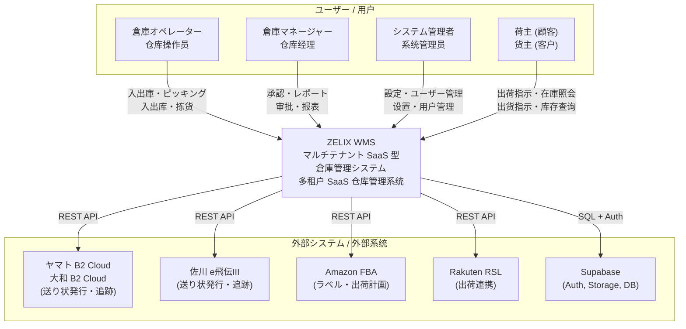

### 2.2 Level 2: Container / 容器

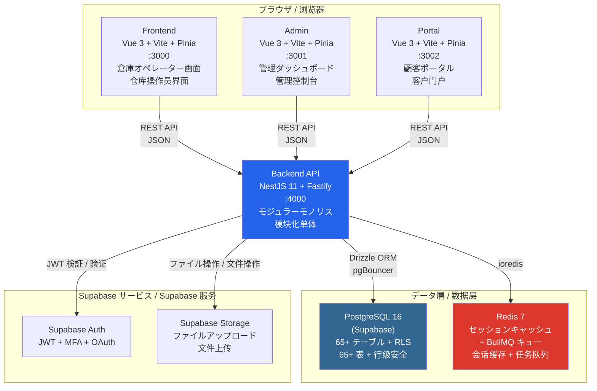

### 2.3 Level 3: Component / 组件

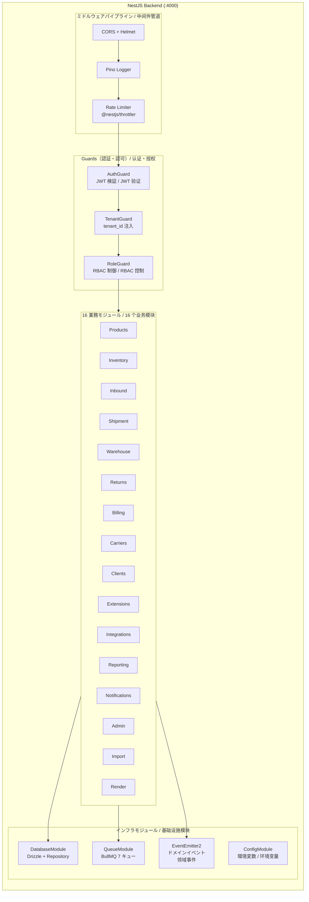

### 2.4 Level 4: Code / 代码

各モジュールの内部構造は統一パターンに従う / 每个模块的内部结构遵循统一模式:

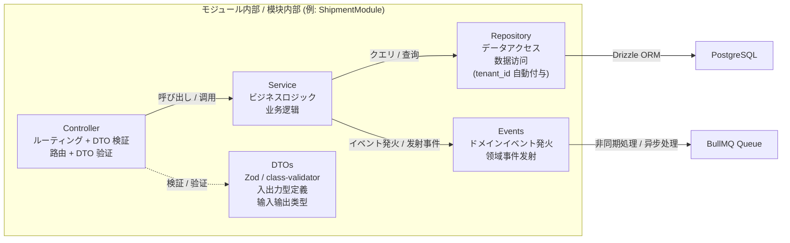

**分層ルール / 分层规则:**
- **Controller**: 軽量。HTTP ルーティング + DTO 検証 + Service 呼び出しのみ / 轻量级，仅路由 + 验证 + 调用 Service
- **Service**: ビジネスロジック集中。トランザクション制御。Repository 経由で DB アクセス / 业务逻辑集中，事务控制，通过 Repository 访问 DB
- **Repository**: BaseRepository 継承。`tenant_id` 自動フィルタ。Drizzle ORM 操作 / 继承 BaseRepository，自动过滤 tenant_id
- **DTO**: readonly。入力検証とレスポンス整形 / readonly，输入验证和响应格式化

---

## 3. 技術スタック全表 / 技术栈全表

### 3.1 バックエンド / 后端

| 技術 / 技术 | バージョン / 版本 | 用途 / 用途 | 選定理由 / 选定理由 |
|---|---|---|---|
| **NestJS** | 11.x | バックエンドフレームワーク / 后端框架 | エンタープライズ DI、モジュール化、TypeScript first / 企业级 DI、模块化、TypeScript 优先 |
| **Fastify** | 5.x | HTTP プラットフォーム / HTTP 平台 | Express の 2-3 倍高速、JSON schema 内蔵 / 比 Express 快 2-3 倍 |
| **TypeScript** | 5.6 | 言語 / 语言 | strict モード。型安全 / strict 模式，类型安全 |
| **Drizzle ORM** | latest | ORM | 型安全、ゼロ抽象、SQL-like API、軽量 / 类型安全、零抽象、轻量 |
| **PostgreSQL** | 16 | メイン DB / 主数据库 | RLS ネイティブ、ACID、JSONB 対応 / RLS 原生、ACID、JSONB 支持 |
| **Supabase** | - | マネージド BaaS | Auth + Storage + DB + Realtime 統合 / 集成 Auth + Storage + DB + Realtime |
| **Redis** | 7 | キャッシュ + キュー / 缓存 + 队列 | 高速 in-memory、BullMQ バックエンド / 高速内存、BullMQ 后端 |
| **BullMQ** | latest | ジョブキュー / 任务队列 | 成熟安定、@nestjs/bullmq 統合 / 成熟稳定、NestJS 集成 |
| **EventEmitter2** | latest | ドメインイベント / 领域事件 | モジュール間疎結合通信 / 模块间松耦合通信 |
| **Pino** | 9.x | 構造化ログ / 结构化日志 | JSON 形式、高性能 / JSON 格式、高性能 |
| **Zod** | 3.x | スキーマ検証 / 模式验证 | 環境変数 + DTO 検証 / 环境变量 + DTO 验证 |
| **@nestjs/swagger** | latest | API ドキュメント / API 文档 | Decorator ベース自動生成 / 装饰器自动生成 |
| **@nestjs/throttler** | latest | レートリミット / 限流 | Redis ストレージ対応 / Redis 存储支持 |
| **@nestjs/terminus** | latest | ヘルスチェック / 健康检查 | DB + Redis + BullMQ 検査 / DB + Redis + BullMQ 检查 |
| **nestjs-pino** | latest | NestJS ログ統合 / NestJS 日志集成 | Pino と NestJS のブリッジ / Pino 与 NestJS 的桥接 |

### 3.2 フロントエンド / 前端

| 技術 / 技术 | バージョン / 版本 | 用途 / 用途 | 選定理由 / 选定理由 |
|---|---|---|---|
| **Vue 3** | 3.x | フロントエンドフレームワーク / 前端框架 | 268 コンポーネント既存、安定稼働 / 268 个组件已有，稳定运行 |
| **Vite** | latest | ビルドツール / 构建工具 | 高速 HMR、ESM ネイティブ / 快速 HMR、ESM 原生 |
| **Pinia** | latest | 状態管理 / 状态管理 | Vue 3 公式推奨 / Vue 3 官方推荐 |
| **Element Plus** | latest | UI コンポーネント / UI 组件 | 日本語ロケール対応、豊富なコンポーネント / 日语本地化、丰富组件 |
| **Vue Router** | 4.x | ルーティング / 路由 | 118 遅延ロードルート / 118 个懒加载路由 |

### 3.3 ツール・インフラ / 工具・基础设施

| 技術 / 技术 | バージョン / 版本 | 用途 / 用途 | 選定理由 / 选定理由 |
|---|---|---|---|
| **Docker Compose** | latest | ローカル開発 / 本地开发 | PG + Redis + 全アプリ一括起動 / 一键启动全部服务 |
| **GitHub Actions** | - | CI/CD | テスト・ビルド・デプロイ自動化 / 测试・构建・部署自动化 |
| **Vitest** | 4.x | テストフレームワーク / 测试框架 | Vite ネイティブ、1807 テスト / Vite 原生、1807 个测试 |
| **Drizzle Kit** | latest | DB マイグレーション / 数据库迁移 | Drizzle ORM 連携、SQL 生成 / Drizzle ORM 配套、SQL 生成 |
| **pdf-lib** | latest | PDF 生成 / PDF 生成 | 送り状・納品書生成 / 送货单・交货单生成 |
| **sharp** | latest | 画像処理 / 图像处理 | ラベル・バーコード画像 / 标签・条码图像 |

### 3.4 廃止技術 / 废弃技术

| 廃止 / 废弃 | 代替 / 替代 | 理由 / 理由 |
|---|---|---|
| Express.js 4.x | NestJS 11 + Fastify | DI 規範なし、パフォーマンス劣位 / 缺少 DI 规范、性能较差 |
| MongoDB 7.x | PostgreSQL 16 (Supabase) | WMS は ACID 事務必須、RLS 必要 / WMS 需要 ACID 事务和 RLS |
| Mongoose 8.x | Drizzle ORM | 型安全性低、ランタイム重い / 类型安全差、运行时重 |
| jsonwebtoken | Supabase Auth | マネージド認証 + RLS 統合 / 托管认证 + RLS 集成 |
| @apollo/server (GraphQL) | REST Only | 利用率 0%、二重 API メンテ不要 / 利用率 0%，无需双重 API |
| swagger-jsdoc | @nestjs/swagger | Decorator ベース自動生成 / 装饰器自动生成 |

---

## 4. ランタイムアーキテクチャ / 运行时架构

### 4.1 リクエストライフサイクル / 请求生命周期

ブラウザからデータベースまでの完全なリクエスト処理フロー:
从浏览器到数据库的完整请求处理流程:

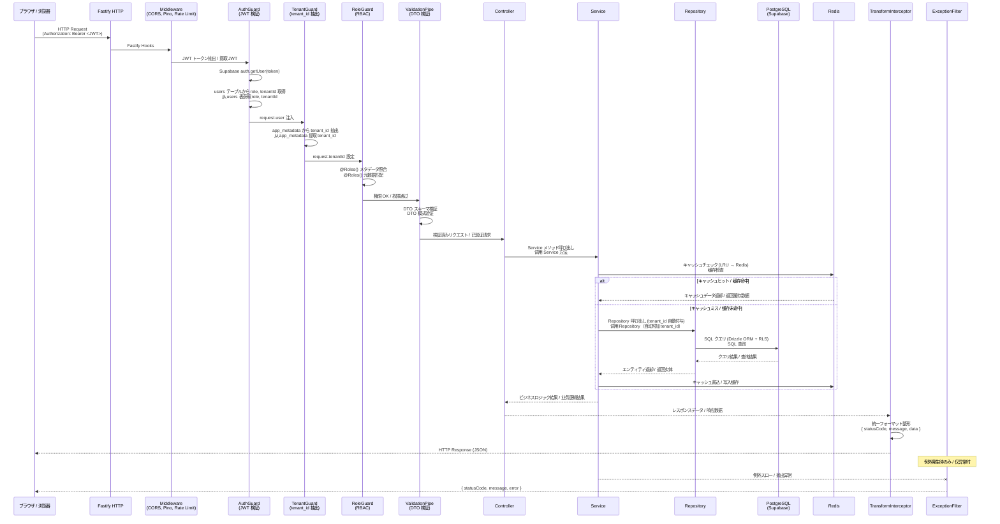

### 4.2 非同期処理フロー / 异步处理流程

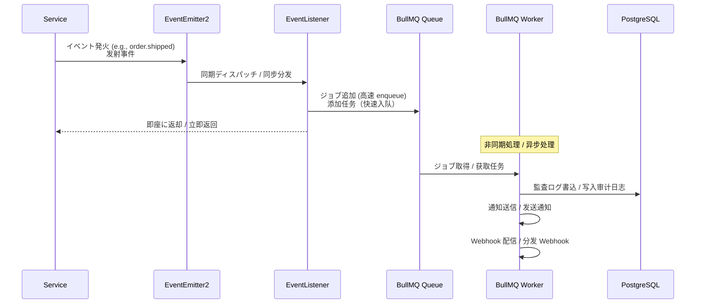

### 4.3 ミドルウェアパイプライン / 中间件管道

```
Request
  │
  ▼
Fastify Hooks (CORS, Helmet, Body Parser, Request ID)
  │
  ▼
Global Middleware (Pino Logger, Rate Limiter)
  │
  ▼
AuthGuard (JWT 検証 / JWT 验证)
  │
  ▼
TenantGuard (tenant_id 抽出 / 提取)
  │
  ▼
RoleGuard (@Roles チェック / 检查) [ルートレベル / 路由级]
  │
  ▼
ValidationPipe (DTO 検証 / DTO 验证)
  │
  ▼
Controller Method
  │
  ▼
TransformInterceptor (レスポンス整形 / 响应格式化)
  │
  ▼
AllExceptionsFilter (例外キャッチ / 异常捕获) [例外時のみ / 仅异常时]
  │
  ▼
Response
```

---

## 5. モジュール依存図 / 模块依赖图

### 5.1 全体依存関係 / 全局依赖关系

```mermaid
graph TB
    subgraph global["グローバルモジュール / 全局模块"]
        CM["CommonModule<br/>(Guards, Interceptors,<br/>Pipes, Filters)"]
        DBM["DatabaseModule<br/>(Drizzle + Repositories)"]
        EEM["EventEmitterModule<br/>(Domain Events)"]
        CFGM["ConfigModule<br/>(Env, Supabase, Redis)"]
    end

    AM["AuthModule<br/>(Supabase Auth, JWT)"]
    QM["QueueModule<br/>(BullMQ 7 キュー)"]

    subgraph business["業務モジュール / 业务模块"]
        P["ProductsModule"]
        I["InventoryModule"]
        IB["InboundModule"]
        SH["ShipmentModule"]
        WH["WarehouseModule"]
        RT["ReturnsModule"]
        BL["BillingModule"]
        CR["CarriersModule"]
        CL["ClientsModule"]
        EX["ExtensionsModule"]
        IG["IntegrationsModule"]
        RP["ReportingModule"]
        NT["NotificationsModule"]
        AD["AdminModule"]
        IM["ImportModule"]
        RN["RenderModule"]
    end

    %% グローバル依存（全モジュールが依存）/ 全局依赖
    CM -.->|"global"| business
    DBM -.->|"global"| business
    EEM -.->|"global"| business
    CFGM -.->|"global"| business

    %% 明示的依存 / 显式依赖
    IB -->|"在庫操作 / 库存操作"| I
    SH -->|"在庫引当 / 库存预留"| I
    SH -->|"配送連携 / 物流集成"| CR
    WH -->|"在庫参照 / 库存引用"| I
    RT -->|"在庫戻し / 库存返还"| I
    RT -->|"出庫参照 / 出库引用"| SH
    CL -->|"認証 / 认证"| AM
    AD -->|"認証 / 认证"| AM
    EX -->|"非同期実行 / 异步执行"| QM
    NT -->|"通知キュー / 通知队列"| QM
    IM -->|"CSV キュー / CSV 队列"| QM
    IG -->|"出庫データ / 出库数据"| SH

    style CM fill:#f59e0b,color:#000
    style DBM fill:#336791,color:#fff
    style QM fill:#dc382d,color:#fff
    style EEM fill:#10b981,color:#fff
```

### 5.2 モジュール責務一覧 / 模块职责一览

| # | モジュール / 模块 | エンドポイント数 | 主要責務 / 主要职责 |
|---|---|---|---|
| 1 | **ProductsModule** | 14 | 商品マスタ CRUD、セット商品、子 SKU 管理 / 商品主数据、套装、子 SKU |
| 2 | **InventoryModule** | 40 | 在庫管理（StockQuant, StockMove, Lot, Location）、引当・調整・移動 / 库存管理、预留・调整・移动 |
| 3 | **InboundModule** | 25 | 入庫ワークフロー (draft→confirmed→receiving→putaway→done) / 入库工作流 |
| 4 | **ShipmentModule** | 17 | 出荷指示 CRUD、出庫申請、バルク操作 / 出货指示、出库申请、批量操作 |
| 5 | **WarehouseModule** | 46 | タスク管理、ウェーブ、検品、ラベリング、棚卸、循環棚卸 / 任务、波次、检品、贴标、盘点 |
| 6 | **ReturnsModule** | 11 | 返品処理 (draft→inspecting→completed) / 退货处理 |
| 7 | **BillingModule** | 26 | 請求管理、料金マスタ、作業チャージ、運賃 / 计费、费率、作业费、运费 |
| 8 | **CarriersModule** | 22 | 配送業者マスタ、B2 Cloud wrapper (変更禁止)、佐川連携 / 物流商、B2 Cloud、佐川 |
| 9 | **ClientsModule** | 23 | 荷主・サブ荷主・顧客・ショップ、ポータル API / 货主、子货主、客户、店铺、门户 |
| 10 | **ExtensionsModule** | 68 | プラグイン、Webhook、スクリプト、ルールエンジン、ワークフロー / 插件、Webhook、脚本、规则引擎 |
| 11 | **IntegrationsModule** | 30 | Amazon FBA、Rakuten RSL、OMS、マーケットプレイス、ERP / FBA、RSL、OMS、市场、ERP |
| 12 | **ReportingModule** | 19 | ダッシュボード、日次レポート、KPI、ピークモード / 看板、日报、KPI、高峰模式 |
| 13 | **NotificationsModule** | 12 | 通知、メールテンプレート / 通知、邮件模板 |
| 14 | **AdminModule** | 23 | テナント管理、ユーザー管理、システム設定、ログ / 租户、用户、设置、日志 |
| 15 | **ImportModule** | 10 | CSV インポート、マッピング設定 / CSV 导入、映射配置 |
| 16 | **RenderModule** | 9 | PDF/ラベル生成、帳票テンプレート / PDF/标签生成、单据模板 |
| | **合計 / 合计** | **~402** | |

### 5.3 共通モジュール / 通用模块

| モジュール / 模块 | スコープ | 内容 / 内容 |
|---|---|---|
| **CommonModule** | global | Guards (Auth, Tenant, Role), Interceptors (Transform, Logging), Pipes (Validation, Pagination), Filters (AllExceptions), Decorators (@CurrentUser, @TenantId, @Roles) |
| **DatabaseModule** | global | Drizzle ORM 接続、65+ Schema 定義、BaseRepository 抽象クラス / Drizzle 连接、65+ Schema、BaseRepository 抽象类 |
| **EventEmitterModule** | global | EventEmitter2 設定、ドメインイベント定義 / EventEmitter2 配置、领域事件定义 |
| **ConfigModule** | global | 環境変数 Zod バリデーション、Supabase/Redis/DB 接続設定 / 环境变量 Zod 验证、各连接配置 |
| **AuthModule** | scoped | Supabase Auth 連携、ログイン/ログアウト、ポータル認証 / Supabase Auth、登录登出、门户认证 |
| **QueueModule** | scoped | BullMQ 7 キュー + 7 プロセッサー + 定時タスク / 7 个队列 + 7 个处理器 + 定时任务 |

---

## 6. データフロー図 / 数据流图

### 6.1 入庫フロー / 入库流程

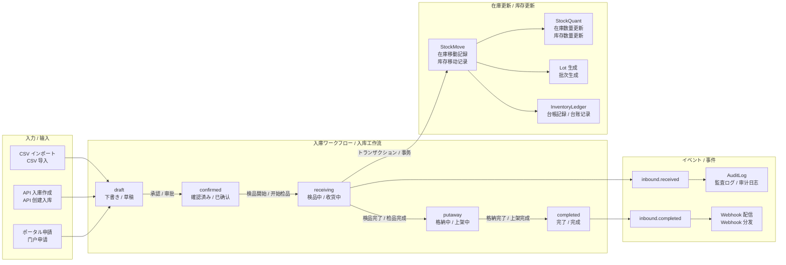

### 6.2 出庫フロー / 出库流程

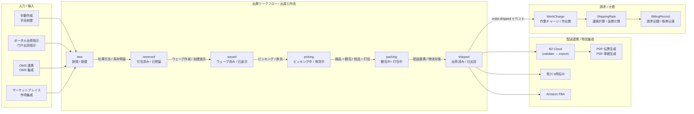

### 6.3 請求フロー / 计费流程

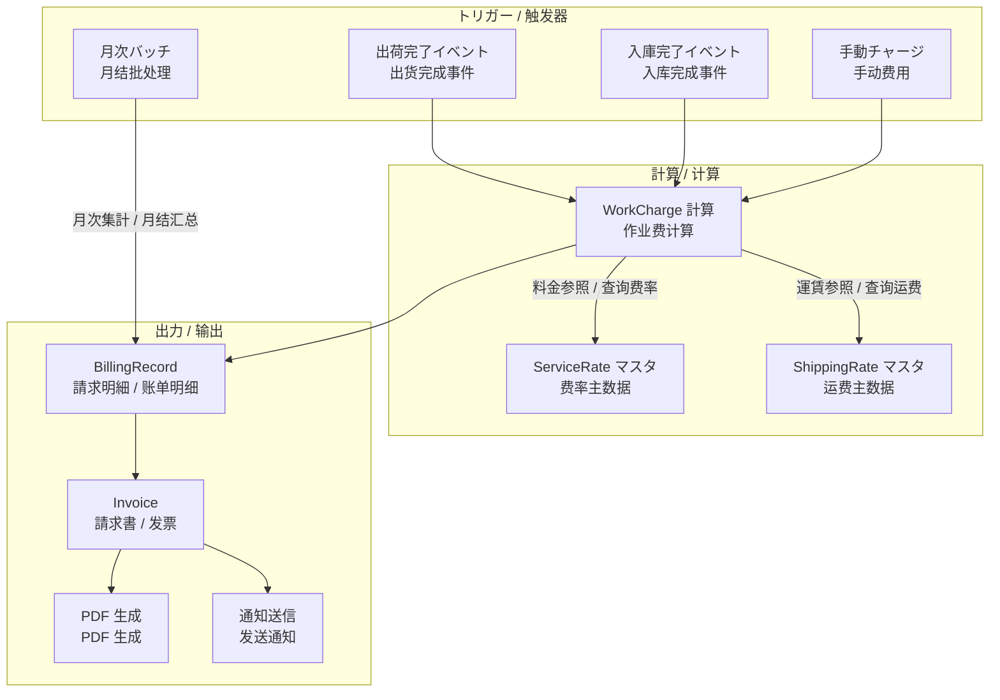

---

## 7. インフラストラクチャトポロジー / 基础设施拓扑

### 7.1 全体構成図 / 全局架构图

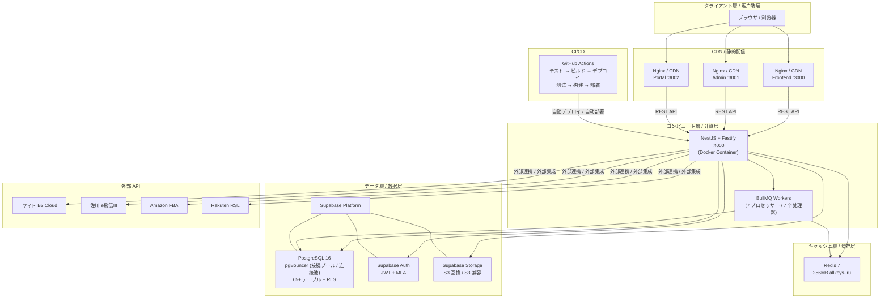

### 7.2 Docker Compose ローカル構成 / Docker Compose 本地构成

| サービス / 服务 | イメージ / 镜像 | ポート / 端口 | メモリ制限 / 内存限制 | ヘルスチェック / 健康检查 |
|---|---|---|---|---|
| **backend** | カスタムビルド / 自定义构建 | 4000 | 512MB | `GET /health` |
| **frontend** | Nginx + Vue SPA | 3000 | 128MB | - |
| **admin** | Nginx + Vue SPA | 3001 | 128MB | - |
| **portal** | Nginx + Vue SPA | 3002 | 128MB | - |
| **postgres** | postgres:16 (Supabase) | 5432 (内部) | - | `pg_isready` |
| **redis** | redis:7-alpine | 6379 (内部) | 256MB | `redis-cli ping` |

### 7.3 キャッシュ戦略 / 缓存策略

3 層キャッシュアーキテクチャ / 3 层缓存架构:

| 層 / 层 | 技術 / 技术 | TTL | 用途 / 用途 |
|---|---|---|---|
| **L1** | LRU (インメモリ / 内存) | 60s | ホットデータ (商品マスタ等) / 热数据 |
| **L2** | Redis | 5min | セッション、B2 Cloud セッション / 会话缓存 |
| **L3** | PostgreSQL | - | コールドデータ (永続化) / 冷数据 |

### 7.4 BullMQ 7 キュー / 7 个 BullMQ 队列

| キュー名 / 队列名 | 並列度 / 并发 | リトライ / 重试 | 用途 / 用途 |
|---|---|---|---|
| `wms-webhook` | 3 | 3 (指数退避) | Webhook 配信 / 分发 |
| `wms-script` | 2 | 3 (指数退避) | 自動化スクリプト実行 / 脚本执行 |
| `wms-audit` | 1 | 3 (指数退避) | 監査ログ書込 / 审计日志写入 |
| `wms-csv-import` | 2 | 3 (指数退避) | CSV 一括インポート / CSV 批量导入 |
| `wms-billing` | 2 | 3 (指数退避) | 請求計算 / 账单计算 |
| `wms-notification` | 3 | 3 (指数退避) | 通知送信 / 通知发送 |
| `wms-report` | 1 | 3 (指数退避) | レポート生成 / 报表生成 |

### 7.5 定時タスク / 定时任务

| スケジュール / 定时 | タスク / 任务 | 説明 / 说明 |
|---|---|---|
| `*/30 * * * *` | 期限切れ引当解放 / 释放过期预留 | 30 分ごと / 每 30 分钟 |
| `0 2 * * *` | 日次レポート生成 / 生成日报 | 毎日 02:00 / 每天 02:00 |
| `0 1 1 * *` | 月次請求書生成 / 生成月结账单 | 毎月 1 日 01:00 / 每月 1 日 01:00 |

---

## 8. マルチアプリマトリックス / 多端应用矩阵

### 8.1 アプリケーション一覧 / 应用列表

| アプリ / 应用 | ポート / 端口 | 技術 / 技术 | コンポーネント数 | 対象ユーザー / 目标用户 | 主要機能 / 主要功能 |
|---|---|---|---|---|---|
| **Frontend** | :3000 | Vue 3 + Vite + Pinia + Element Plus | 247 | operator, manager, admin, viewer | 入出庫、ピッキング、在庫管理、帳票、レポート / 入出库、拣货、库存、单据、报表 |
| **Admin** | :3001 | Vue 3 + Vite + Pinia + Element Plus | 9 | admin | テナント管理、ユーザー管理、システム設定、操作ログ / 租户、用户、系统设置、操作日志 |
| **Portal** | :3002 | Vue 3 + Vite + Pinia + Element Plus | 12 | client | 出荷指示投入、在庫照会、出荷状況トラッキング / 出货指示、库存查询、出货追踪 |
| **Backend API** | :4000 | NestJS 11 + Fastify | ~402 endpoints | 全アプリの API バックエンド / 所有应用的 API 后端 | REST API、認証、ビジネスロジック、DB アクセス / REST API、认证、业务逻辑、数据库 |

### 8.2 フロントエンド共有アーキテクチャ / 前端共享架构

```
ZELIXWMS/
├── shared/           # 3 アプリ間共有コード / 3 个应用共享代码
│   ├── api/          # API クライアント / API 客户端
│   ├── types/        # TypeScript 型定義 / TypeScript 类型定义
│   └── utils/        # 共通ユーティリティ / 通用工具
├── frontend/         # メイン (247 コンポーネント)
├── admin/            # 管理 (9 コンポーネント)
├── portal/           # 門戸 (12 コンポーネント)
└── packages/
    └── plugin-sdk/   # 拡張プラグイン SDK / 扩展插件 SDK
```

### 8.3 アプリ × ロール対応表 / 应用 x 角色对应表

| ロール / 角色 | Frontend (:3000) | Admin (:3001) | Portal (:3002) |
|---|:---:|:---:|:---:|
| **admin** | **全機能** | **全機能** | - |
| **manager** | **全機能** | 閲覧のみ / 仅查看 | - |
| **operator** | 入出庫・作業 / 入出库操作 | - | - |
| **viewer** | 閲覧のみ / 仅查看 | - | - |
| **client** | - | - | **全機能** |

---

## 9. 5 ロール権限マトリックス / 5 角色权限矩阵

### 9.1 ロール定義 / 角色定义

| ロール / 角色 | 説明 / 说明 | データスコープ / 数据范围 |
|---|---|---|
| **admin** | システム管理者 / 系统管理员 | テナント横断全権限 / 跨租户全权限 |
| **manager** | 倉庫マネージャー / 仓库经理 | テナント内全操作 / 租户内全操作 |
| **operator** | 倉庫作業者 / 仓库操作员 | テナント内日常作業 / 租户内日常操作 |
| **viewer** | 閲覧者 / 只读用户 | テナント内読取のみ / 租户内仅读取 |
| **client** | 荷主 / 货主 | 自社データのみ / 仅自己公司数据 |

### 9.2 モジュール × ロール権限表 / 模块 x 角色权限表

凡例 / 图例: **RW** = 読み書き/读写, **R** = 読取のみ/仅读, **R(自)** = 自社のみ読取/仅读自己公司, **-** = アクセス不可/无权限

| モジュール / 模块 | admin | manager | operator | viewer | client |
|---|:---:|:---:|:---:|:---:|:---:|
| **商品 CRUD** / Products | RW | RW | R | R | R(自) |
| **入庫操作** / Inbound | RW | RW | RW | R | R(自) |
| **出庫操作** / Shipment | RW | RW | RW | R | R(自) |
| **出庫申請** / Outbound Request | RW | RW | R | R | RW(自) |
| **在庫照会** / Inventory Query | RW | RW | R | R | R(自) |
| **在庫調整** / Stock Adjust | RW | RW | - | R | - |
| **在庫引当** / Reservation | RW | RW | RW | R | - |
| **棚卸** / Stocktaking | RW | RW | RW | R | - |
| **循環棚卸** / Cycle Count | RW | RW | RW | R | - |
| **ウェーブ管理** / Wave | RW | RW | RW | R | - |
| **ピッキング** / Picking | RW | RW | RW | R | - |
| **検品** / Inspection | RW | RW | RW | R | - |
| **ラベリング** / Labeling | RW | RW | RW | R | - |
| **返品処理** / Returns | RW | RW | RW | R | R(自) |
| **請求管理** / Billing | RW | RW | - | R | R(自) |
| **配送業者** / Carriers | RW | RW | R | R | - |
| **B2 Cloud 連携** | RW | RW | RW | - | - |
| **荷主管理** / Clients | RW | RW | R | R | R(自) |
| **ユーザー管理** / Users | RW | R | - | - | - |
| **テナント管理** / Tenants | RW | - | - | - | - |
| **システム設定** / Settings | RW | R | - | - | - |
| **拡張管理** / Extensions | RW | RW | - | - | - |
| **プラグイン** / Plugins | RW | RW | - | - | - |
| **Webhook** | RW | RW | - | - | - |
| **FBA/RSL 連携** | RW | RW | R | R | - |
| **レポート** / Reports | RW | RW | R | R | R(自) |
| **KPI** | RW | RW | - | R | - |
| **通知** / Notifications | RW | RW | R | R | R(自) |
| **CSV インポート** / Import | RW | RW | RW | - | - |
| **PDF/ラベル生成** / Render | RW | RW | RW | R | R(自) |
| **操作ログ** / Audit Log | RW | R | - | - | - |

### 9.3 認証フロー / 认证流程

```
1. ブラウザ → Supabase Auth (login) → JWT 発行 (app_metadata: { tenant_id, role })
   浏览器 → Supabase Auth (登录) → JWT 发行
2. ブラウザ → Backend API (Authorization: Bearer <JWT>)
   浏览器 → 后端 API
3. AuthGuard → Supabase auth.getUser(token) → user 検証
   AuthGuard → 验证用户
4. TenantGuard → JWT app_metadata.tenant_id → リクエストに注入
   TenantGuard → 注入 tenant_id
5. RoleGuard → @Roles() メタデータと user.role 比較
   RoleGuard → 比较角色
6. Repository → 全クエリに WHERE tenant_id = ? 自動付与
   Repository → 全查询自动附加 WHERE tenant_id = ?
7. PostgreSQL RLS → 最終防衛線として行レベル制御
   PostgreSQL RLS → 作为最后防线的行级控制
```

---

## 10. 非機能要件 / 非功能性需求

### 10.1 パフォーマンス / 性能

| 指標 / 指标 | 目標値 / 目标值 | 保証手段 / 保障手段 |
|---|---|---|
| **API レスポンス (p95)** | **< 200ms** | Fastify 2-3x 高速、3 層キャッシュ / 3 层缓存 |
| **API レスポンス (p99)** | **< 500ms** | PostgreSQL インデックス最適化 / 索引优化 |
| **DB クエリ** | **< 50ms** | Drizzle relational query で N+1 防止、複合インデックス / 防止 N+1、复合索引 |
| **バルク操作 (1000 件)** | **< 5s** | バッチ INSERT/UPDATE、トランザクション / 批量操作、事务 |
| **コールドスタート** | **< 3s** | NestJS + Fastify 最適化 |
| **同時接続ユーザー** | **100+** (単一インスタンス / 单实例) | ステートレス設計、pgBouncer / 无状态设计 |
| **日次処理能力** | **100,000 件/日** | BullMQ 並列処理、インデックス最適化 / BullMQ 并行、索引优化 |

### 10.2 可用性 / 可用性

| 指標 / 指标 | 目標値 / 目标值 | 実現手段 / 实现方式 |
|---|---|---|
| **稼働率 / 可用率** | **99.9%** (月間ダウンタイム < 43 分 / 月停机 < 43 分) | Supabase マネージド HA / Supabase 托管高可用 |
| **デプロイ / 部署** | ゼロダウンタイム / 零停机 | Rolling update |
| **バックアップ / 备份** | 日次自動 / 每日自动 | Supabase 自動バックアップ / Supabase 自动备份 |
| **災害復旧 / 灾难恢复** | RPO < 24h, RTO < 1h | Supabase point-in-time recovery |

### 10.3 スケーラビリティ / 可扩展性

| ユーザー規模 / 用户规模 | アーキテクチャ対応 / 架构应对 |
|---|---|
| **~1,000** | 現行アーキテクチャで十分 / 当前架构即可 |
| **~10,000** | 水平スケーリング (複数 API インスタンス)、Redis クラスタリング / 水平扩展、Redis 集群 |
| **~100,000** | CDN 強化、読み書き分離 (read replica)、BullMQ 専用 Worker ノード / CDN、读写分离、专用 Worker |
| **~1,000,000** | マイクロサービス分割、イベント駆動アーキテクチャ、マルチリージョン / 微服务、事件驱动、多区域 |

**スケーラビリティ設計要素 / 可扩展性设计要素:**
- ステートレスバックエンド設計 → 水平スケーリング対応 / 无状态后端 → 支持水平扩展
- pgBouncer (Supabase 内蔵) → 接続プール管理 / pgBouncer → 连接池管理
- BullMQ → 複数 Worker 並列対応 / BullMQ → 多 Worker 并行
- 3 層キャッシュ → DB 負荷軽減 / 3 层缓存 → 减轻 DB 负载

### 10.4 セキュリティ / 安全

| 対策 / 措施 | 実装 / 实现 |
|---|---|
| **テナント分離 / 租户隔离** | RLS + アプリケーション層二重分離 / RLS + 应用层双重隔离 |
| **認証 / 认证** | Supabase Auth (JWT, OAuth, MFA) |
| **認可 / 授权** | RBAC (5 ロール + Guard チェーン) / RBAC (5 角色 + Guard 链) |
| **SQL インジェクション防止** | Drizzle パラメータ化クエリ / Drizzle 参数化查询 |
| **XSS 防止** | Fastify Helmet + Content-Security-Policy |
| **CSRF 防止** | SameSite cookie + CSRF token |
| **レートリミット / 限流** | @nestjs/throttler (全局 1000/15min, auth 20/15min, write 200/15min) |
| **OWASP Top 10** | 全項目対策実施 / 全项对策 |
| **入力検証 / 输入验证** | Zod + class-validator 全境界検証 / 全边界验证 |
| **秘密管理 / 密钥管理** | 環境変数 + Zod 起動時検証 / 环境变量 + Zod 启动验证 |
| **監査ログ / 审计日志** | AuditInterceptor → PostgreSQL 永続化 / 持久化到 PostgreSQL |

### 10.5 可観測性 / 可观测性

| 領域 / 领域 | ツール / 工具 | 説明 / 说明 |
|---|---|---|
| **構造化ログ / 结构化日志** | Pino 9.x (JSON) | リクエスト ID 自動関連付け / 请求 ID 自动关联 |
| **ヘルスチェック / 健康检查** | @nestjs/terminus | `/health`, `/health/liveness`, `/health/readiness` (DB + Redis + BullMQ) |
| **操作ログ / 操作日志** | AuditInterceptor | 全変更操作を PostgreSQL に記録 / 全变更操作记录到 PostgreSQL |
| **API ログ / API 日志** | LoggingInterceptor | リクエスト/レスポンス記録 / 请求/响应记录 |
| **エラー追跡 / 错误追踪** | AllExceptionsFilter | 構造化エラーコンテキスト / 结构化错误上下文 |
| **APM レディ** | OpenTelemetry | Traces + Metrics + Logs エクスポート準備 / 导出准备 |

---

## 11. 重要制約 / 关键约束

### 11.1 yamatoB2Service.ts 変更禁止 / 禁止修改

**最重要の制約。この制約に違反するいかなる変更も禁止。**
**最重要的约束。禁止任何违反此约束的变更。**

| 対象 / 对象 | 説明 / 说明 |
|---|---|
| **ファイル / 文件** | `backend/src/services/yamatoB2Service.ts` |
| **関数 / 函数** | `authenticatedFetch()`, `validateShipments()`, `exportShipments()`, `login()`, `loginFromApi()`, `addressMapping` |
| **関連 / 关联** | `backend/src/utils/yamatoB2Format.ts` の `b2ApiToJapaneseKeyMapping` |
| **理由 / 理由** | 2026-03-12 に長時間デバッグして安定化。proxy の 'entry' エラーは B2 Cloud セッション切れが原因、自動リトライで解決済み / 2026-03-12 经过长时间调试稳定化 |
| **NestJS での利用 / NestJS 中使用** | `B2CloudService` で wrapper ラップ。`dynamic import` で既存コードを呼び出し、内部は一切変更しない / 用 B2CloudService 包装，通过 dynamic import 调用 |

**B2 Cloud API 利用ルール / B2 Cloud API 使用规则:**
- `/api/v1/shipments/validate` を使用（日本語キー） / 使用此端点（日文键名）
- `/api/v1/shipments` を使用（英語キー、エクスポート用）/ 使用此端点（英文键名，导出用）
- `/api/v1/shipments/validate-full` は使用禁止（幅チェッカーにバグあり）/ 禁止使用（宽度检查器有 bug）

### 11.2 Vue 3 フロントエンド不変 / Vue 3 前端不变

| 制約 / 约束 | 説明 / 说明 |
|---|---|
| 変更範囲 / 变更范围 | API ベース URL のみ変更 / 仅变更 API base URL |
| コンポーネント | 268 個 (247 + 9 + 12) 変更不要 / 268 个组件无需修改 |
| ID 互換 / ID 兼容 | TransformInterceptor で `_id` エイリアスを自動付与 / 自动附加 `_id` 别名 |

### 11.3 テスト互換性 / 测试兼容性

| 制約 / 约束 | 数値 / 数值 |
|---|---|
| 既存テスト数 / 现有测试数 | **1807+** (Backend 1454 + Frontend 353) |
| 目標通過率 / 目标通过率 | **100%**（適応後 / 适配后） |
| カバレッジ目標 / 覆盖率目标 | **80%+** |

### 11.4 API 後方互換性 / API 向后兼容性

| 制約 / 约束 | 説明 / 说明 |
|---|---|
| パス構造 / 路径结构 | 100% 維持 (`/api/products`, `/api/shipment-orders` 等) / 100% 保持 |
| HTTP メソッド | 変更なし / 不变 |
| リクエスト/レスポンス | 最大限互換維持 / 最大限保持兼容 |
| ID フォーマット | ObjectId → UUID (唯一の変更) / 唯一的变更 |
| `_id` エイリアス | レスポンスに `_id` = `id` のエイリアスを自動付与 / 自动附加 `_id` 别名 |

### 11.5 継続利用技術 / 继续使用的技术

迁移时不废弃、继续使用 / 移行時に廃止せず継続使用:

- **BullMQ + Redis**: キュー/キャッシュバックエンド / 队列/缓存后端
- **Zod**: スキーマ検証 / 模式验证
- **Vitest**: テストフレームワーク / 测试框架
- **pdf-lib, muhammara**: PDF 処理 / PDF 处理
- **sharp, skia-canvas**: 画像処理 / 图像处理
- **Node.js 20+**: ランタイム / 运行时

---

## 12. コーディング規約 / 代码约定

### 12.1 バイリンガル注釈（必須）/ 双语注释（必须）

すべてのコメント・ドキュメント・commit メッセージは**中国語 + 日本語**の二言語で記載すること。
所有注释、文档、commit 信息必须使用**中文 + 日文**双语记载。

```typescript
// 在庫引当を実行する / 执行库存预留
async reserveStock(tenantId: string, dto: ReserveStockDto): Promise<StockReservation> {
  // 現在庫数を確認 / 确认当前库存数
  const quant = await this.stockQuantRepository.findByProductAndLocation(/*...*/);
  // ...
}
```

```
# commit メッセージ例 / commit 信息示例
feat: 在庫引当ロジック実装 实现库存预留逻辑
fix: B2 Cloud セッション切れ時のリトライ修正 修复B2 Cloud会话过期重试
```

### 12.2 イミュータブルパターン / 不可变模式

- 既存オブジェクトを直接変更せず、新しいオブジェクトを返す / 不直接修改现有对象，返回新对象
- DTO は `readonly` / DTO 使用 `readonly`
- Service は無状態 / Service 无状态
- スプレッド演算子でコピー後変更 / 使用展开运算符复制后修改

```typescript
// WRONG / 错误
const updated = existing;
updated.status = 'confirmed';

// CORRECT / 正确
const updated = { ...existing, status: 'confirmed' as const };
```

### 12.3 ファイルサイズ制限 / 文件大小限制

| ルール / 规则 | 値 / 值 |
|---|---|
| ファイル目安 / 文件建议 | 200-400 行 |
| ファイル上限 / 文件上限 | 800 行 |
| 関数上限 / 函数上限 | 50 行 |
| ネスト上限 / 嵌套上限 | 4 階層 / 4 层 |

### 12.4 NestJS パターン / NestJS 模式

| 層 / 层 | 責務 / 职责 | ルール / 规则 |
|---|---|---|
| **Controller** | ルーティング + DTO 検証 + Service 呼び出し / 路由 + 验证 + 调用 Service | 軽量。ビジネスロジック禁止 / 禁止业务逻辑 |
| **Service** | ビジネスロジック + トランザクション / 业务逻辑 + 事务 | Repository 経由で DB アクセス / 通过 Repository 访问 DB |
| **Repository** | データアクセス封装 / 数据访问封装 | `tenant_id` 自動フィルタ必須 / 必须自动过滤 tenant_id |
| **Module** | 機能単位分離 / 按功能分离 | 独立テスト可能 / 可独立测试 |

### 12.5 エラーハンドリング / 错误处理

| 例外クラス / 异常类 | HTTP Status | 用途 / 用途 |
|---|---|---|
| `WmsNotFoundException` | 404 | リソース未発見 / 资源不存在 |
| `InsufficientStockException` | 409 | 在庫不足 / 库存不足 |
| `InvalidStatusTransitionException` | 422 | ステータス遷移不正 / 状态转换非法 |
| `TenantMismatchException` | 403 | テナント不一致 / 租户不匹配 |
| `DuplicateResourceException` | 409 | リソース重複 / 资源重复 |

レスポンス統一フォーマット / 统一响应格式:
```json
{ "statusCode": 200, "message": "OK", "data": { } }
{ "statusCode": 404, "message": "商品未找到 / 商品が見つかりません", "error": "WmsNotFoundException" }
```

### 12.6 API 設計規約 / API 设计规范

- プレフィックス / 前缀: `/api/`
- 命名: kebab-case (`/api/shipment-orders`, `/api/inbound-orders`)
- ID 形式: UUID
- 分頁 / 分页: `?page=1&limit=50` → `{ items, total, page, limit }`
- ソート / 排序: `?sort=createdAt&order=desc`
- レートリミット / 限流: global 1000/15min, auth 20/15min, write 200/15min

### 12.7 ドキュメント同期ルール / 文档同步规则

コード変更時は対応ドキュメントを**先に更新**してから開発する:
代码变更时**先更新**对应文档，再进行开发:

| 変更種別 / 变更类型 | 対応ドキュメント / 对应文档 |
|---|---|
| 要件変更 / 需求变更 | `docs/migration/01-requirements.md` |
| DB 設計変更 | `docs/migration/02-database-design.md` |
| アーキテクチャ変更 / 架构变更 | `docs/migration/03-backend-architecture.md` |
| API 変更 | `docs/migration/04-api-mapping.md` |
| 開発計画變更 / 开发计划变更 | `docs/migration/06-migration-plan.md` |
| 全活動 / 所有活动 | `docs/devlog.md` |

---

## 13. ADR 一覧 / ADR 列表

### ADR-001: NestJS Platform → Fastify（非 Express）

- **状態 / 状态:** 確定 / 确定
- **決定 / 决定:** `@nestjs/platform-fastify` を使用 / 使用 Fastify 平台
- **理由 / 理由:** Express の 2-3 倍高速、JSON schema 内蔵、全面移行なので Express 踏襲不要 / 比 Express 快 2-3 倍，全新迁移无需沿用

### ADR-002: GraphQL 廃止 → REST Only

- **状態 / 状态:** 確定 / 确定
- **決定 / 决定:** @apollo/server GraphQL を廃止、REST のみ / 废止 GraphQL，仅 REST
- **理由 / 理由:** フロントエンド利用率 0%、二重 API メンテ不要 / 前端利用率 0%，无需双重维护

### ADR-003: ObjectId → UUID v5 決定論的変換

- **状態 / 状态:** 確定 / 确定
- **決定 / 决定:** UUID v5 (namespace="ZELIXWMS", name=ObjectId.toHexString()) / 确定性转换
- **理由 / 理由:** 同一 ObjectId は常に同一 UUID を生成。外キー整合性維持 / 保持外键完整性

### ADR-004: RLS + Application-level 二重テナント分離

- **状態 / 状态:** 確定 / 确定
- **決定 / 决定:** PostgreSQL RLS + アプリ層 tenant_id の二重保障 / 双重隔离
- **理由 / 理由:** 単層故障でもデータ漏洩しない / 单层失效不会导致数据泄露

### ADR-005: Repository Pattern で tenant_id 強制

- **状態 / 状态:** 確定 / 确定
- **決定 / 决定:** BaseRepository 全メソッドに tenant_id 必須 / 全方法强制 tenant_id
- **理由 / 理由:** 開発者の tenant_id フィルタ漏れ防止 / 防止开发者遗忘

### ADR-006: Products テーブル → ワイドレイアウト（EAV 不採用）

- **状態 / 状态:** 確定 / 确定
- **決定 / 决定:** 宽表 + JSONB 列。EAV パターン不採用 / 宽表 + JSONB，不用 EAV
- **理由 / 理由:** WMS 属性は比較的固定。ワイドテーブルの方がクエリ性能優秀 / WMS 属性固定，宽表查询性能更好

---

## 14. 用語対照表 / 术语对照表

| 中文 | 日本語 | English | 説明 / 说明 |
|---|---|---|---|
| 仓库管理系统 | 倉庫管理システム | WMS | 本システム / 本系统 |
| 第三方物流 | サードパーティ・ロジスティクス | 3PL | ターゲット業界 / 目标行业 |
| 入库 | 入庫 | Inbound | 商品受入→検品→格納 / 收货→检品→上架 |
| 出库 | 出荷 | Outbound / Shipment | 引当→ピック→パック→出荷 / 预留→拣→包→出 |
| 库存 | 在庫 | Inventory / Stock | StockQuant (数量) + StockMove (移動) |
| 盘点 | 棚卸 | Stocktaking | 実在庫とシステム在庫の照合 / 实际与系统库存核对 |
| 拣货 | ピッキング | Picking | 倉庫からの商品取出 / 从仓库取出商品 |
| 打包 | パッキング | Packing | 出荷前梱包 / 出货前打包 |
| 计费 | 請求 | Billing | 作業費 + 保管料 + 運賃 / 作业费 + 仓储费 + 运费 |
| 租户 | テナント | Tenant | 荷主企業単位 / 货主企业单位 |
| 行级安全 | 行レベルセキュリティ | RLS | PostgreSQL RLS ポリシー |
| 送货单 | 送り状 | Waybill / Shipping Label | 配送伝票 / 物流单据 |
| 交货单 | 納品書 | Delivery Note | 納品証明 / 交货证明 |
| 波次 | ウェーブ | Wave | 複数出荷のバッチ処理 / 多出货批处理 |
| 预留 | 引当 | Reservation | 在庫の事前確保 / 库存预先占用 |
| 上架 | 格納 | Putaway | 入庫商品の棚入れ / 入库商品上架 |
| 费率 | 料金マスタ | Service Rate | 作業単価定義 / 作业单价定义 |
| 模块化单体 | モジュラーモノリス | Modular Monolith | マイクロサービスではない単一プロセス / 非微服务的单进程 |

---

## 関連ドキュメント / 相关文档

| ドキュメント / 文档 | パス / 路径 | 内容 / 内容 |
|---|---|---|
| システム概要 / 系统概述 | `docs/design/00-system-overview.md` | 新規参画者向け概要 / 新成员入职概要 |
| 要件定義 / 需求定义 | `docs/migration/01-requirements.md` | 迁移需求、技术选型、ADR / 迁移需求・技术选型・ADR |
| DB 設計 / 数据库设计 | `docs/migration/02-database-design.md` | 65+ テーブル定義、RLS、索引 / 65+ 表定义、RLS、索引 |
| バックエンド設計 / 后端设计 | `docs/migration/03-backend-architecture.md` | 16 モジュール詳細、Guard チェーン、キュー設計 / 16 模块详细、Guard 链、队列 |
| API マッピング / API 映射 | `docs/migration/04-api-mapping.md` | 全 492 エンドポイント対応表 / 全 492 端点映射 |
| 開発ガイド / 开发指南 | `docs/migration/05-development-guide.md` | セットアップ、テスト、デプロイ / 搭建、测试、部署 |
| 実施計画 / 实施计划 | `docs/migration/06-migration-plan.md` | 11 週間 340h ロードマップ / 11 周 340h 路线图 |
| 開発記録 / 开发记录 | `docs/devlog.md` | 全開発活動の時系列記録 / 全开发活动时间线 |

---

> **最終更新 / 最后更新**: 2026-03-21
> **作成者 / 作者**: Architecture Review
> **ステータス / 状态**: 確定 / 确定
```
