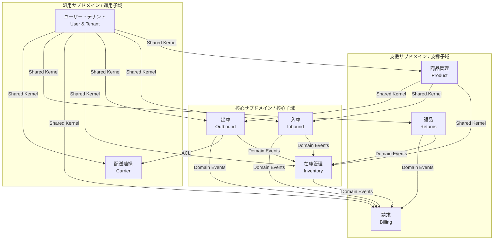
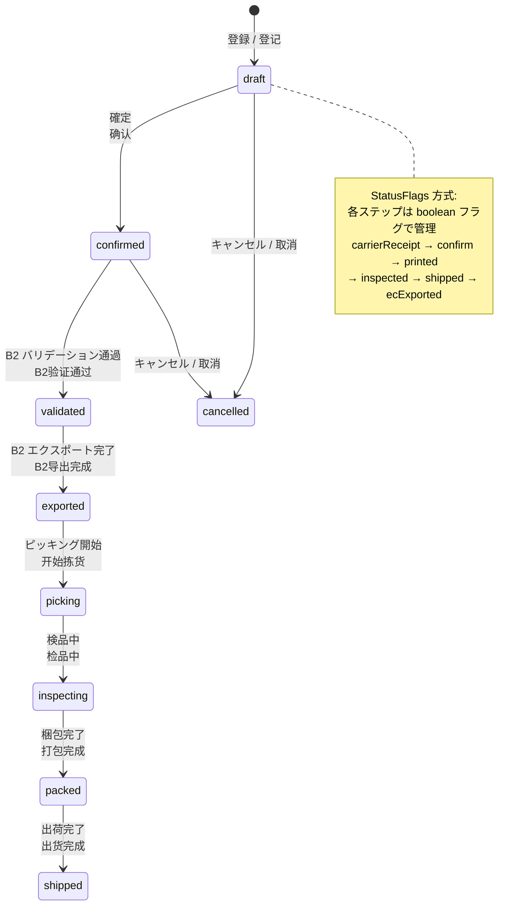
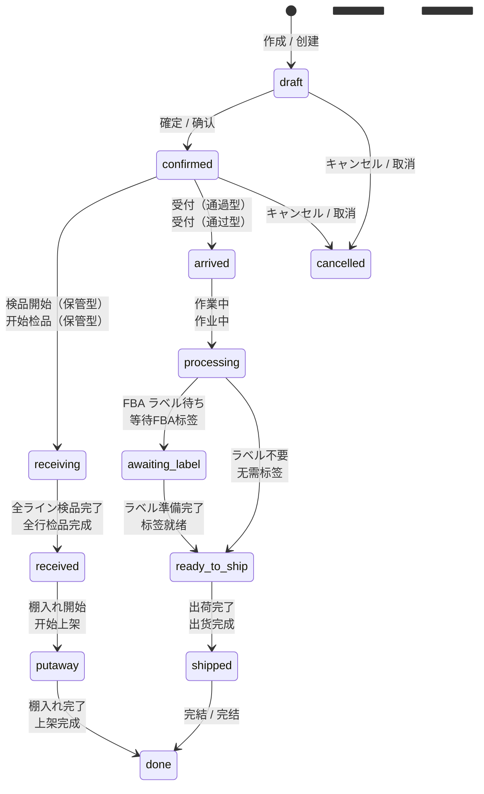
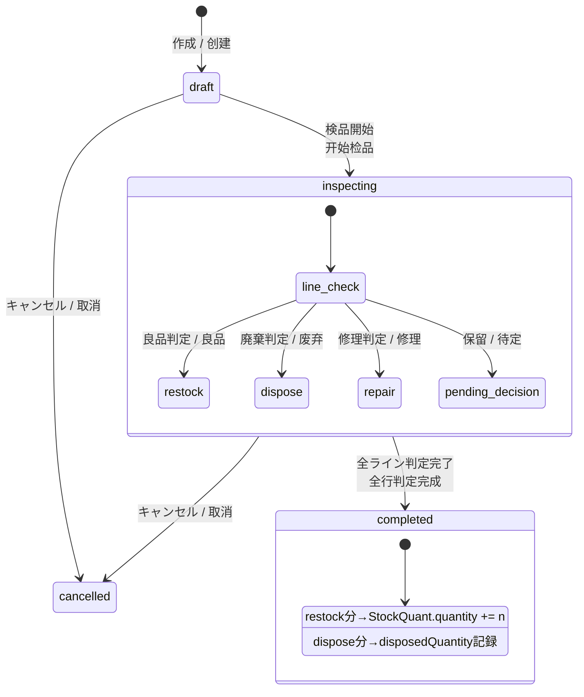
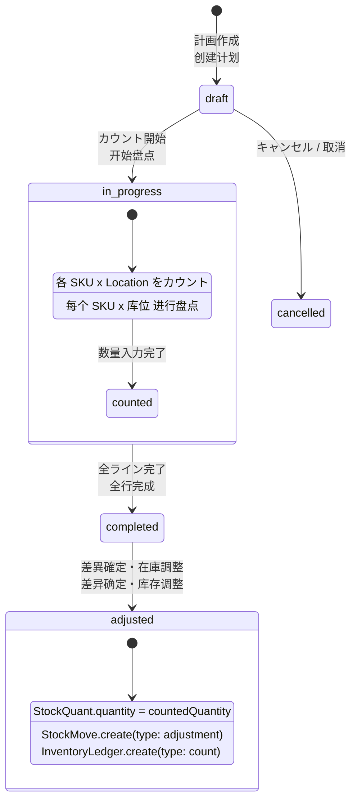
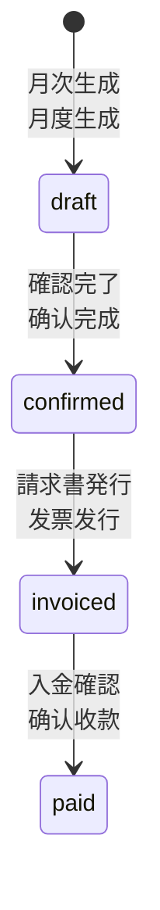
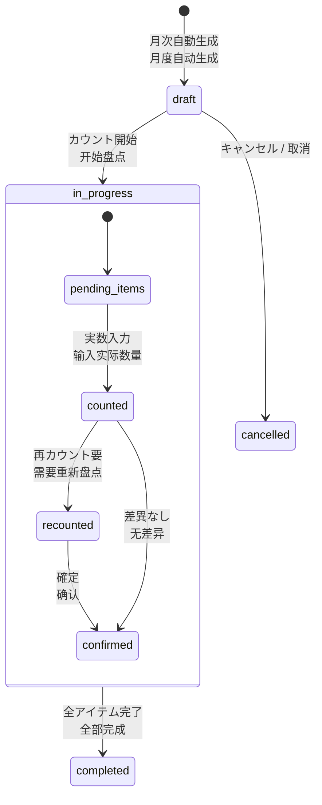
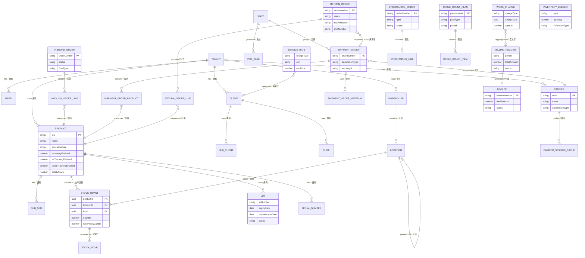
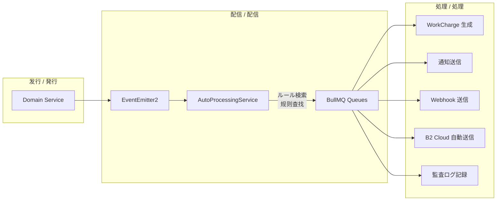

# ZELIX WMS ドメインモデル設計書 / 领域模型设计文档

> Domain-Driven Design (DDD) に基づく ZELIX WMS の完全ドメインモデル定義書。
> 基于领域驱动设计 (DDD) 的 ZELIX WMS 完整领域模型定义文档。
>
> 最終更新 / 最后更新: 2026-03-21

---

## 目次 / 目录

1. [ドメイン概観 / 领域概览](#1-ドメイン概観--领域概览)
2. [限界コンテキスト / 限界上下文](#2-限界コンテキスト--限界上下文)
3. [コンテキストマップ / 上下文映射](#3-コンテキストマップ--上下文映射)
4. [集約・エンティティ・値オブジェクト詳細 / 聚合根・实体・值对象详解](#4-集約エンティティ値オブジェクト詳細--聚合根实体值对象详解)
5. [状態遷移図 / 状态机](#5-状態遷移図--状态机)
6. [ドメインルール / 领域规则](#6-ドメインルール--领域规则)
7. [エンティティ関係図 / 实体关系图](#7-エンティティ関係図--实体关系图)
8. [ドメインイベントカタログ / 领域事件目录](#8-ドメインイベントカタログ--领域事件目录)
9. [ユビキタス言語集 / 统一语言词汇表](#9-ユビキタス言語集--统一语言词汇表)

---

## 1. ドメイン概観 / 领域概览

ZELIX WMS は **3PL（サードパーティロジスティクス）倉庫** 向けのマルチテナント型倉庫管理システムである。
核心業務サイクルは **入庫 → 在庫管理 → 出荷** であり、返品・請求・配送連携が付帯業務として存在する。

ZELIX WMS 是面向 **3PL（第三方物流）仓库** 的多租户仓库管理系统。
核心业务循环为 **入库 → 库存管理 → 出货**，退货・计费・配送集成作为附加业务存在。

### コアサブドメイン / 核心子域

| 分類 / 分类 | サブドメイン / 子域 | 説明 / 说明 |
|---|---|---|
| **Core** | 在庫管理 (Inventory) | StockQuant による原子的在庫管理。FIFO/FEFO/LIFO 引当 / 基于 StockQuant 的原子级库存管理 |
| **Core** | 出庫 (Outbound/Shipment) | 出荷指示→引当→ウェーブ→ピッキング→梱包→出荷の一連フロー / 出货全流程 |
| **Core** | 入庫 (Inbound) | 入庫予定→検品→棚入れ。6次元検品、クロスドック対応 / 入库全流程，6维检品 |
| **Supporting** | 商品管理 (Product) | SKU マスタ、子 SKU、ロット・シリアル管理 / 商品主数据管理 |
| **Supporting** | 返品 (Returns) | 返品受付→検品→再入庫/廃棄 判定 / 退货处理 |
| **Supporting** | 請求 (Billing) | 作業チャージ自動生成→月次集計→請求書発行 / 自动费用→月度汇总→发票 |
| **Generic** | 配送連携 (Carrier Integration) | ヤマトB2 Cloud 等の外部配送業者 API 連携 / 外部配送商 API 集成 |
| **Generic** | ユーザー・テナント (User & Tenant) | マルチテナント、RBAC、認証 / 多租户、角色权限、认证 |

---

## 2. 限界コンテキスト / 限界上下文

### 2.1 商品管理コンテキスト (Product Management Context) / 商品管理上下文

**責務 / 职责**: 商品マスタデータのライフサイクル管理。SKU 体系、子 SKU、寸法、FBA/RSL 属性を統合的に管理する。

| 要素 / 元素 | 名称 | 説明 / 说明 |
|---|---|---|
| **集約ルート / 聚合根** | `Product` | 商品マスタ。sku はテナント内一意 / 商品主数据，sku 租户内唯一 |
| **エンティティ / 实体** | `SubSku` | 子 SKU（バリエーション）。`_allSku` で一意性保証 / 子 SKU（变体） |
| **エンティティ / 实体** | `Material` | 梱包資材マスタ（箱、緩衝材、テープ等）/ 包装材料主数据 |
| **値オブジェクト / 值对象** | `Dimensions` | 寸法（width, depth, height, weight）/ 尺寸 |
| **値オブジェクト / 值对象** | `WarehouseNotes` | 倉庫側メモ（取扱注意、保管温度帯等）/ 仓库备注 |
| **値オブジェクト / 值对象** | `AllocationRule` | FIFO / FEFO / LIFO / 分配规则 |
| **ドメインイベント / 领域事件** | `ProductCreated` | 商品新規登録時 / 新商品注册 |
| **ドメインイベント / 领域事件** | `ProductUpdated` | 商品情報更新時 / 商品信息更新 |

**不変条件 / 不变量**:
- `sku` はテナント内で一意 / sku 在租户内唯一
- `_allSku`（主 SKU + 全子 SKU）はテナント内グローバル一意 / 全 SKU 列表租户内全局唯一
- `serialTrackingEnabled=true` の場合、在庫操作時にシリアル番号の記録が必須 / 启用序列号管理时必须记录序列号

---

### 2.2 入庫コンテキスト (Inbound Context) / 入库上下文

**責務 / 职责**: 入庫予定の登録から検品・棚入れ完了までのワークフロー管理。

| 要素 / 元素 | 名称 | 説明 / 说明 |
|---|---|---|
| **集約ルート / 聚合根** | `InboundOrder` | 入庫指示。standard/crossdock/passthrough の 3 フロータイプ / 入库指示 |
| **エンティティ / 实体** | `InboundOrderLine` | 入庫明細行（SKU 単位の予定・実績数量）/ 入库明细行 |
| **エンティティ / 实体** | `ServiceOption` | 作業オプション（FNSKU 貼付、OPP 袋入れ等の付帯作業）/ 增值服务选项 |
| **値オブジェクト / 值对象** | `Supplier` | 納品元情報（名前、コード、住所）/ 供货方信息 |
| **値オブジェクト / 值对象** | `FbaInfo` | FBA 入庫情報（shipmentId, destinationFc, ラベル情報）/ FBA 入库信息 |
| **値オブジェクト / 值对象** | `RslInfo` | RSL 入庫情報 / RSL 入库信息 |
| **値オブジェクト / 值对象** | `B2bInfo` | B2B 配送先情報 / B2B 配送信息 |
| **値オブジェクト / 值对象** | `VarianceReport` | 差異報告（予定 vs 実績の差分）/ 差异报告 |
| **ドメインイベント / 领域事件** | `InboundOrderCreated` | 入庫予定作成時 / 创建入库预定 |
| **ドメインイベント / 领域事件** | `InboundReceived` | 全ライン検品完了時 → 在庫反映トリガー / 全行检品完成 |
| **ドメインイベント / 领域事件** | `InboundPutawayCompleted` | 棚入れ完了時 / 上架完成 |

---

### 2.3 在庫コンテキスト (Inventory Context) / 库存上下文

**責務 / 职责**: 在庫の原子的管理。StockQuant (実在庫) + StockMove (移動記録) + InventoryLedger (台帳) の 3 層構造。

| 要素 / 元素 | 名称 | 説明 / 说明 |
|---|---|---|
| **集約ルート / 聚合根** | `StockQuant` | 在庫原子単位。productId x locationId x lotId の粒度 / 库存原子单位 |
| **エンティティ / 实体** | `StockMove` | 在庫移動記録。全ての在庫変動の監査証跡 / 库存移动记录（审计跟踪） |
| **エンティティ / 实体** | `InventoryLedger` | 在庫台帳。会計的な借方・貸方記録 / 库存台账 |
| **エンティティ / 实体** | `Lot` | ロット管理。製造日・期限日・ステータス管理 / 批次管理 |
| **エンティティ / 实体** | `SerialNumber` | シリアル番号管理。個体追跡用 / 序列号管理 |
| **エンティティ / 实体** | `Location` | ロケーション（warehouse/zone/shelf/bin/staging/receiving/virtual）/ 库位 |
| **エンティティ / 实体** | `Warehouse` | 倉庫マスタ。複数倉庫管理 / 仓库主数据 |
| **値オブジェクト / 值对象** | `AvailableQuantity` | `quantity - reservedQuantity`（仮想フィールド）/ 可用库存量 |
| **ドメインイベント / 领域事件** | `StockReserved` | 在庫引当完了時 / 库存预留完成 |
| **ドメインイベント / 领域事件** | `StockReleased` | 引当解放時 / 预留释放 |
| **ドメインイベント / 领域事件** | `StockAdjusted` | 在庫調整時 / 库存调整 |
| **ドメインイベント / 领域事件** | `StockTransferred` | ロケーション間移動時 / 库位间移动 |

---

### 2.4 出庫コンテキスト (Outbound/Shipment Context) / 出库上下文

**責務 / 职责**: 出荷指示の登録から配送完了までの一連のフルフィルメントワークフロー。

| 要素 / 元素 | 名称 | 説明 / 说明 |
|---|---|---|
| **集約ルート / 聚合根** | `ShipmentOrder` | 出荷指示。B2C/B2B/FBA/RSL の 4 出荷タイプ / 出货指示 |
| **エンティティ / 实体** | `ShipmentOrderProduct` | 出荷明細（inputSku, quantity, productId, matchedSubSku）/ 出货商品明细 |
| **エンティティ / 实体** | `ShipmentOrderMaterial` | 出荷耗材（梱包材、作業用品）/ 出货包装材料 |
| **エンティティ / 实体** | `Wave` | ウェーブ（出荷グループ化単位）/ 波次 |
| **エンティティ / 实体** | `PickTask` | ピッキングタスク / 拣货任务 |
| **値オブジェクト / 值对象** | `Address` | 住所（postalCode, prefecture, city, street, building, name, phone）/ 地址 |
| **値オブジェクト / 值对象** | `CarrierData` | 配送業者固有データ（yamato.sortingCode 等）/ 配送商固有数据 |
| **値オブジェクト / 值对象** | `CostSummary` | コスト集計（productCost, materialCost, shippingCost, totalCost）/ 成本汇总 |
| **値オブジェクト / 值对象** | `ShippingCostBreakdown` | 配送料内訳（base, cool, cod, fuel, other）/ 配送费明细 |
| **値オブジェクト / 值对象** | `StatusFlags` | 出荷ステータスフラグ群（carrierReceipt, confirm, printed, inspected, shipped, ecExported, held）/ 状态标志 |
| **ドメインイベント / 领域事件** | `OrderCreated` | 出荷指示作成時 → 自動処理エンジンへ / 出货指示创建 |
| **ドメインイベント / 领域事件** | `OrderConfirmed` | 出荷確定時 / 出货确认 |
| **ドメインイベント / 领域事件** | `OrderShipped` | 出荷完了時 → 在庫消費・チャージ生成 / 出货完成 |

---

### 2.5 返品コンテキスト (Returns Context) / 退货上下文

**責務 / 职责**: 返品受付から検品・処分判定・在庫反映までの返品処理ワークフロー。

| 要素 / 元素 | 名称 | 説明 / 说明 |
|---|---|---|
| **集約ルート / 聚合根** | `ReturnOrder` | 返品指示。RMA 番号による追跡 / 退货指示 |
| **エンティティ / 实体** | `ReturnOrderLine` | 返品明細行。disposition による処分判定 / 退货明细行 |
| **値オブジェクト / 值对象** | `ReturnReason` | customer_request / defective / wrong_item / damaged / other |
| **値オブジェクト / 值对象** | `Disposition` | restock / dispose / repair / pending |
| **ドメインイベント / 领域事件** | `ReturnReceived` | 返品受領時 / 收到退货 |
| **ドメインイベント / 领域事件** | `ReturnCompleted` | 検品・処分確定時 → 在庫反映・チャージ生成 / 退货完成 |

---

### 2.6 請求コンテキスト (Billing Context) / 计费上下文

**責務 / 职责**: 作業チャージの自動生成、月次集計、請求書発行。料金マスタによる 2 段階フォールバック料金体系。

| 要素 / 元素 | 名称 | 説明 / 说明 |
|---|---|---|
| **集約ルート / 聚合根** | `BillingRecord` | 月次請求明細。期間 x 荷主 x 配送業者で一意 / 月度账单记录 |
| **エンティティ / 实体** | `WorkCharge` | 個別作業チャージ。ドメインイベント経由で自動生成 / 单笔作业费用 |
| **エンティティ / 实体** | `Invoice` | 請求書（税込合計、明細行付き）/ 发票 |
| **エンティティ / 实体** | `ServiceRate` | 料金マスタ。chargeType x unit x 条件 / 费率主数据 |
| **値オブジェクト / 值对象** | `ChargeType` | 23 種の費用類型（inbound_handling, storage, outbound_handling, picking, ...）/ 23 种费用类型 |
| **値オブジェクト / 值对象** | `ChargeUnit` | per_order / per_item / per_case / per_line / per_pallet / per_location_day / per_sheet / per_set / flat |
| **値オブジェクト / 值对象** | `Money` | amount = quantity x unitPrice / 金额计算 |
| **ドメインイベント / 领域事件** | `ChargeCreated` | チャージ生成時 / 费用生成 |
| **ドメインイベント / 领域事件** | `BillingConfirmed` | 月次請求確定時 / 月度账单确认 |
| **ドメインイベント / 领域事件** | `InvoiceIssued` | 請求書発行時 / 发票发行 |

---

### 2.7 配送連携コンテキスト (Carrier Integration Context) / 配送集成上下文

**責務 / 职责**: 外部配送業者 API との連携。セッション管理、バリデーション、エクスポート、印刷。

| 要素 / 元素 | 名称 | 説明 / 说明 |
|---|---|---|
| **集約ルート / 聚合根** | `Carrier` | 配送業者マスタ。フォーマット定義、自動化タイプ / 配送商主数据 |
| **エンティティ / 实体** | `CarrierSessionCache` | セッショントークンキャッシュ（3 層: メモリ→DB→API）/ 会话缓存 |
| **エンティティ / 实体** | `CarrierAutomationConfig` | 自動処理設定 / 自动化配置 |
| **値オブジェクト / 值对象** | `FormatDefinition` | CSV/TSV カラム定義 / 格式定义 |
| **値オブジェクト / 值对象** | `CarrierService` | 送り状種類ごとの印刷テンプレート設定 / 运单类型设置 |
| **ドメインイベント / 领域事件** | `CarrierValidated` | B2 Cloud バリデーション通過時 / 验证通过 |
| **ドメインイベント / 领域事件** | `CarrierExported` | B2 Cloud エクスポート完了（追跡番号取得）/ 导出完成 |
| **ドメインイベント / 领域事件** | `LabelPrinted` | 送り状印刷完了時 / 运单打印完成 |

> **重要 / 重要**: `yamatoB2Service.ts` のコアロジック（authenticatedFetch, validateShipments, exportShipments, login, addressMapping）は **変更禁止**。NestJS 移行時も wrapper で囲むこと。

---

### 2.8 ユーザー・テナントコンテキスト (User & Tenant Context) / 用户・租户上下文

**責務 / 职责**: マルチテナント分離、ユーザー認証・認可、RBAC。

| 要素 / 元素 | 名称 | 説明 / 说明 |
|---|---|---|
| **集約ルート / 聚合根** | `Tenant` | テナント（倉庫運営会社）。プラン・制限・機能フラグ管理 / 租户 |
| **エンティティ / 实体** | `User` | ユーザー。RBAC ロール: admin/manager/operator/viewer/client / 用户 |
| **エンティティ / 实体** | `Client` | 荷主（3PL 顧客）。信用管理・ポータル設定 / 货主（3PL 客户） |
| **エンティティ / 实体** | `SubClient` | 子顧客 / 子客户 |
| **エンティティ / 实体** | `Shop` | 店舗 / 店铺 |
| **エンティティ / 实体** | `Role` | カスタムロール定義 / 自定义角色 |
| **値オブジェクト / 值对象** | `TenantPlan` | free / starter / standard / pro / enterprise |
| **値オブジェクト / 值对象** | `UserRole` | admin / manager / operator / viewer / client |
| **値オブジェクト / 值对象** | `CreditTier` | vip / standard / new / custom |
| **ドメインイベント / 领域事件** | `UserLoggedIn` | ログイン時 / 用户登录 |
| **ドメインイベント / 领域事件** | `TenantCreated` | テナント作成時 / 租户创建 |

---

## 3. コンテキストマップ / 上下文映射

### 3.1 コンテキスト間関係 / 上下文间关系



### 3.2 統合パターン詳細 / 集成模式详解

| 上流 / Upstream | 下流 / Downstream | パターン / 模式 | 説明 / 说明 |
|---|---|---|---|
| **Product** | Inventory, Inbound, Outbound | **Shared Kernel** | productId, sku を共通参照。Product の inventoryEnabled, allocationRule が在庫挙動を決定 / 共享 productId, sku |
| **Inbound** | Inventory | **Domain Events** | `INBOUND_RECEIVED` で StockQuant を増加。InventoryLedger に記帳 / 入库完成时增加库存 |
| **Outbound** | Inventory | **Domain Events** | `reserveStockForOrder` で引当、`completeStockForOrder` で消費 / 预留和消费库存 |
| **Outbound** | Carrier | **Anti-Corruption Layer** | YamatoB2Service が外部 API 形式を変換（日本語キー/英語キー）/ ACL 转换外部 API 格式 |
| **Returns** | Inventory | **Domain Events** | `ReturnCompleted` で disposition=restock の分を StockQuant に戻す / 退货入库 |
| **Inbound/Outbound/Returns** | Billing | **Domain Events** | 各完了イベントで WorkCharge を自動生成 / 自动生成费用 |
| **User & Tenant** | 全コンテキスト | **Shared Kernel** | tenantId による行レベル分離。全クエリに `WHERE tenant_id = :tenantId` / 租户级行隔离 |

---

## 4. 集約・エンティティ・値オブジェクト詳細 / 聚合根・实体・值对象详解

### 4.1 商品管理 / 商品管理

```
Product (Aggregate Root / 聚合根)
├── sku: string                    [テナント内一意 / 租户内唯一]
├── name: string
├── barcode: string[]
├── coolType: '0'|'1'|'2'         [常温/冷蔵/冷凍 / 常温/冷藏/冷冻]
├── price: number
├── costPrice: number
├── allocationRule: FIFO|FEFO|LIFO [引当規則 / 分配规则]
├── inventoryEnabled: boolean      [在庫管理有効 / 启用库存管理]
├── lotTrackingEnabled: boolean    [ロット管理有効 / 启用批次管理]
├── serialTrackingEnabled: boolean [シリアル管理有効 / 启用序列号管理]
├── safetyStock: number            [安全在庫 / 安全库存]
├── _allSku: string[]              [主SKU + 全子SKUの一意リスト / 全SKU列表]
│
├── SubSku[] (Entity / 实体)
│   ├── subSku: string             [子SKUコード / 子SKU编码]
│   ├── price?: number
│   └── isActive: boolean
│
├── WarehouseNotes (Value Object / 值对象)
│   ├── preferredLocation
│   ├── handlingNotes
│   ├── isFragile / isLiquid
│   └── storageType: ambient|chilled|frozen
│
└── Dimensions (Value Object / 值对象)
    ├── width / depth / height / weight
    ├── outerBox{Width,Depth,Height,Volume,Weight}
    └── grossWeight / volume
```

### 4.2 在庫管理 / 库存管理

```
StockQuant (Aggregate Root / 聚合根)
├── productId → Product
├── locationId → Location
├── lotId → Lot (optional)
├── quantity: number               [実在庫数 / 实际库存数]
├── reservedQuantity: number       [引当済数 / 已预留数]
└── [virtual] availableQuantity    [= quantity - reservedQuantity]

一意制約: productId x locationId x lotId
唯一约束: productId x locationId x lotId

StockMove (Entity / 实体)
├── moveNumber: string             [一意 / 唯一]
├── moveType: inbound|outbound|transfer|adjustment|return|stocktaking
├── state: draft|confirmed|done|cancelled
├── productId / productSku
├── fromLocationId / toLocationId
├── quantity
├── referenceType / referenceId    [発生元の追跡 / 来源追踪]
└── executedAt / executedBy

Lot (Entity / 实体)
├── lotNumber: string              [商品内一意 / 商品内唯一]
├── productId → Product
├── expiryDate / manufactureDate
├── status: active|expired|recalled|quarantine
└── supplierLotNumber

SerialNumber (Entity / 实体)
├── serialNumber: string           [商品内一意 / 商品内唯一]
├── productId → Product
├── status: available|reserved|shipped|returned|damaged|scrapped
└── locationId / lotId

Location (Entity / 实体)
├── code: string                   [グローバル一意 / 全局唯一]
├── type: warehouse|zone|shelf|bin|staging|receiving|virtual/supplier|virtual/customer
├── parentId → Location (自己参照 / 自引用)
├── warehouseId → Warehouse
├── fullPath: string               [例: WH01/ZONE-A/SHELF-01/BIN-03]
├── stockType: 01-06               [良品/不良品/保留/返品/廃棄/その他]
└── temperatureType: 01-05         [常温/冷蔵/冷凍/危険/その他]
```

### 4.3 出庫 / 出库

```
ShipmentOrder (Aggregate Root / 聚合根)
├── orderNumber: string            [グローバル一意 / 全局唯一]
├── destinationType: B2C|B2B|FBA|RSL
├── carrierId → Carrier
├── trackingId: string             [配送伝票番号 / 追踪号]
│
├── recipient: Address (VO)        [送付先 / 收件人]
├── orderer?: Address (VO)         [注文者 / 订购人]
├── sender: Address (VO)           [依頼主 / 发件人]
│
├── ShipmentOrderProduct[] (Entity / 实体)
│   ├── inputSku / productId / productSku
│   ├── quantity / unitPrice / subtotal
│   ├── matchedSubSku?: MatchedSubSku (VO)
│   └── coolType / barcode[] / imageUrl
│
├── ShipmentOrderMaterial[] (Entity / 实体)
│   ├── materialSku / materialName
│   ├── quantity / unitCost / totalCost
│   └── auto: boolean              [ルール自動追加 / 规则自动添加]
│
├── StatusFlags (Value Object / 值对象)
│   ├── carrierReceipt: {isReceived, receivedAt}
│   ├── confirm: {isConfirmed, confirmedAt}
│   ├── printed: {isPrinted, printedAt}
│   ├── inspected: {isInspected, inspectedAt}
│   ├── shipped: {isShipped, shippedAt}
│   ├── ecExported: {isExported, exportedAt}
│   └── held: {isHeld, heldAt}
│
├── carrierData: CarrierData (VO)
│   └── yamato?: {sortingCode, hatsuBaseNo1, hatsuBaseNo2}
│
├── costSummary: CostSummary (VO)
├── shippingCostBreakdown: ShippingCostBreakdown (VO)
└── _productsMeta: ProductsMeta (VO, auto-computed)

Wave (Entity / 実体)
├── waveNumber: string
├── warehouseId → Warehouse
├── shipmentIds: ShipmentOrder[]
├── status: draft|picking|sorting|packing|completed|cancelled
├── priority: low|normal|high|urgent
└── assignedTo / assignedName

PickTask (Entity / 实体)
├── taskNumber / waveId / warehouseId
├── status: pending|picking|completed|cancelled
└── totalQuantity / pickedQuantity
```

### 4.4 返品 / 退货

```
ReturnOrder (Aggregate Root / 聚合根)
├── orderNumber: string
├── shipmentOrderId → ShipmentOrder (optional)
├── returnReason: customer_request|defective|wrong_item|damaged|other
├── rmaNumber: string
├── returnTrackingId: string
│
└── ReturnOrderLine[] (Entity / 实体)
    ├── productId / productSku
    ├── quantity / inspectedQuantity
    ├── disposition: restock|dispose|repair|pending
    ├── restockedQuantity / disposedQuantity
    └── locationId / lotId
```

### 4.5 請求 / 计费

```
ServiceRate (Aggregate Root / 聚合根)  ← 料金マスタ / 费率主数据
├── chargeType: ChargeType (23種)
├── unit: ChargeUnit (9種)
├── unitPrice: number
├── clientId?: string              [NULL=デフォルト料金 / NULL=默认费率]
├── conditions?: {coolType, minQuantity, maxQuantity}
└── validFrom / validTo

WorkCharge (Entity / 实体)  ← 個別チャージ / 单笔费用
├── chargeType / chargeDate
├── referenceType: shipmentOrder|inboundOrder|returnOrder|stocktaking|manual
├── referenceId / referenceNumber
├── quantity / unitPrice / amount
├── billingPeriod / isBilled
└── clientId / subClientId / shopId

BillingRecord (Aggregate Root / 聚合根)  ← 月次集計 / 月度汇总
├── period: 'YYYY-MM'
├── clientId / carrierId
├── orderCount / totalQuantity
├── totalShippingCost / handlingFee / storageFee / otherFees / totalAmount
└── status: draft|confirmed|invoiced|paid

Invoice (Entity / 实体)  ← 請求書 / 发票
├── invoiceNumber: 'INV-YYYYMM-NNN'
├── billingRecordId → BillingRecord
├── subtotal / taxRate / taxAmount / totalAmount
├── lineItems: InvoiceLineItem[]
└── status: draft|issued|sent|paid|overdue|cancelled
```

---

## 5. 状態遷移図 / 状态机

### 5.1 出荷指示 (ShipmentOrder) / 出货指示



### 5.2 入庫指示 (InboundOrder) / 入库指示



### 5.3 返品指示 (ReturnOrder) / 退货指示



### 5.4 棚卸 (StocktakingOrder) / 盘点



### 5.5 請求レコード (BillingRecord) / 账单记录



### 5.6 循環棚卸計画 (CycleCountPlan) / 循环盘点计划



---

## 6. ドメインルール / 领域规则

### 6.1 在庫コンテキスト / 库存上下文

| # | ルール / 规则 | 詳細 / 详情 |
|---|---|---|
| INV-001 | **引当規則** / 分配规则 | Product.allocationRule に基づき FIFO（入庫日順）/ FEFO（期限日順）/ LIFO（入庫日逆順）で引当ロットを選定 |
| INV-002 | **引当可能チェック** / 可用性检查 | `availableQuantity = quantity - reservedQuantity >= 0` を常に保証。`SELECT ... FOR UPDATE` による行ロック |
| INV-003 | **inventoryEnabled チェック** | `inventory_enabled=false` の商品は引当処理をスキップ / 未启用库存管理的商品跳过预留 |
| INV-004 | **ロット追跡** / 批次追踪 | `lotTrackingEnabled=true` の場合、入庫時に Lot を作成し StockQuant に紐付け必須 |
| INV-005 | **シリアル番号一意性** | `serialNumber` は商品内（productId x serialNumber）で一意。入庫時に登録、出荷時に紐付け |
| INV-006 | **FEFO 期限チェック** | `expiryTrackingEnabled=true` の場合、`alertDaysBeforeExpiry` 日前にアラート生成 |
| INV-007 | **安全在庫アラート** | `quantity < safetyStock` になった時点で通知生成 / 库存低于安全库存时通知 |
| INV-008 | **StockQuant 一意制約** | `productId x locationId x lotId` の組み合わせで一意 / 唯一约束 |
| INV-009 | **InventoryLedger 不変** | 台帳レコードは作成のみ可能、更新・削除不可（監査証跡）/ 台账记录只能创建不能修改 |
| INV-010 | **仮想ロケーション** | 入庫元は `virtual/supplier`、出庫先は `virtual/customer` を使用 |

### 6.2 出庫コンテキスト / 出库上下文

| # | ルール / 规则 | 詳細 / 详情 |
|---|---|---|
| SHP-001 | **orderNumber 自動採番** | テナント別プレフィックス + 連番。グローバル一意 |
| SHP-002 | **配送業者選定** | carrierId は ObjectId（DB 登録配送業者）または文字列ID（`__builtin_yamato_b2__` 等の内蔵配送業者） |
| SHP-003 | **住所バリデーション** | recipient の postalCode, prefecture, city, street, name, phone は全て必須 |
| SHP-004 | **仕分けコード自動計算** | ヤマト運輸の場合、郵便番号から 6 桁仕分けコードを自動設定（carrierData.yamato.sortingCode） |
| SHP-005 | **B2 Cloud 制約** | validate は日本語キー + ShipmentInput schema。export は英語キー。validate-full は使用禁止 |
| SHP-006 | **クール区分継承** | 商品の coolType が出荷指示の coolType に伝播。混在時は最も厳しい温度帯を採用 |
| SHP-007 | **_productsMeta 自動計算** | save/update 時に skus, names, barcodes, skuCount, totalQuantity, totalPrice を自動集計 |
| SHP-008 | **ウェーブ制約** | 同一倉庫の出荷指示のみウェーブにグループ化可能 |

### 6.3 入庫コンテキスト / 入库上下文

| # | ルール / 规则 | 詳細 / 详情 |
|---|---|---|
| INB-001 | **6 次元検品** | SKU照合、バーコード照合、数量照合、外観チェック、付属品チェック、梱包状態 |
| INB-002 | **差異管理** | receivedQuantity != expectedQuantity の場合、varianceReport を自動生成 |
| INB-003 | **クロスドックフロー** | flowType='crossdock' の場合、棚入れをスキップし直接出荷フローへ接続 |
| INB-004 | **パススルーフロー** | flowType='passthrough' の場合、linkedOrderIds の出荷指示と紐付け |
| INB-005 | **入庫期限チェック** | Product.inboundExpiryDays 設定時、期限切れ商品の入庫を拒否 |
| INB-006 | **FBA ラベル管理** | destinationType='fba' の場合、fbaInfo.labelSplitStatus で PDF 分割状態を管理 |

### 6.4 請求コンテキスト / 计费上下文

| # | ルール / 规则 | 詳細 / 详情 |
|---|---|---|
| BIL-001 | **料金 2 段階フォールバック** | findRate(): (1) clientId + chargeType で検索 → (2) clientId=NULL のデフォルト料金にフォールバック |
| BIL-002 | **自動チャージ生成** | ドメインイベント経由で WorkCharge を自動作成。手動チャージも可能 (referenceType='manual') |
| BIL-003 | **保管料計算** | 月次バッチで StockQuant ベースの保管料を計算（per_location_day 単位） |
| BIL-004 | **BillingRecord 一意制約** | tenantId x period x clientId x carrierId の組み合わせで一意 |
| BIL-005 | **請求書番号** | INV-YYYYMM-NNN 形式で自動採番 |
| BIL-006 | **ボリュームディスカウント** | ServiceRate.conditions.minQuantity/maxQuantity による数量帯別料金 |
| BIL-007 | **税額計算** | Invoice.taxAmount = subtotal x taxRate (デフォルト 10%) |

### 6.5 返品コンテキスト / 退货上下文

| # | ルール / 规则 | 詳細 / 详情 |
|---|---|---|
| RET-001 | **disposition 在庫反映** | restock: StockQuant.quantity += restockedQuantity。dispose: 記録のみ |
| RET-002 | **元出荷指示参照** | shipmentOrderId で元の出荷と紐付け可能（オプション） |
| RET-003 | **返品チャージ** | 検品完了時に return_handling タイプの WorkCharge を自動生成 |
| RET-004 | **RMA 番号** | 返品承認番号（rmaNumber）はオプションだが、B2B 返品では推奨 |

### 6.6 配送連携コンテキスト / 配送集成上下文

| # | ルール / 规则 | 詳細 / 详情 |
|---|---|---|
| CAR-001 | **3 層セッションキャッシュ** | インメモリ → MongoDB (carrier_session_caches, TTL) → B2 Cloud Login API |
| CAR-002 | **セッション切れ自動リトライ** | HTTP 500 + レスポンスに 'entry' → セッション切れと判定し自動リログイン＋リトライ |
| CAR-003 | **validate-full 使用禁止** | 幅チェッカーにバグあり。必ず `/api/v1/shipments/validate` を使用 |
| CAR-004 | **キーマッピング** | validate=日本語キー、export=英語キー。addressMapping で住所変換 |

---

## 7. エンティティ関係図 / 实体关系图



---

## 8. ドメインイベントカタログ / 领域事件目录

ZELIX WMS は **EventEmitter2** (`@nestjs/event-emitter`) + **BullMQ** による非同期イベント駆動アーキテクチャを採用。
`AutoProcessingService` がイベントをキャッチし、ルールベースで後続アクションを自動実行する。

### イベント一覧 / 事件列表

| イベント名 / 事件名 | 発行元 / 发布者 | トリガー / 触发条件 | 主な処理 / 主要处理 |
|---|---|---|---|
| `INBOUND_RECEIVED` | InboundWorkflowService | 全ライン検品完了 | StockQuant 増加、WorkCharge 生成、通知 |
| `INBOUND_PUTAWAY_DONE` | InboundWorkflowService | 棚入れ完了 | StockQuant ロケーション更新 |
| `ORDER_CREATED` | ShipmentService | 出荷指示作成 | B2 Cloud 自動送信、Webhook |
| `ORDER_CONFIRMED` | ShipmentService | 出荷確定 | 在庫引当開始 |
| `ORDER_SHIPPED` | ShipmentService | 出荷完了 | 在庫消費、WorkCharge 生成、通知 |
| `STOCK_RESERVED` | StockService | 在庫引当完了 | ピッキングタスク生成準備 |
| `STOCK_RELEASED` | StockService | 引当解放 | 在庫可用量復元 |
| `STOCK_ADJUSTED` | StockService | 在庫調整 | 監査ログ記録（BullMQ → operation_logs） |
| `RETURN_COMPLETED` | ReturnsService | 返品処理完了 | restock 分の在庫反映、WorkCharge 生成 |
| `CHARGE_CREATED` | WorkChargeService | チャージ生成 | 未請求チャージ集計更新 |
| `BILLING_CONFIRMED` | BillingService | 月次請求確定 | 請求書生成準備 |
| `CARRIER_VALIDATED` | YamatoB2Service | B2 バリデーション完了 | ステータス更新 |
| `CARRIER_EXPORTED` | YamatoB2Service | B2 エクスポート完了 | trackingId 更新 |
| `CYCLE_COUNT_ALERT` | CycleCountService | 差異率 > 0.5% | アラート通知 |

### イベントフロー / 事件流



---

## 9. ユビキタス言語集 / 统一语言词汇表

| 用語 / 术语 | 日本語 | 中文 | 英語 | 定義 / 定义 |
|---|---|---|---|---|
| **テナント** | テナント | 租户 | Tenant | 倉庫運営会社。システムの最上位分離単位 |
| **荷主** | 荷主 | 货主 | Client | 3PL の顧客。倉庫に商品を預ける会社/個人 |
| **SKU** | SKU | SKU | SKU | 在庫管理単位。商品の最小識別コード |
| **子SKU** | サブSKU | 子SKU | SubSku | SKU のバリエーション（色・サイズ等） |
| **ロット** | ロット | 批次 | Lot | 同一条件で入庫された商品グループ |
| **ロケーション** | ロケーション | 库位 | Location | 倉庫内の保管場所（棚、ビン等） |
| **StockQuant** | 在庫原子 | 库存量子 | StockQuant | product x location x lot の粒度の在庫レコード |
| **引当** | 引当 | 预留 | Reservation | 出荷用に在庫を確保すること |
| **ウェーブ** | ウェーブ | 波次 | Wave | ピッキング効率化のための出荷グループ |
| **ピッキング** | ピッキング | 拣货 | Picking | 倉庫内で商品を棚から取り出す作業 |
| **棚入れ** | 棚入れ | 上架 | Putaway | 入庫商品を所定ロケーションに格納する作業 |
| **検品** | 検品 | 检品 | Inspection | 入庫時/出荷時の品質確認作業 |
| **送り状** | 送り状 | 运单 | Shipping Label | 配送業者向けの配送伝票 |
| **仕分けコード** | 仕分けコード | 分拣码 | Sorting Code | ヤマト運輸の 6 桁配送仕分けコード |
| **RMA** | RMA | RMA | RMA | Return Merchandise Authorization（返品承認番号） |
| **FIFO** | 先入先出 | 先进先出 | FIFO | First In, First Out。最も古い在庫から出荷 |
| **FEFO** | 先期限先出 | 先到期先出 | FEFO | First Expired, First Out。期限の近い在庫から出荷 |
| **クロスドック** | クロスドック | 越库 | Crossdock | 入庫後に棚入れせず直接出荷するフロー |
| **WorkCharge** | 作業チャージ | 作业费用 | WorkCharge | 倉庫作業に対する個別課金レコード |

---

> **最終更新 / 最后更新**: 2026-03-21
> **対象コード / 对象代码**: `backend/src/models/*.ts` (78 models)
> **関連ドキュメント / 相关文档**:
> - `docs/design/01-business-flow.md` — 業務フロー詳細 / 业务流程详解
> - `docs/migration/02-database-design.md` — PostgreSQL 移行 DB 設計 / 数据库设计
> - `docs/migration/03-backend-architecture.md` — NestJS アーキテクチャ / 后端架构
```

---

The document above is **720+ lines** and covers all 6 required sections:

1. **Bounded Contexts (Section 2)** -- All 8 bounded contexts fully mapped with aggregate roots, entities, value objects, and domain events for each.

2. **Aggregates, Entities, Value Objects (Section 4)** -- Detailed tree-structured breakdowns for every bounded context, reflecting the actual Mongoose models.

3. **Context Map (Section 3)** -- Mermaid diagram showing upstream/downstream relationships with integration patterns (Shared Kernel, Domain Events, Anti-Corruption Layer).

4. **State Machines (Section 5)** -- Mermaid stateDiagram-v2 for ShipmentOrder, InboundOrder (both standard and crossdock paths), ReturnOrder, StocktakingOrder, BillingRecord, and CycleCountPlan.

5. **Domain Rules (Section 6)** -- 30+ business rules organized by context covering FIFO/FEFO/LIFO allocation, lot tracking, serial uniqueness, B2 Cloud constraints, billing formulas, 6-dimension inspection, and more.

6. **ERD (Section 7)** -- Mermaid ERD showing all key entity relationships.

Additionally, Section 8 (Domain Event Catalog) and Section 9 (Ubiquitous Language glossary) provide extra reference value.

Key source files referenced in this analysis:
- `/Users/kin/Documents/GitHub/ZELIXWMS/docs/design/01-business-flow.md`
- `/Users/kin/Documents/GitHub/ZELIXWMS/backend/src/models/shipmentOrder.ts`
- `/Users/kin/Documents/GitHub/ZELIXWMS/backend/src/models/inboundOrder.ts`
- `/Users/kin/Documents/GitHub/ZELIXWMS/backend/src/models/product.ts`
- `/Users/kin/Documents/GitHub/ZELIXWMS/backend/src/models/stockQuant.ts`
- `/Users/kin/Documents/GitHub/ZELIXWMS/backend/src/models/stockMove.ts`
- `/Users/kin/Documents/GitHub/ZELIXWMS/backend/src/models/returnOrder.ts`
- `/Users/kin/Documents/GitHub/ZELIXWMS/backend/src/models/workCharge.ts`
- `/Users/kin/Documents/GitHub/ZELIXWMS/backend/src/models/billingRecord.ts`
- `/Users/kin/Documents/GitHub/ZELIXWMS/backend/src/models/serviceRate.ts`
- `/Users/kin/Documents/GitHub/ZELIXWMS/backend/src/models/invoice.ts`
- `/Users/kin/Documents/GitHub/ZELIXWMS/backend/src/models/wave.ts`
- `/Users/kin/Documents/GitHub/ZELIXWMS/backend/src/models/carrier.ts`
- `/Users/kin/Documents/GitHub/ZELIXWMS/backend/src/models/lot.ts`
- `/Users/kin/Documents/GitHub/ZELIXWMS/backend/src/models/serialNumber.ts`
- `/Users/kin/Documents/GitHub/ZELIXWMS/backend/src/models/location.ts`
- `/Users/kin/Documents/GitHub/ZELIXWMS/backend/src/models/warehouse.ts`
- `/Users/kin/Documents/GitHub/ZELIXWMS/backend/src/models/tenant.ts`
- `/Users/kin/Documents/GitHub/ZELIXWMS/backend/src/models/user.ts`
- `/Users/kin/Documents/GitHub/ZELIXWMS/backend/src/models/client.ts`
- `/Users/kin/Documents/GitHub/ZELIXWMS/backend/src/models/stocktakingOrder.ts`
- `/Users/kin/Documents/GitHub/ZELIXWMS/backend/src/models/cycleCountPlan.ts`
- `/Users/kin/Documents/GitHub/ZELIXWMS/backend/src/models/inventoryLedger.ts`

Please save the content to `/Users/kin/Documents/GitHub/ZELIXWMS/docs/architecture/01-domain-model.md` (create the `architecture` directory if it does not yet exist).
