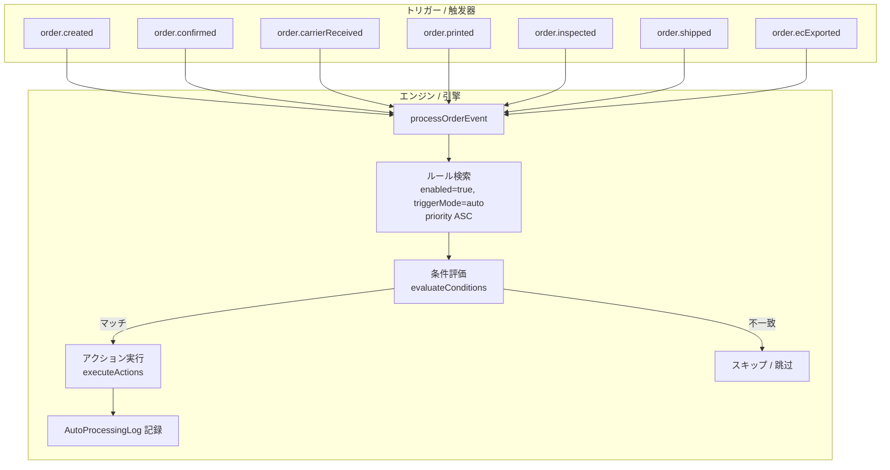
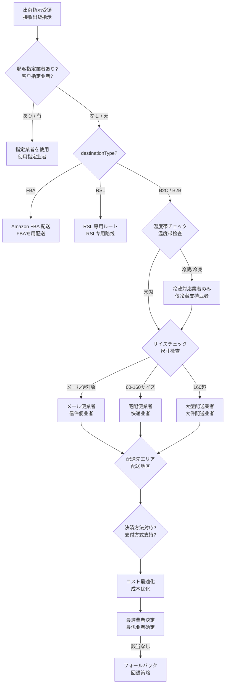
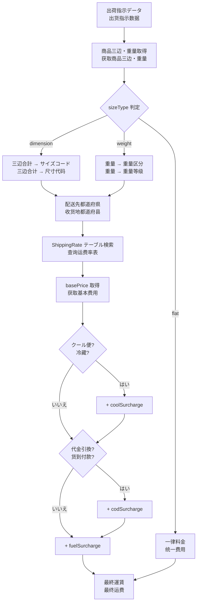
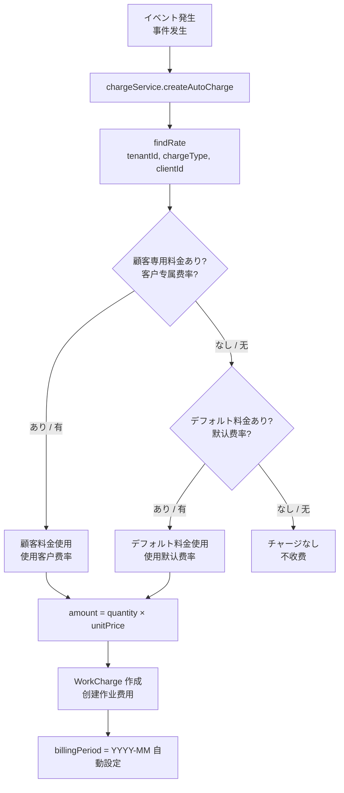
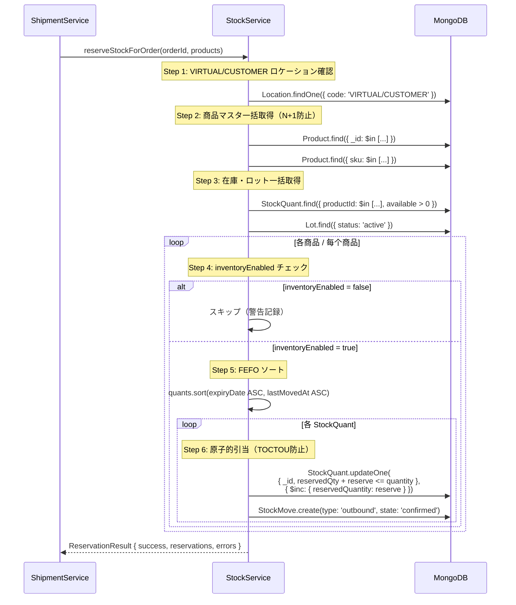
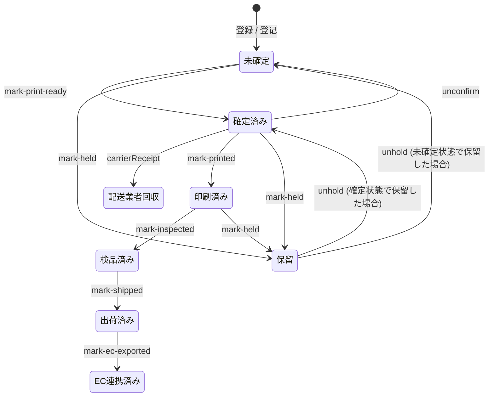
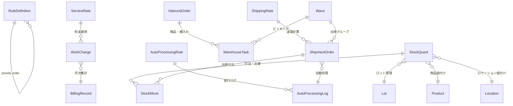

# ZELIX WMS ビジネスルールエンジン / 业务规则引擎

> 本ドキュメントは ZELIX WMS の全ビジネスルールを体系的に定義するリファレンスです。
> 本文档是 ZELIX WMS 所有业务规则的系统化定义参考。

---

## 目次 / 目录

1. [自動処理ルールエンジン / 自动处理规则引擎](#1-自動処理ルールエンジン--自动处理规则引擎)
2. [汎用ルールエンジン / 通用规则引擎](#2-汎用ルールエンジン--通用规则引擎)
3. [配送業者自動選択 / 配送业者自动选择](#3-配送業者自動選択--配送业者自动选择)
4. [運賃計算 / 运费计算](#4-運賃計算--运费计算)
5. [請求計算 / 计费计算](#5-請求計算--计费计算)
6. [在庫引当ルール / 库存预留规则](#6-在庫引当ルール--库存预留规则)
7. [入庫検品ルール / 入库检品规则](#7-入庫検品ルール--入库检品规则)
8. [ステータス遷移ルール / 状态迁移规则](#8-ステータス遷移ルール--状态迁移规则)

---

## 1. 自動処理ルールエンジン / 自动处理规则引擎

### 1.1 概要 / 概述

`AutoProcessingEngine` は出荷指示に対するイベント駆動型の自動処理エンジンです。
`AutoProcessingEngine` 是针对出货指示的事件驱动型自动处理引擎。

ドメインイベント発生時に、事前定義されたルールの条件を評価し、マッチした場合にアクションを自動実行します。
当领域事件发生时，评估预定义规则的条件，匹配时自动执行相应动作。

**ソースコード / 源代码**: `backend/src/services/autoProcessingEngine.ts`, `backend/src/models/autoProcessingRule.ts`

### 1.2 アーキテクチャ / 架构



### 1.3 ルール定義スキーマ / 规则定义模式

```typescript
interface IAutoProcessingRule {
  _id: ObjectId;
  name: string;                        // ルール名 / 规则名
  enabled: boolean;                    // 有効フラグ / 启用标志
  triggerMode: 'auto' | 'manual';      // 自動 or 手動 / 自动或手动
  allowRerun: boolean;                 // 再実行許可 / 允许重新执行
  memo?: string;                       // 備考 / 备注
  triggerEvents: TriggerEvent[];       // トリガーイベント / 触发事件
  conditions: IAutoProcessingCondition[]; // 条件リスト / 条件列表
  actions: IAutoProcessingAction[];    // アクションリスト / 动作列表
  priority: number;                    // 優先度（小が先）/ 优先级（小的先执行）
}
```

### 1.4 トリガーイベント / 触发事件

| イベント / 事件 | 発火タイミング / 触发时机 | 典型的なアクション / 典型动作 |
|---|---|---|
| `order.created` | 出荷指示新規作成時 / 出货指示新建时 | 商品追加、グループ設定 |
| `order.confirmed` | 確定処理後 / 确认处理后 | B2 バリデーション送信 |
| `order.carrierReceived` | 配送業者回收後 / 配送业者回执后 | ステータス更新 |
| `order.printed` | 送り状印刷後 / 运单打印后 | 通知送信 |
| `order.inspected` | 検品完了後 / 检品完成后 | 梱包指示 |
| `order.shipped` | 出荷完了後 / 出货完成后 | EC モール連携 |
| `order.ecExported` | EC 連携完了後 / EC 联动完成后 | 最終通知 |

### 1.5 条件タイプと演算子 / 条件类型和运算符

#### 条件タイプ / 条件类型

| タイプ / 类型 | 説明 / 说明 | 評価対象 / 评估对象 |
|---|---|---|
| `orderField` | 注文フィールド比較 / 订单字段比较 | `order.{fieldKey}` のネスト値 |
| `orderStatus` | 注文ステータス比較 / 订单状态比较 | `order.status.*` フィールド |
| `orderGroup` | 注文グループ所属 / 订单组归属 | `order.orderGroupId` |
| `carrierRawRow` | キャリアCSVの生行データ / 配送CSV原始行 | `order.carrierRawRow[column]` |
| `sourceRawRow` | ソースCSVの生行データ / 来源CSV原始行 | `order.sourceRawRows[*][column]` |

#### OrderField 演算子 / 运算符

| 演算子 / 运算符 | 対象型 / 适用类型 | 説明 / 说明 | 例 / 示例 |
|---|---|---|---|
| `is` | 文字列 | 完全一致 / 完全匹配 | `carrier is "ヤマト"` |
| `isNot` | 文字列 | 不一致 / 不匹配 | `status isNot "shipped"` |
| `contains` | 文字列 | 部分一致 / 包含 | `memo contains "急ぎ"` |
| `notContains` | 文字列 | 部分不一致 / 不包含 | `memo notContains "テスト"` |
| `hasAnyValue` | 任意 | 値あり / 有值 | `trackingId hasAnyValue` |
| `isEmpty` | 任意 | 空値 / 空值 | `trackingId isEmpty` |
| `equals` | 数値 | 数値一致 / 数值等于 | `quantity equals 1` |
| `notEquals` | 数値 | 数値不一致 / 数值不等于 | `quantity notEquals 0` |
| `lessThan` | 数値 | 未満 / 小于 | `totalPrice lessThan 1000` |
| `lessThanOrEqual` | 数値 | 以下 / 小于等于 | `weight lessThanOrEqual 25` |
| `greaterThan` | 数値 | 超過 / 大于 | `skuCount greaterThan 5` |
| `greaterThanOrEqual` | 数値 | 以上 / 大于等于 | `quantity greaterThanOrEqual 10` |
| `between` | 数値 | 範囲内 / 在范围内 | `weight between [1, 25]` |
| `before` | 日付 | 以前 / 之前 | `shipPlanDate before "2026-04-01"` |
| `after` | 日付 | 以後 / 之后 | `createdAt after "2026-03-01"` |

#### RawRow 演算子（CSV生データ用）/ 运算符（CSV原始数据用）

| 演算子 / 运算符 | 説明 / 说明 |
|---|---|
| `is` | セル値の完全一致 / 单元格完全匹配 |
| `isNot` | セル値の不一致 / 单元格不匹配 |
| `contains` | セル値の部分一致 / 单元格包含 |
| `notContains` | セル値の部分不一致 / 单元格不包含 |
| `isEmpty` | セルが空 / 单元格为空 |
| `hasAnyValue` | セルに値あり / 单元格有值 |

### 1.6 アクションタイプ / 动作类型

| アクション / 动作 | パラメータ / 参数 | 説明 / 说明 |
|---|---|---|
| `addProduct` | `productSku`, `quantity` | 注文に商品を自動追加 / 自动添加商品到订单 |
| `setOrderGroup` | `orderGroupId` | 注文グループを自動設定 / 自动设置订单组 |

**将来拡張予定 / 未来扩展计划**:
- `setCarrier` — 配送業者の自動設定 / 自动设置配送业者
- `setPriority` — 優先度の自動設定 / 自动设置优先级
- `sendNotification` — 通知の自動送信 / 自动发送通知
- `updateStatus` — ステータスの自動遷移 / 自动状态转换
- `triggerWebhook` — Webhook の自動発火 / 自动触发 Webhook

### 1.7 優先度と競合解決 / 优先级与冲突解决

```
ルール評価順序 / 规则评估顺序:
1. enabled=true, triggerMode='auto' でフィルタ
2. priority ASC でソート（小さい数値が先に評価）
3. 全ルールを順次評価（stopOnMatch=false の場合は最後まで継続）
4. 同一注文に対して同一ルールは allowRerun=false なら 1回のみ実行
```

**競合解決戦略 / 冲突解决策略**:
- 同一フィールドへの複数アクション → 後のルールが上書き / 后执行的规则覆盖
- `addProduct` は累積（同じ SKU を複数回追加可能）/ 累加（可多次添加相同SKU）
- `setOrderGroup` は最後のマッチが有効 / 最后匹配的有效

### 1.8 実行ログ / 执行日志

全てのルール実行は `AutoProcessingLog` に記録されます。
所有规则执行都记录在 `AutoProcessingLog` 中。

```typescript
{
  orderId: ObjectId;           // 対象注文 / 目标订单
  orderSystemId: string;       // 注文番号 / 订单号
  ruleId: ObjectId;            // 実行ルール / 执行的规则
  ruleName: string;            // ルール名 / 规则名
  event: TriggerEvent;         // トリガーイベント / 触发事件
  actionsExecuted: IAction[];  // 実行アクション / 已执行动作
  success: boolean;            // 成功/失敗 / 成功/失败
  error?: string;              // エラー詳細 / 错误详情
  executedAt: Date;            // 実行日時 / 执行时间
}
```

### 1.9 テストサンドボックス（ドライランモード）/ 测试沙盒（干运行模式）

`runRuleManually()` を使用してルールのテスト実行が可能です。
可以使用 `runRuleManually()` 进行规则测试执行。

```
手動実行フロー / 手动执行流程:
1. 全注文をロード
2. 各注文に対して条件を評価
3. マッチした注文にアクションを実行
4. 結果を返却: { processed, matched, executed, errors }
```

**本番環境での安全な使用 / 生产环境安全使用**:
- `triggerMode: 'manual'` のルールは自動実行されない / 不会被自动执行
- `allowRerun: false` で重複実行を防止 / 防止重复执行
- ログで全実行履歴を追跡可能 / 可通过日志追踪所有执行历史

---

## 2. 汎用ルールエンジン / 通用规则引擎

### 2.1 概要 / 概述

`RuleEngine` はモジュール横断的な汎用ルール評価エンジンです。棚入れ、ピッキング、ウェーブ、補充、
配送業者選択、注文ルーティング、梱包などの各モジュールに対応します。
`RuleEngine` 是跨模块的通用规则评估引擎。支持上架、拣货、波次、补货、配送业者选择、订单路由、打包等模块。

**ソースコード / 源代码**: `backend/src/services/ruleEngine.ts`, `backend/src/models/ruleDefinition.ts`

### 2.2 対象モジュール / 目标模块

| モジュール / 模块 | 用途 / 用途 |
|---|---|
| `putaway` | 棚入れロケーション割当 / 上架库位分配 |
| `picking` | ピッキング方法選択 / 拣货方式选择 |
| `wave` | ウェーブグループ分け / 波次分组 |
| `replenishment` | 補充トリガー / 补货触发 |
| `carrier_selection` | 配送業者自動選択 / 配送业者自动选择 |
| `order_routing` | 注文ルーティング / 订单路由 |
| `packing` | 梱包ルール / 打包规则 |
| `custom` | カスタム / 自定义 |

### 2.3 ルール定義スキーマ / 规则定义模式

```typescript
interface IRuleDefinition {
  _id: ObjectId;
  name: string;                          // ルール名 / 规则名
  description?: string;                  // 説明 / 说明
  module: RuleModule;                    // 対象モジュール / 目标模块
  warehouseId?: ObjectId;                // 対象倉庫（null=全倉庫）/ 目标仓库
  clientId?: ObjectId;                   // 対象顧客（null=全顧客）/ 目标客户
  priority: number;                      // 優先度（小が先）/ 优先级
  conditionGroups: IRuleConditionGroup[]; // 条件グループ / 条件组
  actions: IRuleAction[];                // アクション / 动作
  stopOnMatch: boolean;                  // マッチ時に評価停止 / 匹配时停止评估
  isActive: boolean;                     // 有効フラグ / 有效标志
  validFrom?: Date;                      // 有効開始日 / 生效开始日
  validTo?: Date;                        // 有効終了日 / 生效结束日
  executionCount: number;                // 累計実行回数 / 累计执行次数
  lastExecutedAt?: Date;                 // 最終実行日時 / 最后执行时间
}
```

### 2.4 条件グループの論理構造 / 条件组的逻辑结构

```
ルール評価 = 全グループが AND（全てマッチ必須）
  グループ内 = logic: 'AND' | 'OR'
    条件 = { field, operator, value }

规则评估 = 所有组 AND（全部必须匹配）
  组内 = logic: 'AND' | 'OR'
    条件 = { field, operator, value }
```

#### 条件演算子 / 条件运算符

| 演算子 / 运算符 | 説明 / 说明 | 値の型 / 值类型 |
|---|---|---|
| `eq` | 等しい / 等于 | any |
| `ne` | 等しくない / 不等于 | any |
| `gt` | より大きい / 大于 | number |
| `gte` | 以上 / 大于等于 | number |
| `lt` | より小さい / 小于 | number |
| `lte` | 以下 / 小于等于 | number |
| `in` | 含まれる / 包含在 | array |
| `not_in` | 含まれない / 不包含在 | array |
| `contains` | 文字列部分一致 / 字符串包含 | string |
| `starts_with` | 前方一致 / 前缀匹配 | string |
| `between` | 範囲内 / 范围内 | [min, max] |

### 2.5 アクションタイプ / 动作类型

| アクション / 动作 | パラメータ例 / 参数示例 | 説明 / 说明 |
|---|---|---|
| `assign_zone` | `{ zoneId: "Z-001" }` | 棚入れゾーン割当 / 分配上架区域 |
| `assign_location` | `{ locationCode: "A-01-02" }` | 特定ロケーション割当 / 分配特定库位 |
| `set_priority` | `{ priority: "high" }` | 優先度設定 / 设置优先级 |
| `set_carrier` | `{ carrierId: "yamato" }` | 配送業者設定 / 设置配送业者 |
| `set_wave_group` | `{ groupKey: "express" }` | ウェーブグループ設定 / 设置波次组 |
| `set_pick_method` | `{ method: "batch" }` | ピッキング方法設定 / 设置拣货方式 |
| `trigger_replenishment` | `{ threshold: 10 }` | 補充トリガー / 触发补货 |
| `notify` | `{ channel: "slack", msg: "..." }` | 通知送信 / 发送通知 |
| `custom` | `{ handler: "customFn" }` | カスタム処理 / 自定义处理 |

### 2.6 スコーピングと優先度 / 作用域与优先级

```
ルール検索の優先度 / 规则搜索优先级:
1. warehouseId + clientId 指定ルール（最も特定的）
   指定仓库+客户的规则（最具体）
2. warehouseId 指定ルール（warehouseId=null のルールも含む）
   指定仓库的规则（包括 warehouseId=null 的规则）
3. clientId 指定ルール（clientId=null のルールも含む）
   指定客户的规则（包括 clientId=null 的规则）
4. priority ASC でソート
   按 priority 升序排序
5. stopOnMatch=true のルールがマッチしたら後続評価停止
   stopOnMatch=true 的规则匹配后停止后续评估
```

---

## 3. 配送業者自動選択 / 配送业者自动选择

### 3.1 選択基準マトリクス / 选择标准矩阵

| 基準 / 标准 | フィールド / 字段 | 説明 / 说明 |
|---|---|---|
| サイズ/重量 / 尺寸/重量 | `product.weight`, 商品三辺合計 | 各業者のサイズ上限と照合 / 与各业者尺寸上限核对 |
| 配送先エリア / 配送地区 | `recipient.prefecture` | 業者のカバーエリアと照合 / 与业者覆盖区域核对 |
| 温度帯 / 温度带 | `coolType`: `0`(常温), `1`(冷蔵), `2`(冷凍) | 業者の温度帯対応 / 业者温度带支持 |
| 決済方法 / 支付方式 | `invoiceType`: 着払い/代引き/発払い | 業者の決済対応 / 业者支付方式支持 |
| コスト最適化 / 成本优化 | 地域×サイズの料金表 | 最安値の業者を選択 / 选择最便宜的业者 |
| 顧客指定 / 客户指定 | `client.preferredCarrier` | 顧客設定のオーバーライド / 客户设置覆盖 |
| 出荷先タイプ / 目的地类型 | `destinationType`: B2C/B2B/FBA/RSL | FBA/RSL は専用ルート / FBA/RSL 使用专用路径 |

### 3.2 決定木 / 决策树



### 3.3 サイズコード計算 / 尺寸代码计算

```
三辺合計 = 長さ(L) + 幅(W) + 高さ(H)  [cm]
三边合计 = 长(L) + 宽(W) + 高(H) [cm]

サイズコードマッピング / 尺寸代码映射:
  ≤ 60cm  → 60サイズ
  ≤ 80cm  → 80サイズ
  ≤ 100cm → 100サイズ
  ≤ 120cm → 120サイズ
  ≤ 140cm → 140サイズ
  ≤ 160cm → 160サイズ
  ≤ 170cm → 170サイズ（ヤマト大型）
  ≤ 200cm → 200サイズ（特大）
```

### 3.4 フォールバック戦略 / 回退策略

条件にマッチする業者がない場合の処理:
当无业者满足条件时的处理：

1. **デフォルト業者適用** — テナント設定の `defaultCarrierId` を使用
   使用租户设置的默认配送业者
2. **手動割当待ち** — `carrier: null` のままキューに入れ、アラート通知
   保持无配送业者状态放入队列，发送告警
3. **エスカレーション** — 管理者通知メール/Slack を自動送信
   自动发送管理员通知邮件/Slack

---

## 4. 運賃計算 / 运费计算

### 4.1 料金テーブル構造 / 费率表结构

**ソースコード / 源代码**: `backend/src/models/shippingRate.ts`

```typescript
interface IShippingRate {
  tenantId: string;             // テナントID / 租户ID
  carrierId: string;            // 配送業者ID / 配送业者ID
  carrierName?: string;         // 配送業者名 / 配送业者名
  name: string;                 // プラン名 / 方案名

  // サイズ条件 / 尺寸条件
  sizeType: 'weight' | 'dimension' | 'flat';
  sizeMin?: number;             // 最小値 / 最小值
  sizeMax?: number;             // 最大値 / 最大值

  // 地区条件 / 地区条件
  fromPrefectures?: string[];   // 発送元都道府県 / 发货地都道府县
  toPrefectures?: string[];     // 配送先都道府県 / 收货地都道府县

  // 料金 / 费用
  basePrice: number;            // 基本料金 / 基本费用 (JPY)
  coolSurcharge: number;        // クール便追加料金 / 冷藏附加费
  codSurcharge: number;         // 代金引換手数料 / 货到付款手续费
  fuelSurcharge: number;        // 燃油サーチャージ / 燃油附加费

  // 有効期間 / 有效期间
  validFrom?: Date;
  validTo?: Date;
  isActive: boolean;
}
```

### 4.2 運賃計算フロー / 运费计算流程



### 4.3 郵便番号 → ゾーンマッピング / 邮编 → 区域映射

```
日本の都道府県は47。配送業者ごとにゾーン分けが異なる。
日本有47个都道府县。每个配送业者的区域划分不同。

ヤマト運輸ゾーン例 / 大和运输区域示例:
  関東発 → 関東着: ゾーン A（最安）
  関東発 → 東海着: ゾーン B
  関東発 → 関西着: ゾーン C
  関東発 → 北海道/沖縄着: ゾーン D（最高）

ShippingRate.fromPrefectures × toPrefectures で定義
通过 fromPrefectures × toPrefectures 定义
```

### 4.4 追加料金 / 附加费

| 種別 / 类型 | 条件 / 条件 | 計算方法 / 计算方式 |
|---|---|---|
| クール便 / 冷藏 | `coolType = 1 or 2` | `+ coolSurcharge` (固定額) |
| 時間指定配送 / 定时配送 | `deliveryTimeSlot` 指定あり | 業者ごとの加算 (通常 0-330 JPY) |
| 代金引換 / 货到付款 | `invoiceType = 代引き` | `+ codSurcharge` (固定額) |
| 燃油サーチャージ / 燃油附加费 | 全件 | `+ fuelSurcharge` (固定額) |
| 離島料金 / 离岛附加费 | 郵便番号リストで判定 | 業者ごとの離島加算 (500-2000 JPY) |

### 4.5 ボリュームディスカウント / 量折

`ServiceRate.conditions.minQuantity` / `maxQuantity` で段階的な料金を設定可能。
可通过 `ServiceRate.conditions.minQuantity` / `maxQuantity` 设置阶梯费率。

```
例 / 示例:
  月間 1-100件:   900 JPY/件
  月間 101-500件: 850 JPY/件
  月間 501件以上:  780 JPY/件
```

### 4.6 通貨 / 货币

全ての金額は **日本円（JPY）** のみ。小数点なし（整数）。
所有金额仅使用**日元（JPY）**。无小数（整数）。

---

## 5. 請求計算 / 计费计算

### 5.1 月次請求サイクル / 月度计费周期

**ソースコード / 源代码**: `backend/src/services/chargeService.ts`

```
請求期間: 毎月1日 → 月末日
计费期间: 每月1日 → 月末日

billingPeriod 形式: "YYYY-MM" (例: "2026-03")
```

### 5.2 チャージタイプ一覧 / 费用类型一览

| カテゴリ / 类别 | chargeType | 単位 / 单位 | 説明 / 说明 |
|---|---|---|---|
| **入庫系 / 入库系** | `inbound_handling` | per_item | 入庫作業料 / 入库作业费 |
| **保管系 / 仓储系** | `storage` | per_location_day | 保管料（ロケーション×日）/ 仓储费（库位x天） |
| | `overdue_storage` | per_location_day | 長期保管追加料 / 超期仓储附加费 |
| **出庫系 / 出库系** | `outbound_handling` | per_order | 出荷作業料 / 出货作业费 |
| | `picking` | per_item | ピッキング料 / 拣货费 |
| | `packing` | per_order | 梱包料 / 打包费 |
| | `inspection` | per_item | 検品料 / 检品费 |
| **配送系 / 配送系** | `shipping` | per_order | 配送料 / 配送费 |
| | `fba_delivery` | per_order | FBA 配送料 / FBA配送费 |
| **返品系 / 退货系** | `return_handling` | per_item | 返品処理料 / 退货处理费 |
| **付帯作業 / 增值服务** | `labeling` | per_sheet | ラベル貼付 / 贴标 |
| | `opp_bagging` | per_item | OPP 袋入れ / 套OPP袋 |
| | `suffocation_label` | per_sheet | 窒息防止ラベル / 防窒息标签 |
| | `fragile_label` | per_sheet | 壊れ物ラベル / 易碎标签 |
| | `bubble_wrap` | per_item | 緩衝梱包 / 气泡膜包装 |
| | `set_assembly` | per_set | セット組み / 组合套装 |
| | `box_splitting` | per_case | 分箱 / 分箱 |
| | `box_merging` | per_case | 合箱 / 合箱 |
| | `box_replacement` | per_case | 箱替え / 换箱 |
| | `photo_documentation` | per_item | 撮影記録 / 拍照留档 |
| | `rush_processing` | per_order | 特急対応 / 加急处理 |
| | `multi_fc_surcharge` | per_order | 複数FC追加 / 多仓附加费 |
| **材料費 / 材料费** | `material` | per_item | 梱包材料費 / 包装材料费 |
| **その他 / 其他** | `other` | flat | その他 / 其他 |

### 5.3 料金マスタと検索ロジック / 费率主数据与查找逻辑



### 5.4 保管料自動計算 / 仓储费自动计算

`calculateDailyStorageFees()` — BullMQ スケジュールジョブで日次実行。
通过 BullMQ 定时任务每日执行。

```
計算ロジック / 计算逻辑:
1. StockQuant から顧客別のロケーション占有数を集計
   从 StockQuant 按客户汇总库位占用数
   → aggregate: quantity > 0, $addToSet locationId, $size
2. 各顧客の storage 料金を ServiceRate から取得
   从 ServiceRate 获取各客户的仓储费率
   → clientId 指定料金 > デフォルト料金 のフォールバック
3. amount = locationCount × unitPrice (JPY/location/day)
4. WorkCharge レコード作成（isBilled: false）
   创建 WorkCharge 记录
```

### 5.5 月次請求書生成 / 月度账单生成

`generateMonthlyBilling()` の処理フロー:
`generateMonthlyBilling()` 的处理流程：

```mermaid
flowchart TD
    A[月次バッチ実行<br>月度批处理执行] --> B[WorkCharge 集計<br>汇总作业费用]
    B --> C[顧客別グルーピング<br>按客户分组]

    C --> D[カテゴリ別金額集計<br>按类别汇总金额]
    D --> D1[handlingFee = 入庫+出庫+ピック+パック+返品+ラベル+検品]
    D --> D2[storageFee = storage + overdue_storage]
    D --> D3[shippingCost = shipping + fba_delivery]
    D --> D4[otherFees = 上記以外全て / 其他所有]

    D1 & D2 & D3 & D4 --> E[BillingRecord upsert]
    E --> F[WorkCharge.isBilled = true]
    F --> G[請求書(draft)完成<br>账单（草稿）完成]
```

### 5.6 BillingRecord 構造 / 账单记录结构

```
{
  tenantId, period, clientId, clientName,
  orderCount,              // 対象注文数 / 目标订单数
  totalQuantity,           // 総数量 / 总数量
  totalShippingCost,       // 配送料合計 / 配送费合计
  handlingFee,             // 作業料合計 / 作业费合计
  storageFee,              // 保管料合計 / 仓储费合计
  otherFees,               // その他合計 / 其他合计
  totalAmount,             // 請求総額 / 账单总额
  status: 'draft'          // draft → confirmed → paid
}
```

### 5.7 請求書ワークフロー / 账单工作流

```
draft → confirmed → paid
  ↓        ↓
  └→ cancelled (どの段階からでも)
                (从任何阶段都可以)
```

---

## 6. 在庫引当ルール / 库存预留规则

### 6.1 引当戦略 / 预留策略

**ソースコード / 源代码**: `backend/src/services/stockService.ts`, `backend/src/models/systemSettings.ts`

システム設定 `outboundAllocationRule` で引当戦略を選択可能:
通过系统设置 `outboundAllocationRule` 选择预留策略：

| 戦略 / 策略 | 対象 / 适用场景 | ソートロジック / 排序逻辑 |
|---|---|---|
| **FEFO** (デフォルト) | 食品・化粧品・賞味期限のある商品 / 有保质期的商品 | `expiryDate ASC` → `lastMovedAt ASC` |
| **FIFO** | 一般商品 / 一般商品 | `lastMovedAt ASC`（入庫日が古い順）/ 按入库日期升序 |
| **LIFO** | 顧客指定 / 客户指定 | `lastMovedAt DESC`（入庫日が新しい順）/ 按入库日期降序 |

### 6.2 FEFO 引当の詳細ロジック / FEFO 预留详细逻辑

現在の実装は FEFO を採用。以下の優先順でソート:
当前实现采用 FEFO。按以下优先级排序：

```
ソート順序 / 排序顺序:
1. lotId あり + non-active ロット → 末尾に移動（引当スキップ）
   有 lotId + 非活跃批次 → 移到末尾（跳过预留）
2. 賞味期限あり同士 → expiryDate ASC（期限が近い順）
   都有保质期 → 按到期日升序（近期优先）
3. 賞味期限あり vs なし → 期限ありが先
   有保质期 vs 无保质期 → 有保质期优先
4. 賞味期限なし同士 → lastMovedAt ASC（古い順）
   都无保质期 → 按最后移动时间升序（旧的优先）
```

### 6.3 引当フロー / 预留流程



### 6.4 部分引当 / 部分预留

在庫不足の場合の処理:
库存不足时的处理：

```
ポリシー / 策略:
- 在庫不足でも引当処理は続行（エラーで止めない）
  库存不足也继续执行预留处理（不因错误停止）
- 利用可能な在庫を可能な限り引当
  尽可能多地预留可用库存
- 不足分は errors 配列に記録（例: "SKU-001: 在庫不足（5個不足）"）
  不足部分记录在 errors 数组中
- 出荷は続行可能（管理者が判断）
  出货可继续（由管理者判断）
```

### 6.5 引当ロックと自動解放 / 预留锁定与自动释放

```
引当ロック / 预留锁定:
- StockQuant.reservedQuantity に加算
  在 StockQuant.reservedQuantity 上累加
- 原子的更新: $expr ガード（reservedQty + reserve <= quantity）
  原子更新: 使用 $expr 防护条件

引当解放 / 预留释放:
- unreserveStockForOrder(orderId)
  释放特定订单的所有预留
- StockMove state: 'confirmed' → 'cancelled'
  库存移动状态变更
- StockQuant.reservedQuantity -= quantity
  预留数量减少

出荷完了 / 出货完成:
- completeStockForOrder(orderId)
  完成特定订单的出货
- StockQuant.quantity -= move.quantity
  实际库存减少
- StockQuant.reservedQuantity -= move.quantity
  预留数量减少
- StockMove state: 'confirmed' → 'done'
  库存移动状态变更
```

### 6.6 将来拡張: 予約ホールドタイマー / 未来扩展: 预留保持计时器

```
計画中の仕様 / 计划中的规格:
- 引当後30分以内に出荷確定しない場合、自動解放
  预留后30分钟内未确认出货则自动释放
- BullMQ delayed job で実装予定
  计划通过 BullMQ delayed job 实现
- systemSettings.reservationHoldMinutes で設定可能
  可通过 systemSettings.reservationHoldMinutes 配置
```

---

## 7. 入庫検品ルール / 入库检品规则

### 7.1 6次元検品 / 6维度检品

**ソースコード / 源代码**: `docs/design/01-business-flow.md` 参照 / 参考

| # | チェック項目 / 检查项 | フィールド / 字段 | 合格条件 / 合格条件 | 不合格時処理 / 不合格时处理 |
|---|---|---|---|---|
| 1 | **SKU 照合** / SKU核对 | `skuMatch` | バーコードスキャンで予定 SKU と一致 / 条码扫描与预定SKU匹配 | 誤品報告 → 差異記録 / 错品报告 |
| 2 | **数量照合** / 数量核对 | `quantityMatch` | 実数量 = 予定数量 / 实际数量 = 预定数量 | 過不足記録 → `receivedQuantity` 記録 |
| 3 | **外観チェック** / 外观检查 | `appearanceOk` | 破損・汚れなし / 无损坏・污渍 | ダメージ報告 → disposition 判定 |
| 4 | **付属品チェック** / 附件检查 | `accessoriesOk` | 付属品完備 / 附件齐全 | 不足品報告 → 荷主連絡 |
| 5 | **梱包状態** / 包装状态 | `packagingOk` | 梱包適切 / 包装合格 | 再梱包指示 or 報告 |
| 6 | **賞味期限** / 保质期 | `expiryDate` | 期限記録（ロット管理対象の場合）/ 记录保质期 | Lot レコード作成 → `expiryAlertDays` チェック |

### 7.2 検品例外処理 / 检品异常处理

| 例外タイプ / 异常类型 | 検知方法 / 检测方式 | 処理フロー / 处理流程 |
|---|---|---|
| **不足（Shortage）** | receivedQty < expectedQty | 差異記録 → 荷主通知 → 入庫数量で在庫反映 |
| **過剰（Overage）** | receivedQty > expectedQty | 差異記録 → 荷主確認待ち → 確認後に在庫反映 |
| **破損（Damage）** | appearanceOk = false | ダメージ報告書作成 → disposition: dispose/repair/pending |
| **誤品（Wrong Item）** | skuMatch = false | 受入拒否 → 荷主連絡 → 返送 or 別ロケーション保管 |

### 7.3 SLA レベル / SLA 等级

検品の SLA は注文のアイテム数に基づいて分類:
检品SLA按订单商品数分类：

| レベル / 等级 | アイテム数 / 商品数 | 目標時間 / 目标时间 | 検品深度 / 检品深度 |
|---|---|---|---|
| **A** | 1-3 | 5分/注文 | 全項目チェック / 全项检查 |
| **B** | 4-10 | 15分/注文 | 全項目チェック / 全项检查 |
| **C** | 11+ | 30分/注文 | 抜き取り検品可 / 可抽检 |

### 7.4 クロスドック自動棚入れ / 交叉转运自动上架

```
条件 / 条件:
- 入庫予定に紐づく出荷指示が既にある場合
  入库预定已关联出货指示时
- systemSettings.inboundAutoCreateLot = true
  系统设置启用自动创建批次

処理 / 处理:
1. 検品完了 → 棚入れスキップ
   检品完成 → 跳过上架
2. 直接在庫引当 → ピッキングステージへ
   直接库存预留 → 进入拣货阶段
3. order.status: 'received' → 'done'（棚入れフェーズを省略）
   订单状态跳过上架阶段
```

### 7.5 システム設定による制御 / 通过系统设置控制

| 設定 / 设置 | デフォルト / 默认 | 説明 / 说明 |
|---|---|---|
| `inboundRequireInspection` | `true` | 検品必須フラグ / 检品必需标志 |
| `inboundAutoCreateLot` | `false` | ロット自動作成 / 自动创建批次 |
| `inboundDefaultLocationCode` | `""` | デフォルト棚入れ先 / 默认上架库位 |
| `inventoryLotTrackingEnabled` | `true` | ロット追跡有効化 / 启用批次追踪 |
| `inventoryExpiryAlertDays` | `30` | 賞味期限アラート日数 / 保质期预警天数 |

---

## 8. ステータス遷移ルール / 状态迁移规则

### 8.1 出荷指示ステータス / 出货指示状态

#### ステータスフィールド構造 / 状态字段结构

出荷指示は複合ステータスモデルを採用（各フラグが独立）:
出货指示采用复合状态模型（各标志独立）：

```typescript
status: {
  confirm:        { isConfirmed: boolean, confirmedAt?: Date },
  carrierReceipt: { isReceived: boolean,  receivedAt?: Date },
  printed:        { isPrinted: boolean,   printedAt?: Date },
  inspected:      { isInspected: boolean, inspectedAt?: Date },
  shipped:        { isShipped: boolean,   shippedAt?: Date },
  ecExported:     { isExported: boolean,  exportedAt?: Date },
  held:           { isHeld: boolean,      heldAt?: Date },
}
```

#### ステータスアクションと遷移 / 状态动作与迁移

| アクション / 动作 | 操作 / 操作 | ガード条件 / 保护条件 | 副作用 / 副作用 |
|---|---|---|---|
| `mark-print-ready` | `confirm.isConfirmed = true` | なし / 无 | `order.confirmed` イベント発火 |
| `mark-printed` | `printed.isPrinted = true` | `confirm.isConfirmed = true` 推奨 | `order.printed` イベント発火 |
| `mark-shipped` | `shipped.isShipped = true` | `trackingNumber` 存在推奨 | `completeStockForOrder()`, `order.shipped` イベント発火, 自動チャージ生成 |
| `mark-ec-exported` | `ecExported.isExported = true` | なし / 无 | `order.ecExported` イベント発火 |
| `mark-inspected` | `inspected.isInspected = true` | なし / 无 | `order.inspected` イベント発火 |
| `mark-held` | `held.isHeld = true` | なし / 无 | 全操作ブロック（出荷停止）/ 阻止所有操作 |
| `unhold` | `held.isHeld = false` | なし / 无 | 操作再開 / 恢复操作 |
| `unconfirm` | `confirm.isConfirmed = false` | `shipped.isShipped = false` | ロールバック / 回滚 |

#### 遷移図 / 迁移图



### 8.2 入庫ステータス / 入库状态

| 遷移 / 迁移 | ガード条件 / 保护条件 | 副作用 / 副作用 |
|---|---|---|
| `draft → confirmed` | ライン数 > 0 | なし / 无 |
| `confirmed → receiving` | なし / 无 | WarehouseTask (type: receiving) 作成 |
| `receiving → received` | 全ライン検品完了 / 全行检品完成 | StockQuant 更新, InventoryLedger 記帳, INBOUND_RECEIVED イベント |
| `received → putaway` | なし / 无 | WarehouseTask (type: putaway) 作成, RuleEngine で棚入れ先提案 |
| `putaway → done` | 全棚入れタスク完了 / 全上架任务完成 | StockQuant 最終更新, 入庫チャージ生成 |
| `draft → cancelled` | なし / 无 | なし / 无 |
| `confirmed → cancelled` | receiving 前のみ / 仅检品前 | なし / 无 |

### 8.3 返品ステータス / 退货状态

| 遷移 / 迁移 | ガード条件 / 保护条件 | 副作用 / 副作用 |
|---|---|---|
| `draft → inspecting` | なし / 无 | 検品タスク開始 / 开始检品任务 |
| `inspecting → completed` | 全ライン disposition 設定済み | `restock` → StockQuant.quantity += n, `dispose` → 廃棄記録, 返品チャージ生成 |
| `draft → cancelled` | なし / 无 | なし / 无 |
| `inspecting → cancelled` | なし / 无 | 検品中のデータ破棄 / 丢弃检品中数据 |

### 8.4 ウェーブステータス / 波次状态

| 遷移 / 迁移 | ガード条件 / 保护条件 | 副作用 / 副作用 |
|---|---|---|
| `draft → picking` | 出荷指示が1件以上 | reserveStockForOrder(), WarehouseTask (type: picking) 作成 |
| `picking → sorting` | 全ピッキングタスク完了 | 仕分けタスク作成 / 创建分拣任务 |
| `sorting → packing` | 全仕分けタスク完了 | 梱包タスク作成 / 创建打包任务 |
| `packing → shipped` | 全梱包タスク完了 | completeStockForOrder(), 出荷チャージ生成 |
| `draft → cancelled` | なし / 无 | なし / 无 |
| `picking → cancelled` | なし / 无 | unreserveStockForOrder() |

### 8.5 棚卸ステータス / 盘点状态

| 遷移 / 迁移 | ガード条件 / 保護条件 | 副作用 / 副作用 |
|---|---|---|
| `draft → counting` | カウント対象 SKU > 0 | なし / 无 |
| `counting → reviewing` | 全 SKU カウント入力済み | 差異計算, 差異率 > 0.5% でアラート |
| `reviewing → completed` | 管理者承認 | StockQuant.quantity = count, StockMove (adjustment) 作成 |
| `draft → cancelled` | なし / 无 | なし / 无 |

### 8.6 ロールバックルール / 回滚规则

出荷指示のロールバックが発生した場合の処理:
出货指示发生回滚时的处理：

| ロールバック操作 / 回滚操作 | 必須処理 / 必需处理 |
|---|---|
| 出荷取消（shipped → unshipped） | `unreserveStockForOrder()` で在庫引当を解放, StockMove state → cancelled |
| 確定取消（confirmed → draft） | B2 Cloud 送信済みの場合は追跡番号をクリア |
| 保留（any → held） | 全操作を一時停止（出荷不可）/ 暂停所有操作 |
| 保留解除（held → previous） | 保留前のステータスに復帰 / 恢复保留前状态 |

### 8.7 保護フィールド / 受保护字段

以下のフィールドは更新操作で変更不可:
以下字段在更新操作中不可修改：

```typescript
// 単件更新時 / 单条更新时
const PROTECTED_FIELDS_UPDATE = [
  '_id', 'orderNumber', 'createdAt', 'tenantId',
  'status', 'sourceRawRows', 'carrierRawRow'
];

// 一括更新時 / 批量更新时
const PROTECTED_FIELDS_BULK_UPDATE = [
  '_id', 'orderNumber', 'createdAt', 'tenantId',
  'sourceRawRows', 'carrierRawRow'
];
```

---

## 付録A: ルールエンジン比較表 / 附录A: 规则引擎对比表

| 特性 / 特性 | AutoProcessingEngine | RuleEngine (汎用) |
|---|---|---|
| **対象** | 出荷指示のみ / 仅出货指示 | 全モジュール / 所有模块 |
| **トリガー** | ドメインイベント / 领域事件 | API 呼び出し / API调用 |
| **条件構造** | フラットリスト (AND) | ネストグループ (AND/OR) |
| **演算子数** | 15種 | 11種 |
| **アクション** | addProduct, setOrderGroup | 9種（assign_zone, set_carrier 等） |
| **スコーピング** | テナントレベル | テナント + 倉庫 + 顧客 |
| **有効期間** | なし | validFrom / validTo |
| **停止制御** | 全ルール評価 | stopOnMatch 対応 |
| **実行記録** | AutoProcessingLog | executionCount + lastExecutedAt |
| **再実行制御** | allowRerun フラグ | なし（常に評価）|

---

## 付録B: データモデル関連図 / 附录B: 数据模型关系图



---

## 付録C: 設定一覧 / 附录C: 配置一览

### SystemSettings（全体設定 / 全局设置）

| キー / 键 | 型 / 类型 | デフォルト / 默认 | 影響範囲 / 影响范围 |
|---|---|---|---|
| `inboundRequireInspection` | boolean | `true` | 入庫検品の必須/任意 |
| `inboundAutoCreateLot` | boolean | `false` | ロット自動作成 |
| `inboundDefaultLocationCode` | string | `""` | デフォルト棚入れ先 |
| `inventoryAllowNegativeStock` | boolean | `false` | マイナス在庫許可 |
| `inventoryDefaultSafetyStock` | number | `0` | 安全在庫数 |
| `inventoryLotTrackingEnabled` | boolean | `true` | ロット追跡有効化 |
| `inventoryExpiryAlertDays` | number | `30` | 賞味期限アラート日数 |
| `outboundAutoAllocate` | boolean | — | 自動引当有効化 |
| `outboundAllocationRule` | enum | `'FEFO'` | 引当戦略 (FIFO/FEFO/LIFO) |
| `outboundRequireInspection` | boolean | — | 出荷検品の必須/任意 |

---

> **最終更新 / 最后更新**: 2026-03-21
> **対象コードベース / 目标代码库**: `backend/src/services/`, `backend/src/models/`
> **関連ドキュメント / 相关文档**:
> - `docs/design/01-business-flow.md` — 業務フロー詳細 / 业务流程详解
> - `docs/migration/03-backend-architecture.md` — バックエンドアーキテクチャ / 后端架构
> - `docs/migration/02-database-design.md` — データベース設計 / 数据库设计
```
