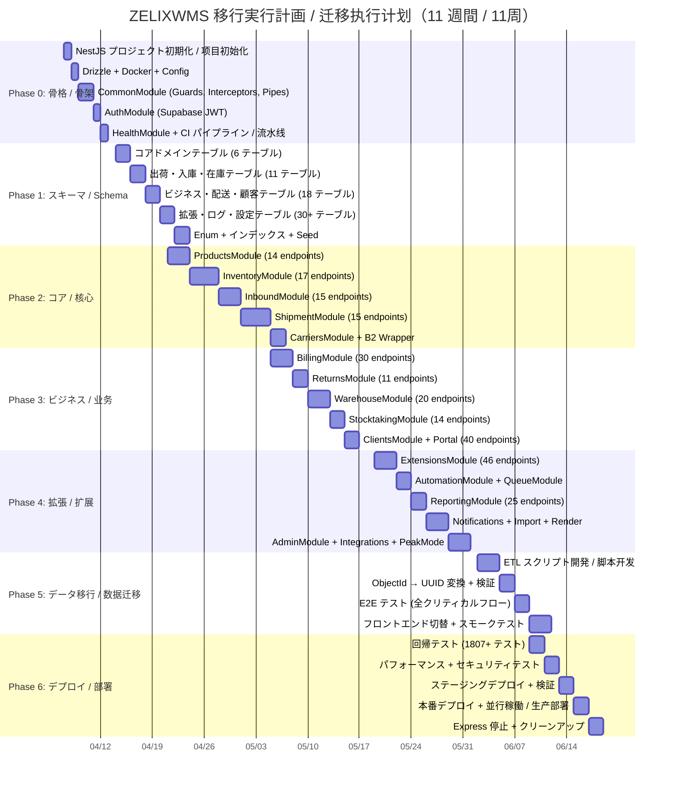

# 16 - 移行実行計画 / 迁移执行计划

> Express.js + MongoDB → NestJS 11 + PostgreSQL 16 (Supabase) 段階的移行の詳細実行計画
> Express.js + MongoDB → NestJS 11 + PostgreSQL 16 (Supabase) 分阶段迁移详细执行计划
>
> 関連ドキュメント / 关联文档:
> - [06-migration-plan.md](../migration/06-migration-plan.md) — 移行計画（概要）/ 迁移计划（概要）
> - [02-database-design.md](../migration/02-database-design.md) — DB 設計 / 数据库设计
> - [03-backend-architecture.md](../migration/03-backend-architecture.md) — NestJS アーキテクチャ / NestJS 架构
> - [10-deployment-topology.md](10-deployment-topology.md) — デプロイトポロジー / 部署拓扑
>
> 最終更新 / 最后更新: 2026-03-21

---

## 目次 / 目录

1. [エグゼクティブサマリー / 执行摘要](#1-エグゼクティブサマリー--执行摘要)
2. [ガントチャート / 甘特图](#2-ガントチャート--甘特图)
3. [週次タスク内訳 / 每周任务明细](#3-週次タスク内訳--每周任务明细)
4. [Phase 検証マトリクス / Phase 验证矩阵](#4-phase-検証マトリクス--phase-验证矩阵)
5. [ロールバックプレイブック / 回滚手册](#5-ロールバックプレイブック--回滚手册)
6. [並行稼働戦略 / 并行运行策略](#6-並行稼働戦略--并行运行策略)
7. [リスクレジスター / 风险登记册](#7-リスクレジスター--风险登记册)
8. [コミュニケーション計画 / 沟通计划](#8-コミュニケーション計画--沟通计划)
9. [完了定義 / 完成定义](#9-完了定義--完成定义)

---

## 1. エグゼクティブサマリー / 执行摘要

### 1.1 概要 / 概述

| 項目 / 项目 | 値 / 值 |
|---|---|
| 期間 / 期间 | **11 週間**（Week 1 〜 Week 11） |
| 総工数 / 总工时 | **340 時間** |
| Phase 数 / Phase 数 | **7 Phase**（Phase 0 〜 Phase 6） |
| 移行対象エンドポイント / 迁移目标端点 | **492 API エンドポイント** |
| 移行対象テーブル / 迁移目标表 | **65+ PostgreSQL テーブル**（MongoDB 78 モデルから） |
| 画面維持 / 画面维护 | **109 画面**（frontend 247 + admin 9 + portal 12 コンポーネント） |
| 既存テスト / 现有测试 | **1807+ テストケース**（互換性維持必須） |
| 並行稼働 / 并行运行 | Express `:4000` + NestJS `:4100` 並行稼働方式 |

### 1.2 Phase 概要 / Phase 概述

| Phase | 週 / 周 | 内容 / 内容 | 工数 / 工时 | 累積完了率 / 累计完成率 |
|-------|--------|------------|------------|----------------------|
| 0 | Week 1 | NestJS 骨格 + Drizzle + 認証 + Health | 40h | 12% |
| 1 | Week 2-3 | 全 65+ Drizzle スキーマ + マイグレーション + Seed | 40h | 24% |
| 2 | Week 3-5 | コア: Products, Inventory, Inbound, Shipment, Carriers | 80h | 47% |
| 3 | Week 5-7 | ビジネス: Billing, Returns, Warehouse, Stocktaking, Clients | 60h | 65% |
| 4 | Week 7-9 | 拡張: Extensions, Automation, Reporting, Import, Render | 50h | 79% |
| 5 | Week 9-10 | データ移行 ETL + E2E + フロントエンド切替 | 40h | 91% |
| 6 | Week 10-11 | 回帰テスト + パフォーマンス + セキュリティ + デプロイ | 30h | 100% |

### 1.3 主要制約 / 主要约束

- **B2 Cloud 変更禁止 / B2 Cloud 禁止变更**: `yamatoB2Service.ts` のコアロジックは wrapper で囲むのみ
- **フロントエンド最小変更 / 前端最小变更**: `VITE_API_URL` の切替のみ、Vue 3 コード変更なし
- **API 後方互換 / API 向后兼容**: 全 492 エンドポイントのパス・レスポンス形式を維持
- **ダウンタイムゼロ / 零停机**: 並行稼働方式で段階的切替

---

## 2. ガントチャート / 甘特图



---

## 3. 週次タスク内訳 / 每周任务明细

### Week 1 — Phase 0: NestJS 骨格構築 / NestJS 骨架构建（40h）

| 日 / 日 | タスク / 任务 | 工数 / 工时 | 成果物 / 交付物 |
|---------|-------------|------------|----------------|
| Mon | NestJS プロジェクト初期化 (pnpm, strict TypeScript) | 2h | `backend-nest/` ディレクトリ |
| Mon | Drizzle ORM セットアップ + `drizzle.config.ts` | 2h | `database.module.ts` |
| Tue | 環境変数管理 (@nestjs/config + Zod バリデーション) | 2h | `config/env.ts` |
| Tue | Docker Compose 更新 (PostgreSQL 16 + Redis 追加) | 2h | `docker-compose.yml` |
| Wed | GlobalModule: `ValidationPipe` (Zod), `TransformInterceptor` (_id 互換) | 4h | `common/pipes/`, `common/interceptors/` |
| Thu | `HttpExceptionFilter` (統一エラーレスポンス形式) | 2h | `common/filters/` |
| Thu | `AuthGuard` (Supabase JWT 検証 + テナント抽出) | 4h | `auth.guard.ts` |
| Fri | `TenantGuard` + `@TenantId()` デコレータ + `RolesGuard` + `@RequireRole()` | 6h | `tenant.guard.ts`, `role.guard.ts` |
| Fri | AuthModule (login, register, me, logout) | 4h | `auth/` |
| Fri | HealthModule (NestJS Terminus: DB, Redis, Memory) | 2h | `health/` |
| Sat | 基本テスト (Auth + Health + Guards) | 4h | `test/` |
| Sat | CI パイプライン設定 (GitHub Actions: lint + test + build) | 4h | `.github/workflows/` |
| — | **Phase 0 バッファ / 缓冲** | 2h | — |

**Week 1 完了条件 / 完成条件:**
- `pnpm start:dev` でアプリが `:4100` で起動する / 应用在 :4100 启动
- `GET /health` が `{ status: 'ok', db: 'up', redis: 'up' }` を返す
- `POST /api/auth/login` で JWT トークン取得可能
- CI パイプラインが green / CI 流水线绿色

---

### Week 2 — Phase 1 前半: コア・出荷・入庫スキーマ / 核心 + 出入库 Schema（20h）

| 日 / 日 | タスク / 任务 | テーブル数 / 表数 | 工数 / 工时 |
|---------|-------------|-----------------|------------|
| Mon | `tenants`, `users`, `warehouses`, `locations`, `products`, `product_sub_skus` | 6 | 6h |
| Tue | `shipment_orders`, `shipment_order_products`, `shipment_order_materials` | 3 | 4h |
| Wed | `inbound_orders`, `inbound_order_lines`, `inbound_service_options` | 3 | 3h |
| Thu | `stock_quants`, `stock_moves`, `inventory_ledger`, `lots`, `serial_numbers` | 5 | 4h |
| Fri | `return_orders`, `return_order_lines` | 2 | 2h |
| Fri | PostgreSQL enum 定義 (`user_role`, `location_type`, `order_status` 等) | — | 1h |

---

### Week 3 — Phase 1 後半 + Phase 2 開始 / Phase 1 后半 + Phase 2 开始（40h）

| 日 / 日 | タスク / 任务 | 工数 / 工时 |
|---------|-------------|------------|
| Mon | 請求テーブル: `billing_records`, `invoices`, `work_charges`, `service_rates`, `shipping_rates`, `price_catalogs` | 4h |
| Mon | 配送テーブル: `carriers`, `carrier_automation_configs`, `carrier_session_cache` | 2h |
| Tue | 顧客テーブル: `clients`, `sub_clients`, `shops`, `customers`, `suppliers`, `order_source_companies` | 3h |
| Tue | 作業テーブル: `waves`, `pick_tasks`, `pick_items`, `packing_tasks`, `labeling_tasks`, `sorting_tasks`, `warehouse_tasks` | 3h |
| Wed | 棚卸 + 拡張 + 自動化テーブル（16 テーブル） | 5h |
| Wed | テンプレート + ログ + 設定 + FBA/RSL + その他（20 テーブル） | 4h |
| Thu | インデックス設計 + 作成 | 3h |
| Thu | 初期マイグレーション SQL 生成 + 実行 + Seed データ | 6h |
| Fri | **Phase 2 開始**: ProductsController (14 endpoints) | 4h |
| Fri | ProductsService (CRUD + search + bulk operations) | 4h |

---

### Week 4 — Phase 2: コアモジュール実装 / 核心模块实现（40h）

| 日 / 日 | タスク / 任务 | 工数 / 工时 |
|---------|-------------|------------|
| Mon | SetProductsController + Service + MaterialsController + Service | 5h |
| Mon | Products CSV インポート + Products テスト | 5h |
| Tue | InventoryController (17 endpoints) | 4h |
| Tue | StockService (reserve, confirm, move, adjust — PostgreSQL トランザクション) | 6h |
| Wed | InventoryService (overview, summary, aging analysis) | 3h |
| Wed | LocationController + LocationService (CRUD + tree 構造) | 3h |
| Thu | LotService + SerialNumberService + InventoryLedgerService | 4h |
| Thu | Inventory テスト (unit + integration) | 4h |
| Fri | InboundController (15 endpoints) + InboundService (CRUD) | 7h |
| Fri | バッファ / 缓冲 | 2h |

---

### Week 5 — Phase 2 完了 + Phase 3 開始 / Phase 2 完成 + Phase 3 开始（40h）

| 日 / 日 | タスク / 任务 | 工数 / 工时 |
|---------|-------------|------------|
| Mon | InboundWorkflowService (confirm → receive → putaway → complete) | 5h |
| Mon | PassthroughController + Service (通過型入庫 / 通过型入库) + CSV | 4h |
| Tue | Inbound テスト | 4h |
| Tue | ShipmentController (15 endpoints) + ShipmentService (CRUD + 50+ filters) | 9h |
| Wed | Shipment bulk operations (create, update, delete, status change) | 3h |
| Wed | OutboundRequestController + SetOrderController | 3h |
| Wed | Shipment テスト | 3h |
| Thu | CarriersController + Service (CRUD) + CarrierAutomationController | 4h |
| Thu | **YamatoB2Module (wrapper — 既存ロジック変更禁止)** | 2h |
| Thu | SagawaModule + Carriers テスト | 2h |
| Fri | **Phase 3 開始**: BillingModule 設計 + chargeService 実装 | 5h |

---

### Week 6 — Phase 3: ビジネスモジュール実装 / 业务模块实现（40h）

| 日 / 日 | タスク / 任务 | 工数 / 工时 |
|---------|-------------|------------|
| Mon | BillingModule: 月次請求生成 + 請求書 (30 endpoints) | 9h |
| Tue | BillingModule テスト + ReturnsModule (11 endpoints) | 8h |
| Wed | ReturnsModule: receive → inspect → putback → complete フロー | 4h |
| Wed | Returns テスト | 4h |
| Thu | WarehouseModule: waves, pick_tasks, inspection, labeling (20 endpoints) | 8h |
| Fri | WarehouseModule テスト + StocktakingModule (14 endpoints) | 8h |

---

### Week 7 — Phase 3 完了 + Phase 4 開始 / Phase 3 完成 + Phase 4 开始（40h）

| 日 / 日 | タスク / 任务 | 工数 / 工时 |
|---------|-------------|------------|
| Mon | StocktakingModule: stocktaking + cycle count + テスト | 8h |
| Tue | ClientsModule: clients, sub-clients, shops, customers, suppliers (35 endpoints) | 10h |
| Wed | ClientPortalModule (荷主ポータル / 货主门户, 5 endpoints) + テスト | 4h |
| Wed | Phase 3 統合テスト + 全 109 画面の 70% 動作確認 | 4h |
| Thu | **Phase 4 開始**: ExtensionsModule (plugin, webhook, script, 46 endpoints) | 8h |
| Fri | ExtensionsModule 続き + custom-field + feature-flag | 4h |
| Fri | AutomationModule (rule engine, workflow, auto-processing, 10 endpoints) | 6h |

---

### Week 8 — Phase 4: 拡張モジュール実装 / 扩展模块实现（40h）

| 日 / 日 | タスク / 任务 | 工数 / 工时 |
|---------|-------------|------------|
| Mon | QueueModule (BullMQ workers: webhook, script, audit) | 4h |
| Mon | ReportingModule: dashboard, KPI, daily-report, exception (25 endpoints) | 8h |
| Tue | NotificationsModule (通知 + メールテンプレート, 15 endpoints) | 5h |
| Tue | ImportModule (CSV + mapping-config + wms-schedule, 15 endpoints) | 5h |
| Wed | RenderModule (PDF + ラベル + form-template, 15 endpoints) | 6h |
| Thu | AdminModule (tenants, users, system-settings, logs, 25 endpoints) | 6h |
| Fri | バッファ + テスト | 6h |

---

### Week 9 — Phase 4 完了 + Phase 5 開始 / Phase 4 完成 + Phase 5 开始（40h）

| 日 / 日 | タスク / 任务 | 工数 / 工时 |
|---------|-------------|------------|
| Mon | IntegrationsModule (FBA, RSL, OMS, marketplace, ERP, 35 endpoints) | 8h |
| Tue | PeakModeModule (3 endpoints) + Phase 4 テスト | 5h |
| Tue | Phase 4 統合テスト + 全 109 画面の 100% API 動作確認 | 4h |
| Wed | **Phase 5 開始**: MongoDB → PostgreSQL ETL スクリプト開発 | 8h |
| Thu | ETL スクリプト続き + ObjectId → UUID v5 変換ロジック | 6h |
| Fri | コレクション別移行スクリプト (依存順: tenants → users → products → ...) | 8h |
| Fri | バッファ | 1h |

---

### Week 10 — Phase 5 完了 + Phase 6 開始 / Phase 5 完成 + Phase 6 开始（40h）

| 日 / 日 | タスク / 任务 | 工数 / 工时 |
|---------|-------------|------------|
| Mon | データ検証スクリプト (件数・FK 整合性・合計検証) | 4h |
| Mon | ETL 実行 + 検証 (ステージング環境) | 4h |
| Tue | E2E テスト (入庫フロー, 出荷フロー, 請求フロー, B2 Cloud) | 6h |
| Wed | フロントエンド API URL 切替 (`VITE_API_URL` → `:4100`) | 2h |
| Wed | フロントエンド全 109 画面スモークテスト | 4h |
| Wed | Playwright 自動テスト (主要フロー) | 2h |
| Thu | **Phase 6 開始**: 回帰テスト（既存 1807+ テスト移行・実行） | 6h |
| Fri | 回帰テスト続き + N+1 クエリ検出・修正 | 5h |
| Fri | インデックスチューニング (EXPLAIN ANALYZE) | 2h |
| — | **バッファ / 缓冲** | 5h |

---

### Week 11 — Phase 6 完了: デプロイ / Phase 6 完成: 部署（30h）

| 日 / 日 | タスク / 任务 | 工数 / 工时 |
|---------|-------------|------------|
| Mon | パフォーマンステスト (k6: 主要 API レイテンシ < 500ms p95) | 4h |
| Mon | 負荷テスト (100 concurrent users) | 2h |
| Tue | セキュリティレビュー (OWASP Top 10 チェック) | 4h |
| Wed | Docker Compose 本番用設定 (`docker-compose.prod.yml`) | 2h |
| Wed | ステージングデプロイ + スモークテスト | 3h |
| Thu | **Go/No-Go 判定会議 / 判定会议** | 1h |
| Thu | 本番デプロイ + 並行稼働開始 (Express:4000 + NestJS:4100) | 2h |
| Fri | 本番スモークテスト + 監視確認 | 2h |
| Fri-次週 | 1 週間並行稼働監視 → Express 停止 + クリーンアップ | 1h |
| — | 最終動作確認 + ドキュメント更新 | 1h |
| — | **Phase 6 バッファ / 缓冲** | 8h |

---

## 4. Phase 検証マトリクス / Phase 验证矩阵

各 Phase の完了前に以下の条件を**すべて**満たすこと。
每个 Phase 完成前必须**全部**满足以下条件。

### 4.1 Phase 0 → Phase 1 ゲート / 关卡

| # | 検証項目 / 验证项目 | 確認方法 / 确认方法 | 合格基準 / 合格标准 |
|---|---|---|---|
| G0-1 | NestJS アプリ起動 | `pnpm start:dev` | エラーなしで `:4100` listen |
| G0-2 | Health エンドポイント | `curl localhost:4100/health` | `{ status: 'ok' }` |
| G0-3 | 認証フロー | login → me → logout テスト | JWT 発行・検証・破棄 |
| G0-4 | AuthGuard 無効トークン拒否 | 無効 JWT で API 呼出 | 401 レスポンス |
| G0-5 | TenantGuard テナント分離 | 異なるテナント ID でアクセス | 403 レスポンス |
| G0-6 | CI パイプライン | GitHub Actions 実行 | Green (lint + test + build) |
| G0-7 | Docker Compose 起動 | `docker compose up` | 全サービス healthy |

### 4.2 Phase 1 → Phase 2 ゲート / 关卡

| # | 検証項目 / 验证项目 | 確認方法 / 确认方法 | 合格基準 / 合格标准 |
|---|---|---|---|
| G1-1 | テーブル数 | `SELECT count(*) FROM information_schema.tables` | 65+ テーブル作成済み |
| G1-2 | 外部キー整合性 | FK 参照チェックスクリプト | 全 FK が有効 |
| G1-3 | RLS ポリシー | tenant_id 異なるクエリ | 行レベル分離確認 |
| G1-4 | Seed データ | `drizzle-kit studio` 確認 | dev + test データ投入済み |
| G1-5 | Enum 定義 | PostgreSQL enum 一覧取得 | 全 enum 作成済み |
| G1-6 | インデックス | `\di` 確認 | 主要インデックス作成済み |
| G1-7 | DB 設計書整合性 | 02-database-design.md と照合 | 全テーブル一致 |

### 4.3 Phase 2 → Phase 3 ゲート / 关卡

| # | 検証項目 / 验证项目 | 確認方法 / 确认方法 | 合格基準 / 合格标准 |
|---|---|---|---|
| G2-1 | 商品 CRUD | API テスト (14 endpoints) | 全パス |
| G2-2 | CSV インポート | テスト CSV アップロード | データ正常投入 |
| G2-3 | 入庫フロー | draft → confirm → receive → putaway → complete | 全ステップ動作 |
| G2-4 | 出荷フロー | create → status update → bulk operations | 全操作動作 |
| G2-5 | 在庫トランザクション | reserve → confirm → move → adjust | ACID 保証確認 |
| G2-6 | B2 Cloud wrapper | validate → export → PDF | 送り状 PDF 生成確認 |
| G2-7 | フロントエンド互換 | コア API レスポンス形式確認 | _id フィールド含む |
| G2-8 | テストカバレッジ | コアモジュール単体テスト | 80%+ |

### 4.4 Phase 3 → Phase 4 ゲート / 关卡

| # | 検証項目 / 验证项目 | 確認方法 / 确认方法 | 合格基準 / 合格标准 |
|---|---|---|---|
| G3-1 | 月次請求生成 | BillingService テスト | トランザクション動作 |
| G3-2 | 返品フロー | receive → inspect → putback → complete | 全ステップ動作 |
| G3-3 | 倉庫操作 | wave → pick → pack → ship | フロー動作 |
| G3-4 | 棚卸 | create → count → complete | フロー動作 |
| G3-5 | 荷主ポータル | client ロール制限 | 権限分離確認 |
| G3-6 | 画面動作率 | 109 画面テスト | 70%+ 動作 |

### 4.5 Phase 4 → Phase 5 ゲート / 关卡

| # | 検証項目 / 验证项目 | 確認方法 / 确认方法 | 合格基準 / 合格标准 |
|---|---|---|---|
| G4-1 | 全 API 実装 | エンドポイント数確認 | 492 endpoints |
| G4-2 | Webhook 送信 | テスト webhook 送信 | リトライ含む動作 |
| G4-3 | BullMQ ワーカー | キュージョブ実行 | 全ワーカー動作 |
| G4-4 | PDF 生成 | ラベル・帳票生成 | 出力正常 |
| G4-5 | ダッシュボード KPI | 集計クエリ | 正しい数値 |
| G4-6 | 画面動作率 | 109 画面テスト | **100% 動作** |

### 4.6 Phase 5 → Phase 6 ゲート / 关卡

| # | 検証項目 / 验证项目 | 確認方法 / 确认方法 | 合格基準 / 合格标准 |
|---|---|---|---|
| G5-1 | データ件数 | MongoDB vs PostgreSQL 行数比較 | 全テーブル一致 |
| G5-2 | 在庫合計 | 在庫数検証スクリプト | 完全一致 |
| G5-3 | FK 整合性 | FK 参照チェック | 全参照有効 |
| G5-4 | ObjectId → UUID | マッピングテーブル検証 | 全 ID 変換済み |
| G5-5 | E2E テスト | Playwright + 手動 | 全クリティカルフローパス |
| G5-6 | フロントエンド | 109 画面スモークテスト | 全画面表示・操作可能 |

### 4.7 Phase 6 → 本番リリース ゲート / 生产发布关卡

| # | 検証項目 / 验证项目 | 確認方法 / 确认方法 | 合格基準 / 合格标准 |
|---|---|---|---|
| G6-1 | 回帰テスト | 1807+ テスト実行 | **全パス** |
| G6-2 | パフォーマンス | k6 負荷テスト | p95 < 500ms |
| G6-3 | 同時接続 | 100 concurrent users | 安定稼働 |
| G6-4 | N+1 クエリ | Drizzle query log 分析 | ゼロ |
| G6-5 | OWASP Top 10 | セキュリティレビュー | 全項目クリア |
| G6-6 | Docker ワンコマンド | `docker compose up` | 全サービス起動 |
| G6-7 | ステージング検証 | ステージング環境フルテスト | 全チェックリスト完了 |
| G6-8 | Go/No-Go 判定 | 判定会議 | 全メンバー合意 |

---

## 5. ロールバックプレイブック / 回滚手册

### 5.1 ロールバック原則 / 回滚原则

```
重要 / 重要:
MongoDB は移行中も変更しない。Express.js は NestJS 安定稼働確認まで停止しない。
MongoDB 在迁移期间不做任何变更。Express.js 在 NestJS 稳定运行确认前不停止。
```

### 5.2 Phase 0-4: 開発中ロールバック / 开发中回滚

**影響 / 影响**: なし（Express が本番稼働中）
**影响**: 无（Express 仍在生产运行）

```bash
# NestJS 開発に問題があれば、単に開発を中断するだけ
# NestJS 开发有问题的话，只需暂停开发即可
# Express.js は :4000 で稼働し続ける
# Express.js 继续在 :4000 运行

# 1. NestJS 開発環境停止 / 停止NestJS开发环境
docker compose -f docker-compose.nest.yml down

# 2. 問題の調査・修正 / 调查修复问题
# (Express は影響なし / Express 不受影响)

# 3. 修正後に再開 / 修复后重启
docker compose -f docker-compose.nest.yml up -d
```

### 5.3 Phase 5: データ移行ロールバック / 数据迁移回滚

**トリガー条件 / 触发条件:**
- データ件数不一致 / 数据行数不一致
- FK 整合性エラー / 外键一致性错误
- 在庫数不一致 / 库存数不一致
- ObjectId → UUID マッピング漏れ / 映射遗漏

```bash
# ステップ 1: フロントエンドを Express に戻す / 将前端切回Express
# 步骤 1:
cd /frontend
# .env: VITE_API_URL=http://localhost:4000/api  (元に戻す / 恢复)
pnpm build && pnpm deploy

# ステップ 2: PostgreSQL データ全削除（必要な場合）/ 清空PostgreSQL数据
# 步骤 2:
docker exec zelixwms-db psql -U postgres -d zelixwms -c "
  DO \$\$
  DECLARE r RECORD;
  BEGIN
    FOR r IN (SELECT tablename FROM pg_tables WHERE schemaname = 'public') LOOP
      EXECUTE 'TRUNCATE TABLE ' || quote_ident(r.tablename) || ' CASCADE';
    END LOOP;
  END \$\$;
"

# ステップ 3: 原因調査 / 调查原因
# 步骤 3:
# ETL ログ確認 / 确认ETL日志
cat logs/etl-migration.log | grep ERROR

# ステップ 4: ETL スクリプト修正後、再実行 / 修复后重新执行
# 步骤 4:
pnpm run etl:migrate --dry-run  # まずドライラン / 先dry run
pnpm run etl:migrate            # 本実行 / 正式执行
pnpm run etl:verify             # 検証 / 验证
```

### 5.4 Phase 6: 本番デプロイロールバック / 生产部署回滚

**トリガー条件 / 触发条件:**
- クリティカル業務フロー停止（入庫・出荷・B2 Cloud）
- データ不整合検出
- パフォーマンス 2 倍以上劣化
- セキュリティ脆弱性発見

```bash
# === 即座ロールバック手順（RTO: 5 分以内）===
# === 即时回滚步骤（RTO: 5分钟内）===

# ステップ 1: フロントエンドを Express に切り戻す（1分）/ 切回Express（1分钟）
# 步骤 1:
cd /frontend
# .env: VITE_API_URL=http://localhost:4000/api
pnpm build && pnpm deploy
# → フロントエンドが Express にリクエスト送信開始
# → 前端开始向Express发送请求

# ステップ 2: NestJS コンテナ停止（オプション）/ 停止NestJS容器
# 步骤 2:
docker compose -f docker-compose.nest.yml stop nest-api

# ステップ 3: Express の Health 確認 / 确认Express的Health
# 步骤 3:
curl http://localhost:4000/health
# → { status: 'ok' } を確認

# ステップ 4: 監視確認 / 确认监控
# 步骤 4:
# - Grafana ダッシュボード確認 / 确认Grafana仪表盘
# - エラーレート確認 / 确认错误率
# - MongoDB 接続数確認 / 确认MongoDB连接数

# ステップ 5: インシデントレポート作成 / 创建事故报告
# 步骤 5:
# - 発生日時、影響範囲、根本原因、再発防止策
# - 发生时间、影响范围、根本原因、防止复发措施
```

### 5.5 ロールバック後の再移行手順 / 回滚后重新迁移步骤

```bash
# 1. 根本原因の特定と修正 / 确定根本原因并修复
# 2. ステージング環境で修正版テスト / 在staging环境测试修复版
# 3. ETL スクリプト再実行（差分移行が可能）/ 重新执行ETL（可增量迁移）

# 差分移行コマンド / 增量迁移命令
pnpm run etl:migrate --since="2026-06-15T00:00:00Z" --dry-run
pnpm run etl:migrate --since="2026-06-15T00:00:00Z"
pnpm run etl:verify --full

# 4. Go/No-Go 再判定 → 本番再デプロイ / 重新判定 → 重新部署
```

---

## 6. 並行稼働戦略 / 并行运行策略

### 6.1 ネットワーク構成 / 网络架构

```
                    ┌─────────────────────────┐
                    │   Nginx / Reverse Proxy   │
                    │    (ポート 80/443)         │
                    └──────┬──────┬────────────┘
                           │      │
               ┌───────────▼┐  ┌──▼───────────┐
               │  Express.js │  │   NestJS 11   │
               │  :4000      │  │   :4100       │
               │  (本番)     │  │   (テスト)    │
               │  (生产)     │  │   (测试)      │
               └──────┬──────┘  └──────┬───────┘
                      │                │
               ┌──────▼──────┐  ┌──────▼───────┐
               │  MongoDB    │  │  PostgreSQL   │
               │  :27017     │  │  :5432        │
               └─────────────┘  │  (Supabase)   │
                                └──────────────┘
                    ┌─────────────────────────┐
                    │     Redis :6379          │
                    │  (共有 / 共享)            │
                    └─────────────────────────┘
```

### 6.2 ポート割当 / 端口分配

| サービス / 服务 | ポート / 端口 | 用途 / 用途 |
|---|---|---|
| Express.js (現行本番) | `:4000` | 本番トラフィック / 生产流量 |
| NestJS (新規) | `:4100` | テスト・検証用 / 测试验证用 |
| PostgreSQL (Supabase) | `:5432` | NestJS 専用 / NestJS 专用 |
| MongoDB | `:27017` | Express.js 専用（変更なし）/ Express 专用 |
| Redis | `:6379` | 両方で共有 / 两者共享 |
| Nginx | `:80/:443` | ルーティング / 路由 |

### 6.3 並行稼働フェーズ / 并行运行阶段

| フェーズ / 阶段 | 期間 / 期间 | トラフィック配分 / 流量分配 | 説明 / 说明 |
|---|---|---|---|
| **Shadow** | Phase 2-4 | Express 100% / NestJS 0% | NestJS は開発・テストのみ / NestJS 仅用于开发测试 |
| **Canary** | Phase 5 | Express 100% / NestJS テスト | E2E テスト用に NestJS にテストトラフィック / 测试流量 |
| **Parallel** | Phase 6 前半 | Express 100% / NestJS スタンバイ | ステージング検証 / Staging 验证 |
| **Switch** | Phase 6 後半 | Express 0% / NestJS 100% | フロントエンド切替 / 前端切换 |
| **Standby** | 本番後 1 週間 | NestJS 100% / Express スタンバイ | 問題時即座切戻可能 / 可即时切回 |
| **Retire** | 本番後 2 週間 | NestJS 100% / Express 停止 | Express 完全停止 / 完全停止 |

### 6.4 API 互換性保証 / API 兼容性保证

NestJS の API レスポンスは Express と完全互換を維持する。
NestJS 的 API 响应与 Express 保持完全兼容。

```typescript
// TransformInterceptor で _id フィールドを自動付与
// TransformInterceptor 自动添加 _id 字段
// NestJS は UUID を使用するが、レスポンスに _id (string) も含める
// NestJS 使用 UUID，但响应中也包含 _id (string)

// Express レスポンス (現行) / Express 响应（现行）
{ "_id": "65f1a2b3c4d5e6f7a8b9c0d1", "name": "Product A", ... }

// NestJS レスポンス (移行後) / NestJS 响应（迁移后）
{ "_id": "550e8400-e29b-41d4-a716-446655440000", "id": "550e8400-...", "name": "Product A", ... }
```

### 6.5 並行稼働時の監視項目 / 并行运行监控项目

| 監視項目 / 监控项目 | Express 閾値 / 阈值 | NestJS 閾値 / 阈值 | アラート / 告警 |
|---|---|---|---|
| レスポンスタイム p95 | < 500ms | < 500ms | Slack 通知 |
| エラーレート | < 0.1% | < 0.1% | PagerDuty |
| メモリ使用量 | < 512MB | < 512MB | Slack 通知 |
| CPU 使用率 | < 70% | < 70% | Slack 通知 |
| DB 接続数 | < 20 (MongoDB) | < 20 (PostgreSQL) | Slack 通知 |
| ヘルスチェック | `/health` 200 | `/health` 200 | PagerDuty |

---

## 7. リスクレジスター / 风险登记册

### 7.1 リスク一覧（Top 15）/ 风险一览（Top 15）

| # | リスク / 风险 | 確率 / 概率 | 影響 / 影响 | スコア / 分数 | カテゴリ / 类别 | オーナー / 负责人 |
|---|---|---|---|---|---|---|
| R01 | B2 Cloud wrapper 互換性破損 / B2 Cloud wrapper 兼容性破损 | 中 | 致命 | **高** | 技術 / 技术 | リード開発者 / 主开发 |
| R02 | ObjectId → UUID 変換で参照切れ / 引用断裂 | 中 | 致命 | **高** | データ / 数据 | データエンジニア |
| R03 | ShipmentOrder 50+ フィルター性能劣化 / 性能退化 | 高 | 高 | **高** | 性能 | バックエンド開発者 |
| R04 | MongoDB 柔軟スキーマ → RDB 制約不足 / 约束不足 | 高 | 中 | **高** | データ / 数据 | DB 設計者 |
| R05 | 在庫トランザクション設計不良 / 事务设计不良 | 低 | 致命 | **高** | 技術 / 技术 | リード開発者 |
| R06 | 工数超過（340h 超え）/ 工时超出 | 高 | 中 | **中高** | プロジェクト / 项目 | PM |
| R07 | Supabase Auth 設定ミス / 配置错误 | 中 | 高 | **中高** | 技術 / 技术 | インフラ担当 |
| R08 | フロントエンド隠れ API 依存 / 前端隐藏API依赖 | 中 | 高 | **中高** | 互換性 / 兼容性 | フロントエンド開発者 |
| R09 | ExtensionsModule の実装遅延 (46 endpoints) | 高 | 中 | **中** | プロジェクト / 项目 | PM |
| R10 | PDF 生成ライブラリ互換性 / PDF库兼容性 | 中 | 中 | **中** | 技術 / 技术 | バックエンド開発者 |
| R11 | データ量大、移行に時間がかかる / 数据量大迁移耗时 | 中 | 中 | **中** | データ / 数据 | データエンジニア |
| R12 | Redis セッション共有の競合 / 会话共享冲突 | 低 | 中 | **低中** | インフラ | インフラ担当 |
| R13 | 既存 1807 テスト移行困難 / 现有测试迁移困难 | 中 | 低 | **低中** | テスト / 测试 | QA |
| R14 | 本番デプロイ時のダウンタイム / 部署时停机 | 低 | 高 | **低中** | 運用 / 运维 | インフラ担当 |
| R15 | チームメンバーの NestJS 学習コスト / 学习成本 | 中 | 低 | **低** | 人員 / 人员 | PM |

### 7.2 リスク別対策 / 各风险对策

#### R01: B2 Cloud wrapper 互換性 / B2 Cloud wrapper 兼容性

| 項目 / 项目 | 内容 / 内容 |
|---|---|
| **予防策 / 预防措施** | `yamatoB2Service.ts` のコアロジックは一切変更禁止。NestJS の `YamatoB2Module` は wrapper のみ作成 / 仅创建wrapper |
| **検出方法 / 检测方法** | Phase 2 で B2 Cloud validate → export → PDF の E2E テスト作成 / 创建E2E测试 |
| **対応策 / 应对措施** | wrapper に問題があれば Express の B2 Cloud エンドポイントにプロキシ / 有问题则代理到Express |
| **フォールバック / 回退方案** | NestJS → Express B2 Cloud API リバースプロキシ / 反向代理到Express B2 Cloud API |

#### R02: ObjectId → UUID 変換 / ObjectId → UUID 转换

| 項目 / 项目 | 内容 / 内容 |
|---|---|
| **予防策 / 预防措施** | UUID v5 (namespace + collection + ObjectId) で決定論的変換。マッピングテーブルを作成 / 确定性转换+创建映射表 |
| **検出方法 / 检测方法** | ETL 後に FK 整合性チェックスクリプト実行 / ETL后执行FK一致性检查 |
| **対応策 / 应对措施** | マッピングテーブルから欠損 ID を特定し、手動修正 / 从映射表定位缺失ID手动修复 |
| **フォールバック / 回退方案** | MongoDB データは無変更のため Express に即座切戻し / MongoDB未变更可即时切回Express |

#### R03: ShipmentOrder フィルター性能 / 过滤性能

| 項目 / 项目 | 内容 / 内容 |
|---|---|
| **予防策 / 预防措施** | 複合インデックス事前設計 + Drizzle query builder 最適化 / 复合索引预设计+查询优化 |
| **検出方法 / 检测方法** | Phase 2 で `EXPLAIN ANALYZE` 確認 + k6 ベンチマーク / 确认执行计划+基准测试 |
| **対応策 / 应对措施** | マテリアライズドビュー or 部分インデックス追加 / 添加物化视图或部分索引 |
| **フォールバック / 回退方案** | 検索結果のキャッシュ層 (Redis) 追加 / 添加搜索结果缓存层 |

#### R04: MongoDB 柔軟スキーマ制約 / 灵活Schema约束

| 項目 / 项目 | 内容 / 内容 |
|---|---|
| **予防策 / 预防措施** | Phase 1 で JSONB カラムを活用し段階的正規化 / 用JSONB列逐步规范化 |
| **検出方法 / 检测方法** | ETL dry-run でデータ変換エラーを事前検出 / dry-run预先检测转换错误 |
| **対応策 / 応对措置** | JSONB にフォールバックし、後続リリースで正規化 / 回退到JSONB，后续版本规范化 |

#### R05: 在庫トランザクション設計 / 库存事务设计

| 項目 / 项目 | 内容 / 内容 |
|---|---|
| **予防策 / 预防措施** | PostgreSQL serializable 分離レベル + 楽観ロック + リトライロジック / 序列化+乐观锁+重试 |
| **検出方法 / 检测方法** | 同時在庫操作テスト（10 並列予約テスト）/ 并发库存操作测试 |
| **対応策 / 应对措施** | advisory lock 導入 or キュー化 / 引入advisory lock或队列化 |

#### R06-R15: 概要対策 / 概要对策

| # | 予防策 / 预防措施 | 対応策 / 应对措施 |
|---|---|---|
| R06 | 週次進捗レビュー + バッファ 10% 確保 / 每周进度审查+10%缓冲 | Phase 4 の低優先度機能を延期 / 延期Phase 4低优先功能 |
| R07 | ローカル Supabase で先にテスト / 先在本地测试 | Auth0 へのフォールバック計画 / Auth0回退计划 |
| R08 | Phase 5 で全 109 画面手動テスト / 手动测试全109画面 | API 互換レイヤーで差異吸収 / 兼容层吸收差异 |
| R09 | Controller 分割 (plugin, webhook, script) / 拆分Controller | 低優先エンドポイント延期 / 延期低优先端点 |
| R10 | 既存コードを wrapper で使用 / wrapper使用现有代码 | Express の render API にプロキシ / 代理到Express |
| R11 | バッチ処理 + 差分移行 / 批处理+增量迁移 | 夜間・週末に移行実行 / 夜间周末执行 |
| R12 | Redis namespace 分離 / 命名空间隔离 | 別 Redis インスタンス / 独立Redis实例 |
| R13 | テストの段階的移行 / 分阶段迁移测试 | 失敗テストは互換レイヤーで対応 / 兼容层处理 |
| R14 | 並行稼働で切替 / 并行运行切换 | 即座ロールバック (RTO 5 分) / 即时回滚 |
| R15 | NestJS ハンズオンセッション事前実施 / 预先实施培训 | ペアプログラミング / 结对编程 |

---

## 8. コミュニケーション計画 / 沟通计划

### 8.1 定期会議 / 定期会议

| 会議 / 会议 | 頻度 / 频率 | 参加者 / 参与者 | 時間 / 时间 | 目的 / 目的 |
|---|---|---|---|---|
| デイリースタンドアップ / 每日站会 | 毎日 | 開発チーム全員 | 15 分 | 進捗共有 + ブロッカー共有 / 进度+阻碍共享 |
| 週次進捗レビュー / 每周进度审查 | 毎週金曜 | 開発チーム + PM | 30 分 | 週次マイルストーン確認 / 里程碑确认 |
| Phase ゲートレビュー / Phase 关卡审查 | Phase 完了時 | 全ステークホルダー | 60 分 | Go/No-Go 判定 / 通过/不通过判定 |
| Go/No-Go 判定会議 / 判定会议 | Week 11 | 全ステークホルダー | 90 分 | 本番リリース最終判定 / 生产发布最终判定 |
| インシデントレビュー / 事故审查 | 必要時 | 関連者 | 30 分 | 問題の根本原因分析 / 根因分析 |

### 8.2 週次ステータスレポート / 每周状态报告

毎週金曜日にステータスレポートを発行する。
每周五发布状态报告。

```markdown
# 週次移行ステータスレポート / 每周迁移状态报告
## Week X — YYYY-MM-DD

### 全体ステータス / 总体状态
🟢 Green / 🟡 Yellow / 🔴 Red

### 今週の成果 / 本周成果
- [ ] タスク 1 完了 / 任务 1 完成
- [ ] タスク 2 完了 / 任务 2 完成

### 来週の計画 / 下周计划
- タスク A / 任务 A
- タスク B / 任务 B

### リスク・課題 / 风险与问题
| リスク / 风险 | ステータス / 状态 | アクション / 行动 |

### メトリクス / 指标
- 実装済みエンドポイント / 已实现端点: X / 492
- テストパス率 / 测试通过率: X%
- 画面動作率 / 画面运行率: X / 109
```

### 8.3 エスカレーション基準 / 升级标准

| レベル / 级别 | 条件 / 条件 | エスカレーション先 / 升级对象 | 対応時間 / 响应时间 |
|---|---|---|---|
| **L1 通常 / 一般** | タスク遅延 1-2 日 / 延迟1-2天 | チームリード / 团队主管 | 24h |
| **L2 警告 / 警告** | Phase ゲート未通過 / 关卡未通过 | PM + チームリード | 12h |
| **L3 重大 / 重大** | B2 Cloud 互換性問題 / 兼容性问题 | PM + テクニカルリード + ステークホルダー | 4h |
| **L4 致命 / 致命** | データ不整合 or 業務停止 / 数据不一致或业务停止 | 全ステークホルダー | 即時 / 立即 |

### 8.4 Phase ゲートレビュー議題 / Phase 关卡审查议题

```markdown
# Phase X ゲートレビュー議題 / Phase X 关卡审查议题

1. Phase X 成果物の確認 / Phase X 交付物确认
   - 実装済み機能一覧 / 已实现功能列表
   - テスト結果 / 测试结果
   - 検証マトリクス チェック結果 / 验证矩阵检查结果

2. 品質メトリクス / 质量指标
   - テストカバレッジ / 测试覆盖率
   - パフォーマンス指標 / 性能指标
   - バグ数 / Bug数

3. リスクレビュー / 风险审查
   - 新規リスク / 新风险
   - 既存リスクの状態変更 / 现有风险状态变更

4. Go/No-Go 判定 / 通过/不通过判定
   - 全員の投票 / 全员投票
   - 条件付き Go の場合の追加アクション / 有条件通过时的追加行动

5. 次の Phase の計画確認 / 下一Phase计划确认
```

### 8.5 通知チャネル / 通知渠道

| イベント / 事件 | チャネル / 渠道 | 宛先 / 收件人 |
|---|---|---|
| デイリースタンドアップ | Slack `#wms-migration` | 開発チーム |
| 週次レポート | Slack `#wms-migration` + メール | 全ステークホルダー |
| Phase ゲート通過 | Slack `#wms-migration` + メール | 全ステークホルダー |
| ブロッカー発生 | Slack `#wms-migration-urgent` | チームリード + PM |
| 本番デプロイ通知 | Slack `#wms-migration` + `#general` + メール | 全社 |
| ロールバック実行 | Slack `#wms-migration-urgent` + 電話 | 全ステークホルダー |
| CI/CD 失敗 | Slack `#wms-ci` (自動) | 開発チーム |

---

## 9. 完了定義 / 完成定义

### 9.1 機能要件 (Functional) / 功能需求

| # | 基準 / 标准 | 測定方法 / 测量方法 | 合格値 / 合格值 |
|---|---|---|---|
| F01 | 全 API エンドポイント実装 | エンドポイント数カウント | **492 / 492** |
| F02 | 全画面動作 | 109 画面スモークテスト | **109 / 109** |
| F03 | B2 Cloud フロー | validate → export → PDF E2E | **パス / 通过** |
| F04 | 入庫フロー | draft → confirm → receive → putaway → complete | **パス** |
| F05 | 出荷フロー | create → status → bulk → B2 Cloud | **パス** |
| F06 | 在庫操作 | reserve → confirm → move → adjust | **トランザクション保証** |
| F07 | 月次請求生成 | BillingService E2E テスト | **パス** |
| F08 | 返品フロー | receive → inspect → putback → complete | **パス** |
| F09 | 倉庫操作 | wave → pick → pack → ship | **パス** |
| F10 | 棚卸 | create → count → complete | **パス** |
| F11 | 認証・認可 | login / logout / role-based access | **パス** |
| F12 | マルチテナント分離 | テナント間データ分離テスト | **パス** |
| F13 | CSV インポート | 商品・入庫・出荷 CSV インポート | **パス** |
| F14 | PDF 生成 | ラベル・帳票・送り状 | **出力正常** |
| F15 | Webhook 送信 | 送信 + リトライ | **パス** |

### 9.2 パフォーマンス要件 (Performance) / 性能需求

| # | 基準 / 标准 | 測定方法 / 测量方法 | 合格値 / 合格值 |
|---|---|---|---|
| P01 | API レスポンスタイム | k6 負荷テスト p95 | **< 500ms** |
| P02 | 出荷一覧 API | 10,000 件クエリ p95 | **< 500ms** |
| P03 | 商品検索 API | フルテキスト検索 p95 | **< 300ms** |
| P04 | CSV インポート | 1,000 行インポート | **< 30s** |
| P05 | PDF 生成 | 単一ラベル生成 | **< 3s** |
| P06 | 同時接続 | 100 concurrent users | **安定稼働** |
| P07 | N+1 クエリ | Drizzle query log 分析 | **ゼロ** |
| P08 | DB 接続プール | PostgreSQL max connections | **< 20 active** |
| P09 | メモリ使用量 | Node.js RSS | **< 512MB** |
| P10 | コールドスタート | `pnpm start:prod` → ready | **< 5s** |

### 9.3 セキュリティ要件 (Security) / 安全需求

| # | 基準 / 标准 | 確認方法 / 确认方法 | 合格値 / 合格值 |
|---|---|---|---|
| S01 | OWASP A01: アクセス制御不備 | AuthGuard + RolesGuard テスト | **パス** |
| S02 | OWASP A02: 暗号化の失敗 | TLS + at-rest encryption 確認 | **パス** |
| S03 | OWASP A03: インジェクション | Drizzle パラメタライズドクエリ確認 | **パス** |
| S04 | OWASP A04: 安全でない設計 | アーキテクチャレビュー | **パス** |
| S05 | OWASP A05: セキュリティ設定ミス | ヘッダー + CORS + CSP 確認 | **パス** |
| S06 | OWASP A06: 脆弱なコンポーネント | `pnpm audit` ゼロ脆弱性 | **パス** |
| S07 | OWASP A07: 認証の不備 | Supabase Auth テスト | **パス** |
| S08 | OWASP A08: データ整合性の不備 | 署名検証 + CI/CD パイプライン | **パス** |
| S09 | OWASP A09: ログと監視の不備 | Pino ログ + Grafana 確認 | **パス** |
| S10 | OWASP A10: SSRF | 外部 URL 検証 | **パス** |
| S11 | RLS ポリシー | テナント間データ漏洩テスト | **パス** |
| S12 | レート制限 | 全エンドポイント制限確認 | **パス** |
| S13 | シークレット管理 | ハードコード検出 | **ゼロ** |

### 9.4 データ移行要件 (Data) / 数据迁移需求

| # | 基準 / 标准 | 測定方法 / 测量方法 | 合格値 / 合格值 |
|---|---|---|---|
| D01 | データ件数一致 | MongoDB vs PostgreSQL 行数比較 | **全テーブル一致** |
| D02 | 在庫合計一致 | 在庫数検証スクリプト | **完全一致** |
| D03 | FK 整合性 | FK 参照チェックスクリプト | **全参照有効** |
| D04 | ObjectId → UUID | マッピングテーブル検証 | **全 ID 変換済み** |
| D05 | 請求データ整合性 | 請求金額合計比較 | **完全一致** |
| D06 | ファイル・画像参照 | URL パス検証 | **全リンク有効** |
| D07 | 日時データ精度 | タイムゾーン変換検証 | **UTC 統一** |
| D08 | JSONB データ | MongoDB 埋め込みドキュメント検証 | **構造維持** |
| D09 | Enum 値マッピング | ステータス値マッピング検証 | **全値正常** |
| D10 | ソフト削除データ | deleted_at 設定確認 | **正常移行** |

### 9.5 最終チェックリスト / 最终检查清单

本番リリース前に以下の全項目を確認すること。
生产发布前确认以下全部项目。

```markdown
# 本番リリース最終チェックリスト / 生产发布最终检查清单

## 機能 / 功能
- [ ] 492 API エンドポイント全て動作確認 / 全部端点确认
- [ ] 109 画面全て表示・操作確認 / 全部画面确认
- [ ] B2 Cloud validate → export → PDF 動作確認 / B2 Cloud 确认
- [ ] 入庫・出荷・返品・棚卸フロー動作確認 / 全流程确认
- [ ] 月次請求生成動作確認 / 月度计费确认
- [ ] Webhook 送信 + リトライ動作確認 / Webhook 确认
- [ ] CSV インポート動作確認 / CSV 导入确认
- [ ] PDF ラベル生成動作確認 / PDF 标签确认

## パフォーマンス / 性能
- [ ] k6 負荷テスト p95 < 500ms / 负载测试通过
- [ ] 100 同時接続安定 / 100并发稳定
- [ ] N+1 クエリ ゼロ / 无 N+1 查询
- [ ] メモリ < 512MB / 内存合格

## セキュリティ / 安全
- [ ] OWASP Top 10 全項目クリア / 全部通过
- [ ] RLS テナント分離確認 / 租户隔离确认
- [ ] pnpm audit ゼロ脆弱性 / 零漏洞
- [ ] シークレットハードコード ゼロ / 零硬编码

## データ / 数据
- [ ] 全テーブル件数一致 / 行数一致
- [ ] 在庫合計一致 / 库存一致
- [ ] FK 整合性 100% / 外键完整性100%
- [ ] ObjectId → UUID 全変換済み / 全部转换完成

## インフラ / 基础设施
- [ ] Docker Compose ワンコマンド起動 / 一键启动
- [ ] ロールバック手順テスト済み / 回滚步骤已测试
- [ ] 監視アラート設定済み / 监控告警已设置
- [ ] バックアップ設定済み / 备份已设置

## ドキュメント / 文档
- [ ] API ドキュメント更新 (Swagger) / API文档更新
- [ ] 運用手順書更新 / 运维手册更新
- [ ] ロールバック手順書更新 / 回滚手册更新
- [ ] devlog 更新 / 开发日志更新

## 承認 / 审批
- [ ] テクニカルリード承認 / 技术主管批准
- [ ] PM 承認 / PM批准
- [ ] Go/No-Go 全員合意 / 全员同意
```

---

## 付録 A: 用語集 / 附录 A: 术语表

| 用語 / 术语 | 説明 / 说明 |
|---|---|
| ETL | Extract-Transform-Load — データ移行パイプライン / 数据迁移管道 |
| RLS | Row-Level Security — PostgreSQL 行レベルセキュリティ / 行级安全 |
| UUID v5 | 名前空間ベースの決定論的 UUID 生成 / 基于命名空间的确定性UUID生成 |
| Phase ゲート / 关卡 | Phase 間の品質確認チェックポイント / Phase间的质量确认检查点 |
| Go/No-Go | 本番リリースの最終承認判定 / 生产发布最终审批判定 |
| RTO | Recovery Time Objective — 復旧目標時間 / 恢复时间目标 |
| Canary | 少量トラフィックでの検証方式 / 少量流量验证方式 |
| Shadow | 本番トラフィックのミラーリング検証 / 生产流量镜像验证 |
| p95 | 95 パーセンタイルレイテンシ / 95百分位延迟 |

---

## 付録 B: 関連ドキュメント / 附录 B: 相关文档

| ドキュメント / 文档 | パス / 路径 | 内容 / 内容 |
|---|---|---|
| 要件定義 | `docs/migration/01-requirements.md` | 移行要件・システム規模 / 迁移需求与系统规模 |
| DB 設計 | `docs/migration/02-database-design.md` | 65+ テーブル設計 / 65+表设计 |
| バックエンドアーキテクチャ | `docs/migration/03-backend-architecture.md` | NestJS モジュール設計 / NestJS模块设计 |
| API マッピング | `docs/migration/04-api-mapping.md` | 492 エンドポイントマッピング / 端点映射 |
| 開発ガイド | `docs/migration/05-development-guide.md` | コーディング規約・開発環境 / 编码规范与开发环境 |
| 移行計画 | `docs/migration/06-migration-plan.md` | Phase 別計画（概要）/ Phase计划（概要） |
| デプロイトポロジー | `docs/architecture/10-deployment-topology.md` | インフラ構成 / 基础设施架构 |
| テスト戦略 | `docs/architecture/12-testing-strategy.md` | テスト方針 / 测试方针 |
| セキュリティ | `docs/architecture/08-security-hardening.md` | セキュリティ対策 / 安全措施 |
| パフォーマンス | `docs/architecture/14-performance-scalability.md` | 性能設計 / 性能设计 |
