# ZELIX WMS 業務フロー詳細 / 业务流程详解

> 本ドキュメントは WMS の業務ロジックを理解するための詳細フローガイドです。
> 本文档是理解 WMS 业务逻辑的详细流程指南。

---

## 目次 / 目录

1. [全体業務フロー / 整体业务流程](#1-全体業務フロー--整体业务流程)
2. [入庫フロー詳細 / 入库流程详解](#2-入庫フロー詳細--入库流程详解)
3. [出荷フロー詳細 / 出货流程详解](#3-出荷フロー詳細--出货流程详解)
4. [在庫管理フロー / 库存管理流程](#4-在庫管理フロー--库存管理流程)
5. [返品フロー / 退货流程](#5-返品フロー--退货流程)
6. [棚卸フロー / 盘点流程](#6-棚卸フロー--盘点流程)
7. [請求フロー / 计费流程](#7-請求フロー--计费流程)
8. [B2 Cloud 連携フロー / B2 Cloud 集成流程](#8-b2-cloud-連携フロー--b2-cloud-集成流程)

---

## 1. 全体業務フロー / 整体业务流程

3PL 倉庫の核心業務は **入庫→在庫管理→出荷** のサイクルです。
3PL 仓库的核心业务是**入库→库存管理→出货**的循环。

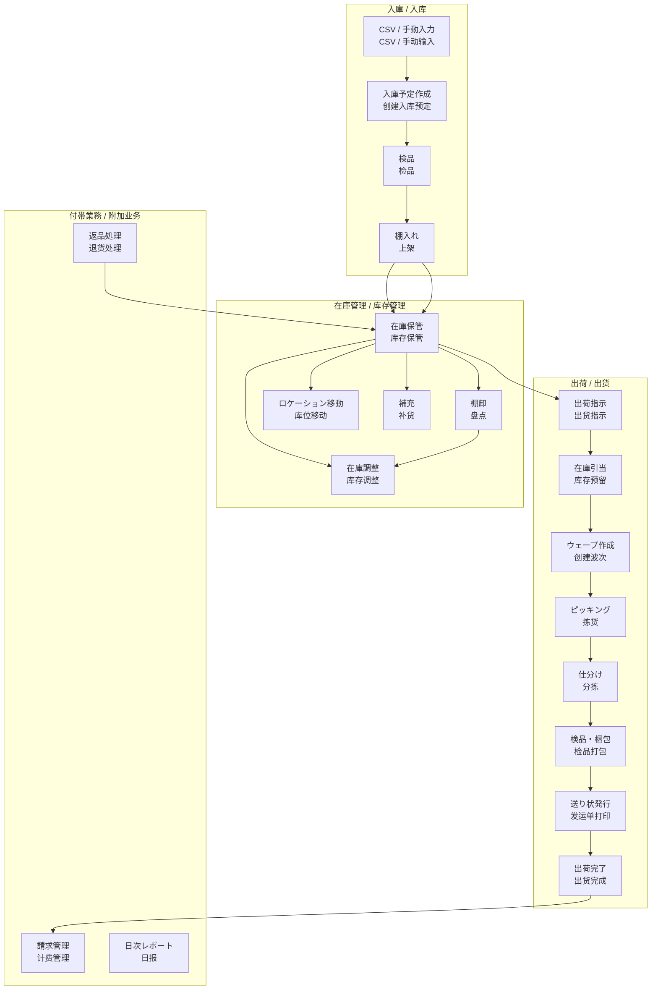

### 関連サービス / 相关服务

| フロー / 流程 | NestJS サービス / 服务 | DB テーブル / 数据库表 |
|---|---|---|
| 入庫 / 入库 | `InboundWorkflowService` | `inbound_orders`, `warehouse_tasks`, `inventory_ledger` |
| 出荷 / 出货 | `ShipmentService`, `WaveService` | `shipment_orders`, `waves`, `pick_tasks` |
| 在庫 / 库存 | `StockService` | `stock_quants`, `stock_moves` |
| 返品 / 退货 | `ReturnsService` | `return_orders` |
| 棚卸 / 盘点 | `CycleCountService`, `StocktakingService` | `cycle_count_plans`, `stocktaking_orders` |
| 請求 / 计费 | `BillingService`, `WorkChargeService` | `work_charges`, `billing_records`, `service_rates` |

---

## 2. 入庫フロー詳細 / 入库流程详解

### ステータス遷移 / 状态迁移

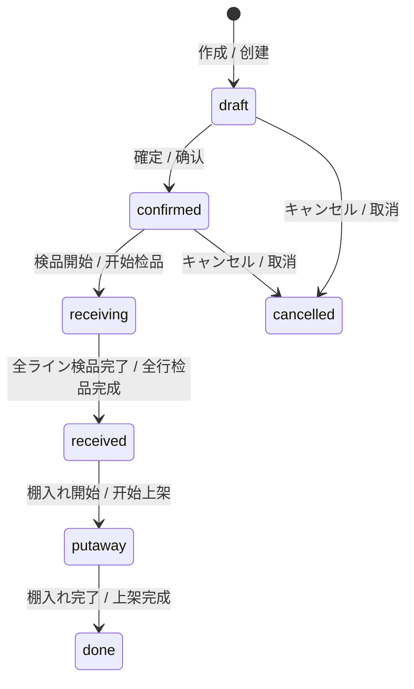

### シーケンス図 / 序列图

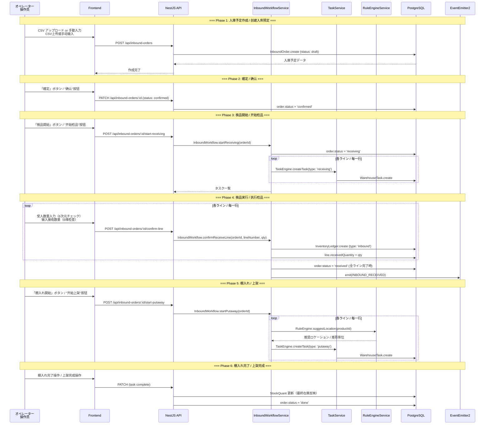

### 検品の 6 次元チェック / 检品的 6 维度检查

`InspectionService` で管理される 6 次元チェック:
由 `InspectionService` 管理的 6 维度检查：

| # | チェック項目 / 检查项 | フィールド | 説明 / 说明 |
|---|---|---|---|
| 1 | SKU 照合 / SKU 核对 | `skuMatch` | 予定 SKU と実物の一致確認 |
| 2 | バーコード照合 / 条码核对 | `barcodeMatch` | バーコードスキャンによる照合 |
| 3 | 数量照合 / 数量核对 | `quantityMatch` | 予定数量と実数量の一致 |
| 4 | 外観チェック / 外观检查 | `appearanceOk` | 破損・汚れの有無 |
| 5 | 付属品チェック / 附件检查 | `accessoriesOk` | 付属品の過不足 |
| 6 | 梱包状態 / 包装状态 | `packagingOk` | 梱包の適切さ |

---

## 3. 出荷フロー詳細 / 出货流程详解

### 出荷指示の入力経路 / 出货指示的输入路径

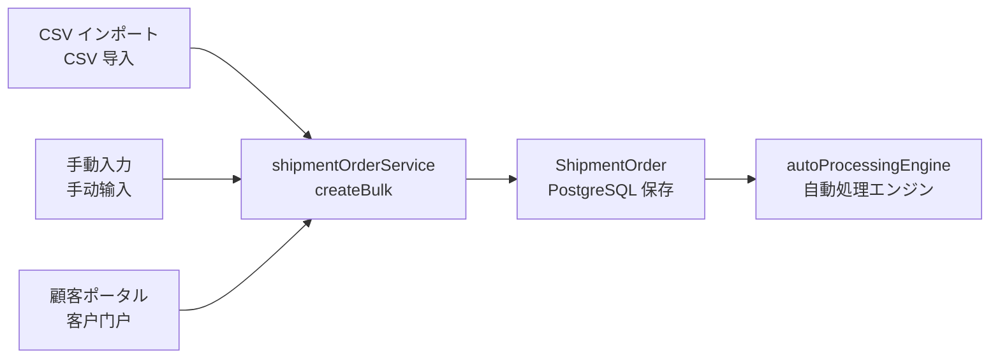

### シーケンス図 / 序列图

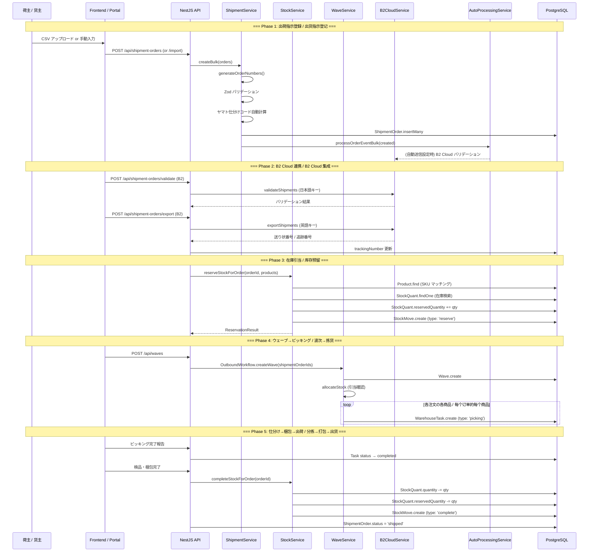

### 出荷指示のステータス遷移 / 出货指示状态迁移

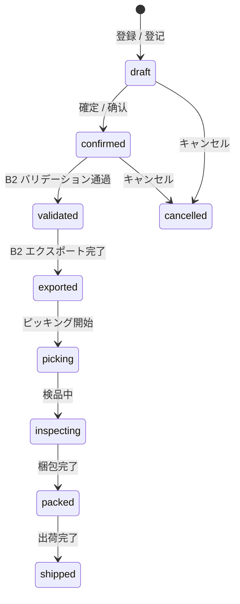

---

## 4. 在庫管理フロー / 库存管理流程

### StockQuant — 原子的在庫管理 / 原子级库存管理

`StockQuant` は **ロケーション × 商品 × ロット** の粒度で在庫を管理するコアモデルです。
`StockQuant` 是以**库位 x 商品 x 批次**粒度管理库存的核心模型。

```
StockQuant {
  productId        // 商品 / 商品
  locationId       // ロケーション / 库位
  lotId            // ロット（オプション）/ 批次（可选）
  quantity          // 実在庫数 / 实际库存数
  reservedQuantity  // 引当済み数 / 已预留数
  availableQuantity // = quantity - reservedQuantity（仮想フィールド）
}
```

### 在庫操作一覧 / 库存操作一览

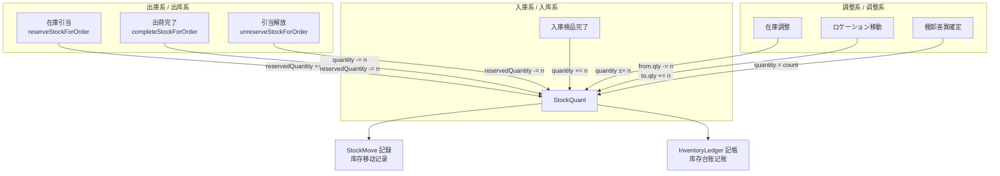

### 引当の流れ（`StockService`）/ 预留流程

`reserveStockForOrder()` の処理（PostgreSQL トランザクション内で実行）:
`reserveStockForOrder()` 的处理逻辑（在 PostgreSQL 事务中执行）：

1. **VIRTUAL/CUSTOMER ロケーション確認** — 仮想出庫先ロケーションの存在チェック
   确认 VIRTUAL/CUSTOMER 虚拟出库目的地库位存在
2. **商品マスタ一括取得** — N+1 問題を回避するため JOIN / バッチ取得
   批量获取商品主数据，通过 JOIN 避免 N+1 问题
3. **inventoryEnabled チェック** — `inventory_enabled=true` の商品のみ引当対象
   仅对 `inventory_enabled=true` 的商品执行预留
4. **stock_quants 検索** — 該当ロケーションから利用可能在庫を検索（`SELECT ... FOR UPDATE`）
   从目标库位搜索可用库存（行锁定）
5. **原子的更新** — `reserved_quantity += quantity` をトランザクション内で実行
   在事务中执行 `reserved_quantity += quantity`
6. **stock_moves 作成** — 移動記録を作成（監査証跡）
   创建移动记录（审计跟踪）

---

## 5. 返品フロー / 退货流程

### ステータス遷移 / 状态迁移

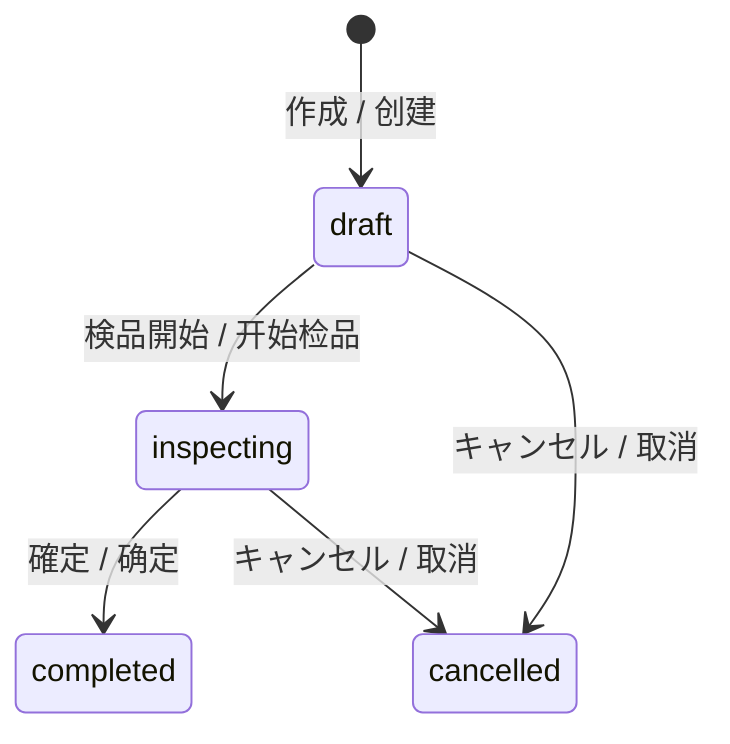

### 返品処理フロー / 退货处理流程

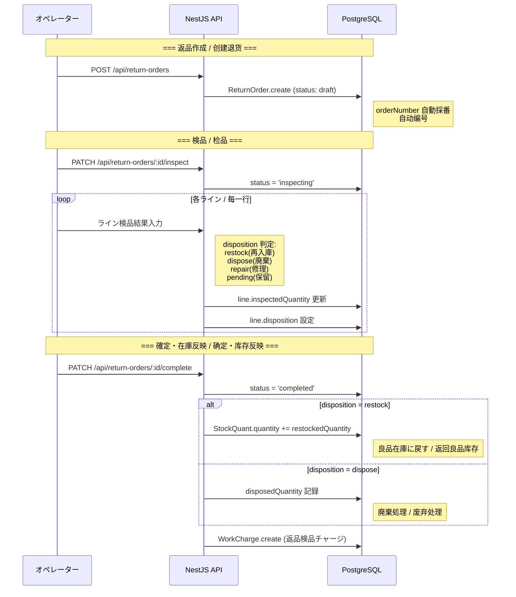

### ReturnOrder モデル / 退货模型

| フィールド | 型 | 説明 / 说明 |
|---|---|---|
| `status` | `draft` \| `inspecting` \| `completed` \| `cancelled` | ステータス |
| `returnReason` | `customer_request` \| `defective` \| `wrong_item` \| `damaged` \| `other` | 返品理由 / 退货原因 |
| `lines[].disposition` | `restock` \| `dispose` \| `repair` \| `pending` | 処分方法 / 处置方式 |
| `rmaNumber` | string | RMA 番号（返品承認番号）/ RMA 编号 |

---

## 6. 棚卸フロー / 盘点流程

### 循環棚卸（月次自動生成）/ 循环盘点（月度自动生成）

`CycleCountService` が月次で自動生成（BullMQ スケジュールジョブ）:
`CycleCountService` 每月自动生成（BullMQ 定时任务）：

- **毎月 20% の SKU** をランダム抽選 → 5 ヶ月で 100% カバー
  每月随机抽选 20% 的 SKU → 5 个月覆盖 100%
- **差異率 > 0.5%** の場合は即時アラート
  差异率 > 0.5% 时立即报警
- **年 1 回の全数棚卸**は決算期に実施
  年终全面盘点在结算期实施

### 棚卸フロー / 盘点流程

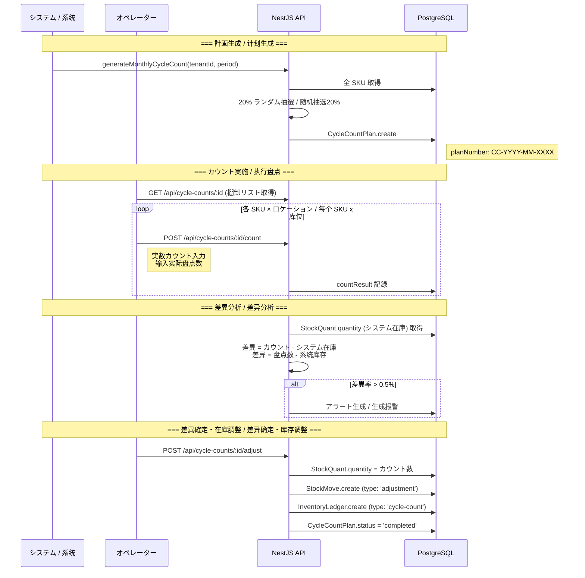

---

## 7. 請求フロー / 计费流程

### 料金体系 / 费率体系

`WorkChargeService` による自動チャージ生成（ドメインイベント経由）:
通过 `WorkChargeService` 自动生成费用（经由领域事件）：

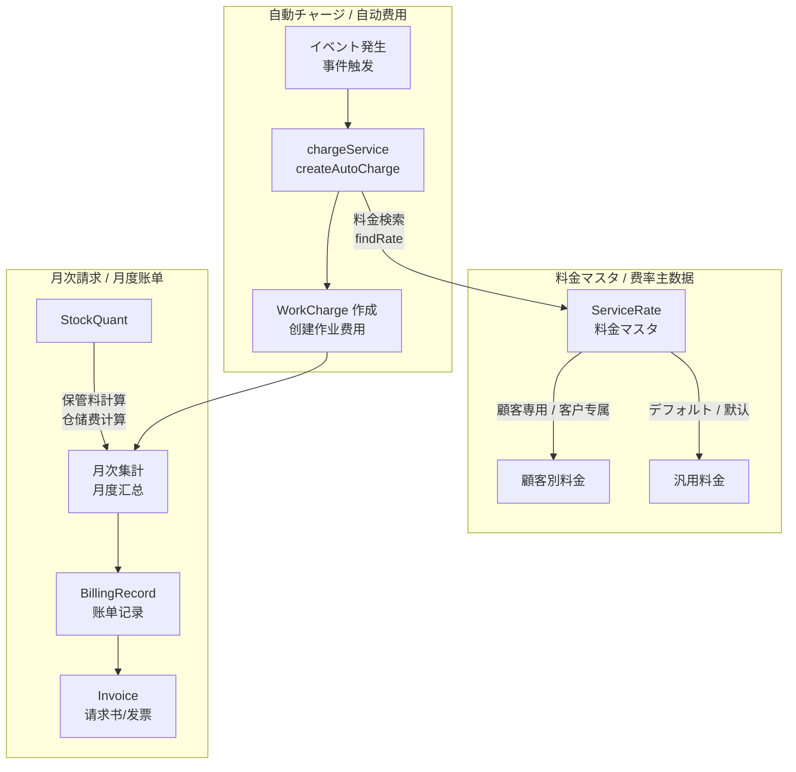

### チャージタイプ / 费用类型

| タイプ | トリガー | 説明 / 说明 |
|---|---|---|
| 入庫チャージ | 入庫完了イベント | 1件あたりの入庫作業料 / 每件入库作业费 |
| 出荷チャージ | 出荷完了イベント | 1件あたりの出荷作業料 / 每件出货作业费 |
| 返品チャージ | 返品検品完了 | 返品検品作業料 / 退货检品作业费 |
| 保管料 | 月次バッチ | StockQuant ベースの在庫保管料 / 基于库存量的仓储费 |
| ラベリング | ラベリング完了 | ラベル貼付作業料 / 贴标作业费 |

### 料金検索ロジック / 费率查找逻辑

`findRate()` は 2 段階フォールバック:
`findRate()` 采用 2 级回退：

1. **顧客専用料金** — `service_rates` テーブルから `client_id + charge_type` で検索
   客户专属费率 — 从 service_rates 表按客户 + 费用类型查找
2. **デフォルト料金** — `client_id IS NULL` のレコードにフォールバック
   默认费率 — 回退到无客户指定的通用费率

---

## 8. B2 Cloud 連携フロー / B2 Cloud 集成流程

> **重要 / 重要**: このフローの実装コード（`yamatoB2Service.ts`）は **変更禁止** です。
> 此流程的实现代码（`yamatoB2Service.ts`）**禁止修改**。

### 全体フロー / 整体流程

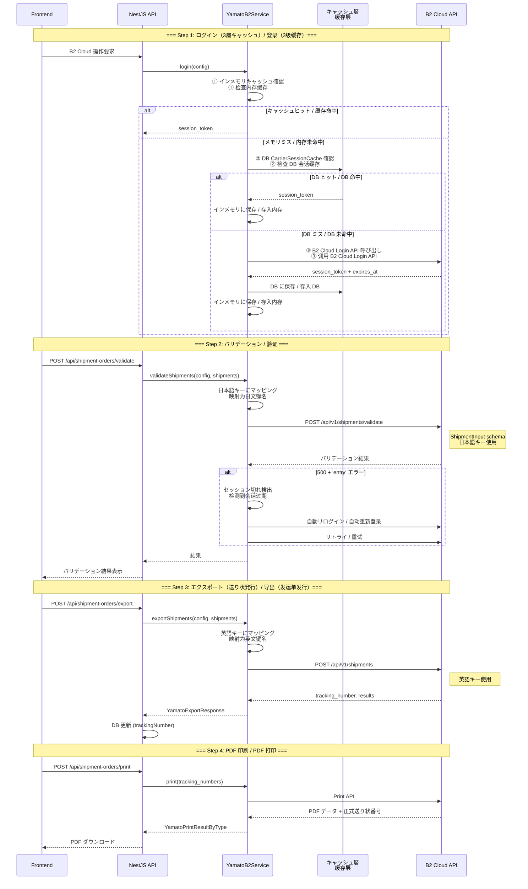

### 重要な技術的ポイント / 重要技术要点

| ポイント / 要点 | 詳細 / 详情 |
|---|---|
| **3 層キャッシュ** | インメモリ → DB(`carrier_session_caches` テーブル) → B2 Cloud API |
| **セッション切れリトライ** | `authenticatedFetch()` が HTTP 500 + レスポンスに 'entry' を検出したら自動リトライ |
| **validate vs validate-full** | `validate`（ShipmentInput, 日本語キー）を使用。`validate-full` は幅チェッカーにバグがあるため使用禁止 |
| **validate = 日本語キー** | `validateShipments()` は日本語キーマッピングで送信 |
| **export = 英語キー** | `exportShipments()` は英語キーマッピングで送信 |
| **addressMapping** | consignee/shipper の住所フィールドを B2 API 形式にマッピング |

### B2 Cloud API エンドポイント / API 端点

| 用途 / 用途 | メソッド | エンドポイント | キー形式 |
|---|---|---|---|
| ログイン / 登录 | POST | Login API | — |
| バリデーション / 验证 | POST | `/api/v1/shipments/validate` | 日本語 |
| エクスポート / 导出 | POST | `/api/v1/shipments` | 英語 |
| 印刷 / 打印 | POST | Print API | — |
| ~~バリデーション(full)~~ | ~~POST~~ | ~~`/api/v1/shipments/validate-full`~~ | ~~使用禁止~~ |

---

## 補足: イベント駆動アーキテクチャ / 补充：事件驱动架构

ZELIX WMS は **EventEmitter2** (`@nestjs/event-emitter`) を通じたドメインイベント駆動処理を採用しています。
イベントは BullMQ キューを経由して非同期処理されます。
ZELIX WMS 采用 **EventEmitter2** 的领域事件驱动处理。事件通过 BullMQ 队列异步处理。

### 主要イベント / 主要事件

| イベント | トリガー / 触发器 | 処理例 / 处理示例 |
|---|---|---|
| `INBOUND_RECEIVED` | 入庫検品完了 | 通知送信・チャージ生成 |
| `ORDER_CREATED` | 出荷指示作成 | B2 自動送信・Webhook |
| `ORDER_SHIPPED` | 出荷完了 | 通知・請求 |
| `STOCK_ADJUSTED` | 在庫調整 | 監査ログ記録（BullMQ → `operation_logs`） |

### 自動処理エンジン / 自动处理引擎

`AutoProcessingService` は `auto_processing_rules` テーブルに基づいて、
ドメインイベント発生時に定義されたアクションを自動実行します。

`AutoProcessingService` 基于 `auto_processing_rules` 表，
在领域事件发生时自动执行已定义的动作。

```
ドメインイベント発生 → EventEmitter2
    → AutoProcessingService.handleEvent()
    → ルール検索（tenant_id + event_type）
    → 条件マッチ → BullMQ キューにジョブ投入
        - B2 Cloud 自動送信
        - Webhook 送信（webhook キュー）
        - 通知送信（notification キュー）
        - ステータス自動遷移
```

---

> **最終更新 / 最后更新**: 2026-03-21
> **対象コード / 对象代码**: `backend-nest/src/modules/` 配下の各 NestJS サービス
> **関連ドキュメント / 相关文档**: `docs/design/00-system-overview.md`, `docs/migration/03-backend-architecture.md`
